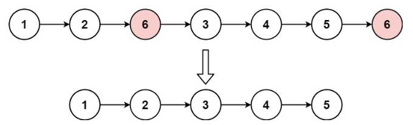

## 203. 移除链表元素
力扣链接：[203. 移除链表元素](https://leetcode.cn/problems/remove-linked-list-elements/description/)

**描述：**  
给你一个链表的头节点 ``head`` 和一个整数 ``val`` ，请你删除链表中所有满足 ``Node.val == val`` 的节点，并返回 **新的头节点** 。

**示例1：**  
> 
>
> **输入：** head = [1,2,6,3,4,5,6], val = 6  
> **输出：** [1,2,3,4,5]

**示例 2：**  
> **输入：** head = [], val = 1  
> **输出：** []

**示例 3：**  
> **输入：** head = [7,7,7,7], val = 7  
> **输出：** []

**提示：**   
- 列表中的节点数目在范围 ``[0, 104]`` 内
- ``1 <= Node.val <= 50``
- ``0 <= val <= 50``

### 解题思路

```cpp
/**
 * Definition for singly-linked list.
 * struct ListNode {
 *     int val;
 *     ListNode *next;
 *     ListNode() : val(0), next(nullptr) {}
 *     ListNode(int x) : val(x), next(nullptr) {}
 *     ListNode(int x, ListNode *next) : val(x), next(next) {}
 * };
 */
class Solution {
public:
    ListNode* removeElements(ListNode* head, int val) {
        ListNode* dummyHead = new ListNode(0); // 设置一个虚拟头结点
        dummyHead->next = head; // 将虚拟头结点指向head，这样方面后面做删除操作
        ListNode* cur = dummyHead;
        while (cur->next != NULL) {
            if(cur->next->val == val) {
                ListNode* tmp = cur->next;
                cur->next = cur->next->next;
                delete tmp;
            } else {
                cur = cur->next;
            }
        }
        head = dummyHead->next;
        delete dummyHead;
        return head;
    }
};
```