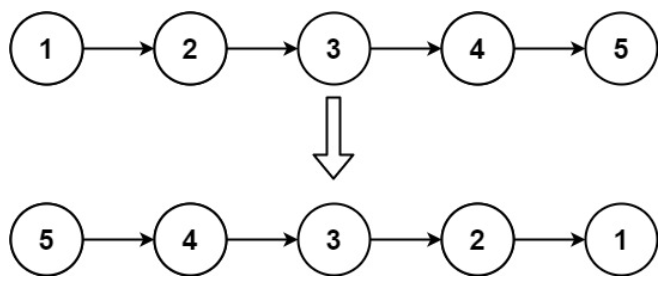
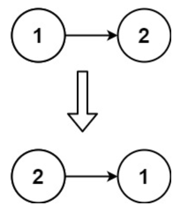

## 206. 反转链表
力扣链接：[206. 反转链表](https://leetcode.cn/problems/reverse-linked-list/description/)

**描述：**  
给你单链表的头节点 ``head`` ，请你反转链表，并返回反转后的链表。

**示例 1：**  
>   
>  
> **输入：**  head = [1,2,3,4,5]  
> **输出：**  [5,4,3,2,1]  

**示例 2：**  
>   
>  
> **输入：**  head = [1,2]  
> **输出：**  [2,1]  

**示例 3：**  

**输入：**  head = []  
**输出：**  []  

**提示：**  
- 链表中节点的数目范围是 ``[0, 5000]``
- ``-5000 <= Node.val <= 5000``

### 解题思路

```cpp
/**
 * Definition for singly-linked list.
 * struct ListNode {
 *     int val;
 *     ListNode *next;
 *     ListNode() : val(0), next(nullptr) {}
 *     ListNode(int x) : val(x), next(nullptr) {}
 *     ListNode(int x, ListNode *next) : val(x), next(next) {}
 * };
 */
class Solution {
public:
    ListNode* reverseList(ListNode* head) {
        ListNode* temp; // 保存cur的下一个节点
        ListNode* cur = head;
        ListNode* pre = NULL;
        int count = 0;
        while(cur){         //计算节点数量
            count++;
            cur = cur->next;
        }
        cur = head;
        while(count--) {
            temp = cur->next;  // 保存一下 cur的下一个节点，因为接下来要改变cur->next
            cur->next = pre; // 翻转操作
            // 更新pre 和 cur指针
            pre = cur;
            cur = temp;
        }
        return pre;
    }
};
```