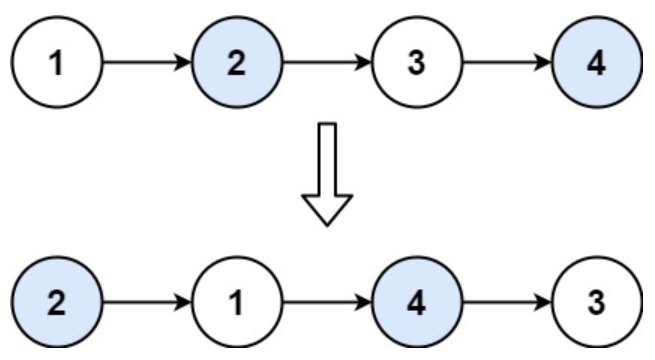

## 24. 两两交换链表中的节点
力扣链接：[24. 两两交换链表中的节点](https://leetcode.cn/problems/swap-nodes-in-pairs/description/)

**描述：**  
给你一个链表，两两交换其中相邻的节点，并返回交换后链表的头节点。你必须在不修改节点内部的值的情况下完成本题（即，只能进行节点交换）。

**示例 1：**  
> 
>
> **输入：**  head = [1,2,3,4]  
> **输出：**  [2,1,4,3]  

**示例 2：**  
> **输入：**  head = []  
> **输出：**  []  

**示例 3：**  
> **输入：**  head = [1]  
> **输出：**  [1]  

**提示：**  
- 链表中节点的数目在范围 ``[0, 100]`` 内
- ``0 <= Node.val <= 100``

### 解题思路

```cpp
/**
 * Definition for singly-linked list.
 * struct ListNode {
 *     int val;
 *     ListNode *next;
 *     ListNode() : val(0), next(nullptr) {}
 *     ListNode(int x) : val(x), next(nullptr) {}
 *     ListNode(int x, ListNode *next) : val(x), next(next) {}
 * };
 */
class Solution {
public:
    ListNode* swapPairs(ListNode* head) {
        ListNode* dummyHead = new ListNode(0); // 设置一个虚拟头结点
        dummyHead->next = head; // 将虚拟头结点指向head，这样方面后面做删除操作
        ListNode* cur = dummyHead;
        while(cur->next != nullptr && cur->next->next != nullptr) {
            ListNode* tmp = cur->next; // 记录临时节点
            ListNode* tmp1 = cur->next->next->next; // 记录临时节点

            cur->next = cur->next->next;    // 步骤一
            cur->next->next = tmp;          // 步骤二
            cur->next->next->next = tmp1;   // 步骤三

            cur = cur->next->next; // cur移动两位，准备下一轮交换
        }
        return dummyHead->next;
    }
};
```