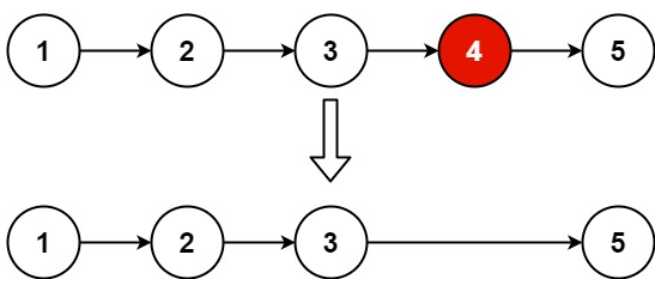

## 19. 删除链表的倒数第 N 个结点
力扣链接：[19. 删除链表的倒数第 N 个结点](https://leetcode.cn/problems/remove-nth-node-from-end-of-list/description/)

**描述：**  
给你一个链表，删除链表的倒数第 n 个结点，并且返回链表的头结点。

**示例 1：**  
>   
>  
> **输入：**  head = [1,2,3,4,5], n = 2  
> **输出：**  [1,2,3,5]  

**示例 2：**  
> **输入：**  head = [1], n = 1  
> **输出：**  []  

**示例 3：**  
> **输入：**  head = [1,2], n = 1  
> **输出：**  [1]  

**提示：**  
- 链表中结点的数目为 ``sz``
- ``1 <= sz <= 30``
- ``0 <= Node.val <= 100``
- ``1 <= n <= sz``

### 解题思路

```cpp
/**
 * Definition for singly-linked list.
 * struct ListNode {
 *     int val;
 *     ListNode *next;
 *     ListNode() : val(0), next(nullptr) {}
 *     ListNode(int x) : val(x), next(nullptr) {}
 *     ListNode(int x, ListNode *next) : val(x), next(next) {}
 * };
 */
class Solution {
public:
    ListNode* removeNthFromEnd(ListNode* head, int n) {
    ListNode* cur=head;
    ListNode* tmp=cur;
    ListNode* VtHead=new ListNode(0,head);
    ListNode* pre=VtHead;
    while(cur){
        for(int i=0;i<n;i++){
            tmp=tmp->next;
        }
        if(!tmp) break;
        pre=cur;
        cur=cur->next;
        tmp=cur;
    }
    pre->next=cur->next;
    delete cur;
    return VtHead->next;
    }
};
```