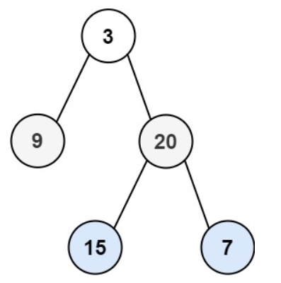

# 102.二叉树的层序遍历
力扣链接：[102.二叉树的层序遍历](https://leetcode.cn/problems/binary-tree-level-order-traversal/description/)  

**描述：**  
　给你二叉树的根节点 root ，返回其节点值的 层序遍历 。 （即逐层地，从左到右访问所有节点）。

**示例 1:**  
>  
>
> **输入:** root = [3,9,20,null,null,15,7]  
> **输出:** [[3],[9,20],[15,7]]  

**示例 2:**  
> **输入:** root = [1]  
> **输出:** [[1]]  

**示例 3:**  
> **输入:** root = []  
> **输出:** []

 **提示：**  
- 树中节点数目在范围 [0, 2000] 内
- -1000 <= Node.val <= 1000

### 解题思路：
**方法一：使用队列**  
　　首先当根结点不为空时入队。然后执行出队时将它的左右孩子入队。当队列非空时，出队当前队列中的所有元素(即同一层的元素)，同时记录。
每出队一个节点，将它的左右孩子入队，如此便可保证队列中的元素是按树的同层元素的从左到右排列。  
**代码：**    
```cpp
/**
 * Definition for a binary tree node.
 * struct TreeNode {
 *     int val;
 *     TreeNode *left;
 *     TreeNode *right;
 *     TreeNode() : val(0), left(nullptr), right(nullptr) {}
 *     TreeNode(int x) : val(x), left(nullptr), right(nullptr) {}
 *     TreeNode(int x, TreeNode *left, TreeNode *right) : val(x), left(left), right(right) {}
 * };
 */
class Solution {
public:
    vector<vector<int>> levelOrder(TreeNode* root) {
        vector<vector<int>> result;
        queue<TreeNode*> que;
        if(root!=nullptr) que.push(root);
        while(!que.empty()){
            vector<int> tmp;
            int size = que.size();
            for(int i=0;i<size;i++){
                TreeNode* node = que.front();
                que.pop();
                tmp.push_back(node->val);
                if(node->left) que.push(node->left);
                if(node->right) que.push(node->right);
            }
            result.push_back(tmp);
        }
        return result;
    }
};
```
