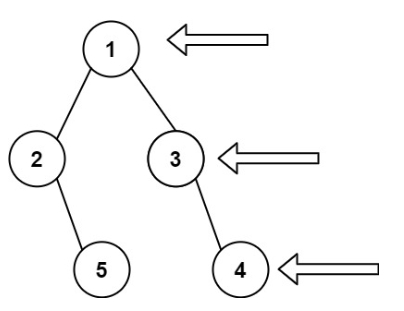

# 199. 二叉树的右视图
力扣链接：[199. 二叉树的右视图](https://leetcode.cn/problems/binary-tree-right-side-view/description/)  

**描述：**  
　给定一个二叉树的 根节点 root，想象自己站在它的右侧，按照从顶部到底部的顺序，返回从右侧所能看到的节点值。

**示例 1:**
>  
>  
> **输入:** [1,2,3,null,5,null,4]  
> **输出:** [1,3,4]  
 
**示例 2:**  
>**输入:** [1,null,3]  
>**输出:** [1,3]  

**示例 3:**  
>**输入:** []  
>**输出:** []  

 **提示：**  
- 二叉树的节点个数的范围是 [0,100]
- -100 <= Node.val <= 100 

### 解题思路：
**方法一：队列**  
　　得到二叉树的层序遍历结果。数组的每个子数组的最后一个元素即为最右边的元素。  
**代码：**    
```cpp
/**
 * Definition for a binary tree node.
 * struct TreeNode {
 *     int val;
 *     TreeNode *left;
 *     TreeNode *right;
 *     TreeNode() : val(0), left(nullptr), right(nullptr) {}
 *     TreeNode(int x) : val(x), left(nullptr), right(nullptr) {}
 *     TreeNode(int x, TreeNode *left, TreeNode *right) : val(x), left(left), right(right) {}
 * };
 */
class Solution {
public:
    vector<int> rightSideView(TreeNode* root) {
        vector<vector<int>> result_tmp;
        queue<TreeNode*> que;
        if(root!=nullptr) que.push(root);
        while(!que.empty()){
            vector<int> tmp;
            int size= que.size();
            for(int i=0;i<size;i++){
                TreeNode* node=que.front();
                que.pop();
                tmp.push_back(node->val);
                if(node->left) que.push(node->left);
                if(node->right) que.push(node->right);
            }
            result_tmp.push_back(tmp);
        }
        vector<int> result(result_tmp.size());
        for(int j=0;j<result.size();j++){
            result[j]=result_tmp[j][result_tmp[j].size()-1];//右面这串表示小数组的最后一个元素
        }
        return result;
    }
};
```
