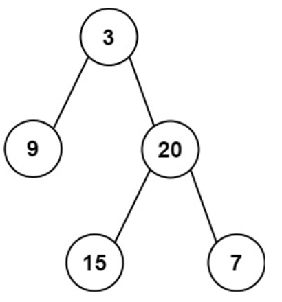
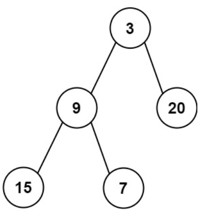

# 637. 二叉树的层平均值
力扣链接：[637. 二叉树的层平均值](https://leetcode.cn/problems/average-of-levels-in-binary-tree/description/)

**描述：**  
　给定一个非空二叉树的根节点 root , 以数组的形式返回每一层节点的平均值。与实际答案相差 ${10}^ {-5}$ 以内的答案可以被接受。  

**示例 1:**
>  
>  
> **输入:** root = [3,9,20,null,null,15,7]  
> **输出:** [3.00000,14.50000,11.00000]  
> **解释:** 第 0 层的平均值为 3,第 1 层的平均值为 14.5,第 2 层的平均值为 11。因此返回 [3, 14.5, 11]。  
 
**示例 2:**  
>  
>
>**输入:** root = [3,9,20,15,7]  
>**输出:** [3.00000,14.50000,11.00000]  

 **提示：**  
- 树中节点数量在 $[1, {10}^ {4}]$ 范围内
- ${-2}^ {31} <= Node.val <= {2}^ {31} - 1$ 

### 解题思路：
**方法一：使用队列**  
　　求出层序遍历，然后计算结果数组的每一个子数组的平均值。  
**代码：**    
```cpp
/**
 * Definition for a binary tree node.
 * struct TreeNode {
 *     int val;
 *     TreeNode *left;
 *     TreeNode *right;
 *     TreeNode() : val(0), left(nullptr), right(nullptr) {}
 *     TreeNode(int x) : val(x), left(nullptr), right(nullptr) {}
 *     TreeNode(int x, TreeNode *left, TreeNode *right) : val(x), left(left), right(right) {}
 * };
 */
class Solution {
public:
    vector<double> averageOfLevels(TreeNode* root) {
        vector<vector<int>> result_tmp;
        queue<TreeNode*> que;
        if(root!=nullptr) que.push(root);
        while(!que.empty()){
            vector<int> tmp;
            int size= que.size();
            for(int i=0;i<size;i++){
                TreeNode* node=que.front();
                que.pop();
                tmp.push_back(node->val);
                if(node->left) que.push(node->left);
                if(node->right) que.push(node->right);
            }
            result_tmp.push_back(tmp);
        }
        vector<double> result(result_tmp.size());
        for(int j=0;j<result.size();j++){
            long sum=0,i=0;
            for(i=0;i<result_tmp[j].size();i++){
                sum+=result_tmp[j][i];
            }
            result[j]=(double)sum/i;
        }
        return result;
    }
};
```
