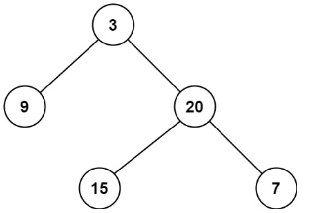

# 111. 二叉树的最小深度
力扣链接：[111. 二叉树的最小深度](https://leetcode.cn/problems/minimum-depth-of-binary-tree/description/)  

**描述：**  
给定一个二叉树，找出其最小深度。  
最小深度是从根节点到最近叶子节点的最短路径上的节点数量。  

**示例 1：**
>  
>  
> **输入：** root = [3,9,20,null,null,15,7]  
> **输出：** 2  
 
**示例 2：**  
>**输入：** root = [2,null,3,null,4,null,5,null,6]  
>**输出：** 5  

 **提示：**  
- 树中节点数的范围在 $[0, 10^5]$ 内  
- -1000 <= Node.val <= 1000  

### 解题思路：
**方法一：深度优先搜索**  

对于每一个非叶子节点，我们只需要分别计算其左右子树的最小叶子节点深度。  
这样就将一个大问题转化为了小问题，可以递归地解决该问题。  

**代码：**    
```cpp
class Solution {
public:
    int minDepth(TreeNode *root) {
        if (root == nullptr) {
            return 0;
        }

        if (root->left == nullptr && root->right == nullptr) {
            return 1;
        }

        int min_depth = INT_MAX;
        if (root->left != nullptr) {
            min_depth = min(minDepth(root->left), min_depth);
        }
        if (root->right != nullptr) {
            min_depth = min(minDepth(root->right), min_depth);
        }

        return min_depth + 1;
    }
};
```
**方法二：广度优先搜索**  

当我们找到一个叶子节点时，直接返回这个叶子节点的深度。广度优先搜索的性质保证了最先搜索到的叶子节点的深度一定最小。  

**代码：**    
```cpp
class Solution {
public:
    int minDepth(TreeNode *root) {
        if (root == nullptr) {
            return 0;
        }

        queue<pair<TreeNode *, int> > que;
        que.emplace(root, 1);
        while (!que.empty()) {
            TreeNode *node = que.front().first;
            int depth = que.front().second;
            que.pop();
            if (node->left == nullptr && node->right == nullptr) {
                return depth;
            }
            if (node->left != nullptr) {
                que.emplace(node->left, depth + 1);
            }
            if (node->right != nullptr) {
                que.emplace(node->right, depth + 1);
            }
        }

        return 0;
    }
};
```
