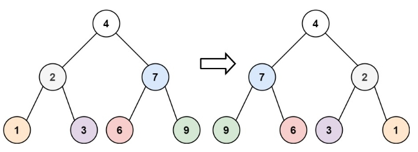
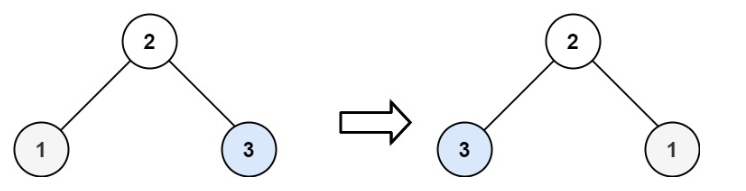

# 226. 翻转二叉树
力扣链接：[226. 翻转二叉树](https://leetcode.cn/problems/invert-binary-tree/description/)  

**描述：**  

给你一棵二叉树的根节点 root ，翻转这棵二叉树，并返回其根节点。  

**示例 1：**
>  
>  
> **输入：** root = [4,2,7,1,3,6,9]  
> **输出：** [4,7,2,9,6,3,1]  
 
**示例 2：**  
>  
>  
>**输入：** root = [2,1,3]  
>**输出：** [2,3,1]  

**示例 3：**  
>**输入：** root = []  
>**输出：** []  

 **提示：**  
- 树中节点数目范围在 [0, 100] 内  
- -100 <= Node.val <= 100  

### 解题思路：
**方法一：递归**  

将每一个非叶子结点的左右孩子都翻转。  

**代码：**    
```cpp
class Solution {
public:
    TreeNode* invertTree(TreeNode* root) {
        if (root == nullptr) {
            return nullptr;
        }
        TreeNode* left = invertTree(root->left);
        TreeNode* right = invertTree(root->right);
        root->left = right;
        root->right = left;
        return root;
    }
};
```

或者(我写的，没用递归)：

```cpp
/**
 * Definition for a binary tree node.
 * struct TreeNode {
 *     int val;
 *     TreeNode *left;
 *     TreeNode *right;
 *     TreeNode() : val(0), left(nullptr), right(nullptr) {}
 *     TreeNode(int x) : val(x), left(nullptr), right(nullptr) {}
 *     TreeNode(int x, TreeNode *left, TreeNode *right) : val(x), left(left), right(right) {}
 * };
 */
class Solution {
public:
    TreeNode* invertTree(TreeNode* root) {
        queue<TreeNode*> que;
        if(root!=nullptr) que.push(root);
        while(!que.empty()){
            int size= que.size();
            for(int i=0;i<size;i++){
                TreeNode* node=que.front();
                que.pop();

                TreeNode* tmp=node->left;
                node->left=node->right;
                node->right=tmp;

                if(node->left) que.push(node->left);
                if(node->right) que.push(node->right);
            }
        }
        return root;
    }
};
```
