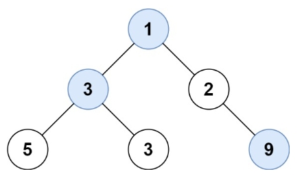

# 515.在每个树行中找最大值
力扣链接：[515.在每个树行中找最大值](https://leetcode.cn/problems/find-largest-value-in-each-tree-row/description/)  

**描述：**  
　　给定一棵二叉树的根节点 root ，请找出该二叉树中每一层的最大值。  

**示例 1:**
><div> </img></div>  
>  
> **输入:** root = [1,3,2,5,3,null,9]  
> **输出:** [1,3,9]  
 
**示例 2:**  
>**输入:** root = [1,2,3]  
>**输出:** [1,3]  

 **提示：**  
- 二叉树的节点个数的范围是  $[0,10^4]$ 
- $-2^{31} <= Node.val <= 2^{31} - 1$ 

### 解题思路：
**方法一：层序遍历**  
　　先层序遍历，然后求每一层最大值。  
**代码：**    
```cpp
/**
 * Definition for a binary tree node.
 * struct TreeNode {
 *     int val;
 *     TreeNode *left;
 *     TreeNode *right;
 *     TreeNode() : val(0), left(nullptr), right(nullptr) {}
 *     TreeNode(int x) : val(x), left(nullptr), right(nullptr) {}
 *     TreeNode(int x, TreeNode *left, TreeNode *right) : val(x), left(left), right(right) {}
 * };
 */
class Solution {
public:
    vector<int> largestValues(TreeNode* root) {
        vector<vector<int>> result_tmp;
        queue<TreeNode*> que;
        if(root!=nullptr) que.push(root);
        while(!que.empty()){
            vector<int> tmp;
            int size= que.size();
            for(int i=0;i<size;i++){
                TreeNode* node=que.front();
                que.pop();
                tmp.push_back(node->val);
                if(node->left) que.push(node->left);
                if(node->right) que.push(node->right);
            }
            result_tmp.push_back(tmp);
        }
        vector<int> result;
        for(int i=0;i<result_tmp.size();i++){
            int max=result_tmp[i][0];
            for(int j=1;j<result_tmp[i].size();j++){
                if(result_tmp[i][j]>max) max=result_tmp[i][j]; 
            }
            result.emplace_back(max);
        }
        return result;
    }
};
```
