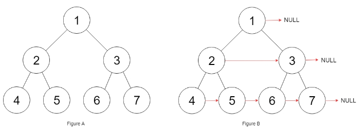

# 116. 填充每个节点的下一个右侧节点指针
力扣链接：[116. 填充每个节点的下一个右侧节点指针](https://leetcode.cn/problems/populating-next-right-pointers-in-each-node/description/) 

**描述：**  
　　给定一个 完美二叉树 ，其所有叶子节点都在同一层，每个父节点都有两个子节点。二叉树定义如下：　　
```cpp
struct Node {
  int val;
  Node *left;
  Node *right;
  Node *next;
}
```
填充它的每个 next 指针，让这个指针指向其下一个右侧节点。如果找不到下一个右侧节点，则将 next 指针设置为 NULL。  
初始状态下，所有 next 指针都被设置为 NULL。  

**示例 1:**
><div> </img></div>  
>  
> **输入：** root = [1,2,3,4,5,6,7]  
> **输出：** [1,#,2,3,#,4,5,6,7,#]  
 
**示例 2:**  
>**输入:** root = []  
>**输出:** []  

 **提示：**  
- 树中节点的数量在 $[0, 2^{12} - 1]$ 范围内  
- -1000 <= node.val <= 1000  

### 解题思路：
**方法一：层序遍历**  
　　层序遍历得到每一层的结点序列，然后前面结点的next指向后面结点。  
**代码：**    
```cpp
/*
// Definition for a Node.
class Node {
public:
    int val;
    Node* left;
    Node* right;
    Node* next;

    Node() : val(0), left(NULL), right(NULL), next(NULL) {}

    Node(int _val) : val(_val), left(NULL), right(NULL), next(NULL) {}

    Node(int _val, Node* _left, Node* _right, Node* _next)
        : val(_val), left(_left), right(_right), next(_next) {}
};
*/

class Solution {
public:
    Node* connect(Node* root) {
        vector<vector<Node*>> result;
        queue<Node*> que;
        if(root!=nullptr) que.push(root);
        while(!que.empty()){
            vector<Node*> tmp;
            int size= que.size();
            for(int i=0;i<size;i++){
                Node* node=que.front();
                que.pop();
                tmp.push_back(node);
                if(node->left) que.push(node->left);
                if(node->right) que.push(node->right);
            }
            result.push_back(tmp);
        }
        for(int i=0;i<result.size();i++){
            result[i][result[i].size()-1]->next=nullptr;
            for(int j=0;j<result[i].size()-1;j++){
                result[i][j]->next=result[i][j+1];
            }
        }
        return root;
    }
};
```
