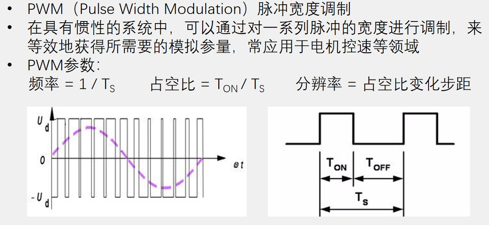
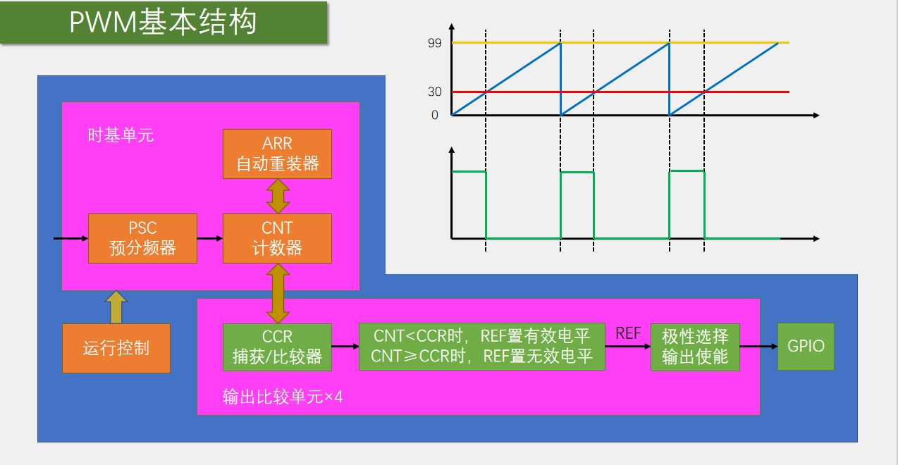

### 4.2.1 输出比较简介  
- 输出比较可以通过比较CNT与CCR寄存器值的关系，来对输出电平进行置1、置0或翻转的操作，用于输出一定频率和占空比的PWM波形  
- 每个高级定时器和通用定时器都拥有4个输出比较通道  
- 高级定时器的前3个通道额外拥有死区生成和互补输出的功能

### 4.2.2 PWM简介  
<div></div>

### 4.2.3 通用定时器输出比较电路  
<div></div>  
<br/>  
该部分电路对应通用定时器的如下部分  
<br/>  
<div></div>  
<br/>  

>TIMx_CCMR1寄存器可以控制输出模式，具体如下表所示。TIMx_CCER寄存器可以是否翻转信号，TIMx_CCER寄存器控制是否输出。

<table>
  <tbody>
    <tr>
      <td>模式</td>
      <td>描述</td>
    </tr>
    <tr>
      <td>冻结</td>
      <td>CNT=CCR时，REF保持为原状态</td>
    </tr>
    <tr>
      <td>匹配时置有效电平</td>
      <td>CNT=CCR时，REF置有效电平</td>
    </tr>
    <tr>
      <td>匹配时置无效电平</td>
      <td>CNT=CCR时，REF置无效电平</td>
    </tr>
    <tr>
      <td>匹配时电平翻转</td>
      <td>CNT=CCR时，REF电平翻转</td>
    </tr>
    <tr>
      <td>强制为无效电平</td>
      <td>CNT与CCR无效，REF强制为无效电平</td>
    </tr>
    <tr>
      <td>强制为有效电平</td>
      <td>CNT与CCR无效，REF强制为有效电平</td>
    </tr>
    <tr>
      <td>PWM模式1</td>
      <td>向上计数：CNT&lt;CCR时，REF置有效电平，CNT≥CCR时，REF置无效电平<br>向下计数：CNT&gt;CCR时，REF置无效电平，CNT≤CCR时，REF置有效电平</td>
    </tr>
    <tr>
      <td>PWM模式2</td>
      <td>向上计数：CNT&lt;CCR时，REF置无效电平，CNT≥CCR时，REF置有效电平<br>向下计数：CNT&gt;CCR时，REF置有效电平，CNT≤CCR时，REF置无效电平</td>
    </tr>
  </tbody>
  <colgroup>
    <col style="width: 22.4444%;">
    <col style="width: 77.5556%;">
  </colgroup>
</table>

### 4.2.4 PWM基本结构
根据以上分析，PWM模式的基本结构如下图所示：  
<div></div>  

>其中，黄色线为ARR值，红色线为CCR值，蓝色线为CNT值。不难发现，PWM的重要参数(频率，占空比，分辨率)如下计算：  
>PWM频率：	Freq = CK_PSC / (PSC + 1) / (ARR + 1)  
>PWM占空比：	Duty = CCR / (ARR + 1)  
>PWM分辨率：	Reso = 1 / (ARR + 1)  

>PWM分辨率是指占空比变化的步距(精度)。显然， $0\leq CCR\leq ARR$ , ARR越大，CCR可变化的范围越大，占空比可变化的精度越小，分辨率越小。

### 4.2.5 软件配置  

根据PWM模式的基本结构框图，配置PWM模式可分为以下步骤：  
1. 开启TIM外设和GPIO外设的时钟
2. 配置GPIO, 把PWM对应的GPIO口，初始化为复用推挽输出的配置
3. 配置时基单元
4. 配置输出比较单元
5. 启动定时器
>GPIO口为什么设置成复用推挽输出？  
>因为在复用推挽模式下，GPIO口的控制权才会交给片上外设(这里是定时器)。

### 4.2.6 PWM控制Led呼吸灯代码  
main.c  
```cpp
#include "stm32f10x.h"                  // Device header
#include "Delay.h"
#include "OLED.h"
#include "PWM.h"

uint8_t i;

int main(void)
{
    OLED_Init();
    PWM_Init();
    
    while (1)
    {
        OLED_ShowString(1,1,"PWM");
        for (i = 0; i <= 100; i++)
        {
            PWM_SetCompare1(i);
            Delay_ms(10);
        }
        for (i = 0; i <= 100; i++)
        {
            PWM_SetCompare1(100 - i);
            Delay_ms(10);
        }
    }
}

```
PWM.h  
```cpp
#ifndef __PWM_H
#define __PWM_H

void PWM_Init(void);
void PWM_SetCompare1(uint16_t Compare);

#endif

```
PWM.c  
```cpp
#include "stm32f10x.h"                  // Device header

void PWM_Init(void)
{
    /*1.开启TIM外设和GPIO外设的时钟*/
    RCC_APB1PeriphClockCmd(RCC_APB1Periph_TIM2, ENABLE);
    RCC_APB2PeriphClockCmd(RCC_APB2Periph_GPIOA, ENABLE);
    
    /*引脚重映射功能*/
    //RCC_APB2PeriphClockCmd(RCC_APB2Periph_AFIO, ENABLE);    //AFIO外设时钟
    //GPIO_PinRemapConfig(GPIO_PartialRemap1_TIM2, ENABLE);    //重映射模式，部分重映射或者完全重映射
    //GPIO_PinRemapConfig(GPIO_Remap_SWJ_JTAGDisable, ENABLE);    //关闭调试端口复用，因为TIM2要重映射的端口PA15默认为JTAG调试端口
    
    /*2.配置GPIO, 把PWM对应的GPIO口，初始化为复用推挽输出的配置*/
    GPIO_InitTypeDef GPIO_InitStructure;
    GPIO_InitStructure.GPIO_Mode = GPIO_Mode_AF_PP;
    GPIO_InitStructure.GPIO_Pin = GPIO_Pin_0;		//GPIO_Pin_15;
    GPIO_InitStructure.GPIO_Speed = GPIO_Speed_50MHz;
    GPIO_Init(GPIOA, &GPIO_InitStructure);
    
    /*选择时钟源*/
    TIM_InternalClockConfig(TIM2);
    
    /*3.配置时基单元*/
    TIM_TimeBaseInitTypeDef TIM_TimeBaseInitStructure;
    TIM_TimeBaseInitStructure.TIM_ClockDivision = TIM_CKD_DIV1;
    TIM_TimeBaseInitStructure.TIM_CounterMode = TIM_CounterMode_Up;
    TIM_TimeBaseInitStructure.TIM_Period = 100 - 1;		//ARR
    TIM_TimeBaseInitStructure.TIM_Prescaler = 720 - 1;		//PSC
    TIM_TimeBaseInitStructure.TIM_RepetitionCounter = 0;
    TIM_TimeBaseInit(TIM2, &TIM_TimeBaseInitStructure);
    
    /*4.配置输出比较单元*/
    TIM_OCInitTypeDef TIM_OCInitStructure;
    TIM_OCStructInit(&TIM_OCInitStructure);
    TIM_OCInitStructure.TIM_OCMode = TIM_OCMode_PWM1;
    TIM_OCInitStructure.TIM_OCPolarity = TIM_OCPolarity_High;
    TIM_OCInitStructure.TIM_OutputState = TIM_OutputState_Enable;
    TIM_OCInitStructure.TIM_Pulse = 0;		//CCR
    TIM_OC1Init(TIM2, &TIM_OCInitStructure);
    
    /*启动定时器*/
    TIM_Cmd(TIM2, ENABLE);
}

/*改变CCR寄存器的值*/
void PWM_SetCompare1(uint16_t Compare)
{
    TIM_SetCompare1(TIM2, Compare);
}

```
