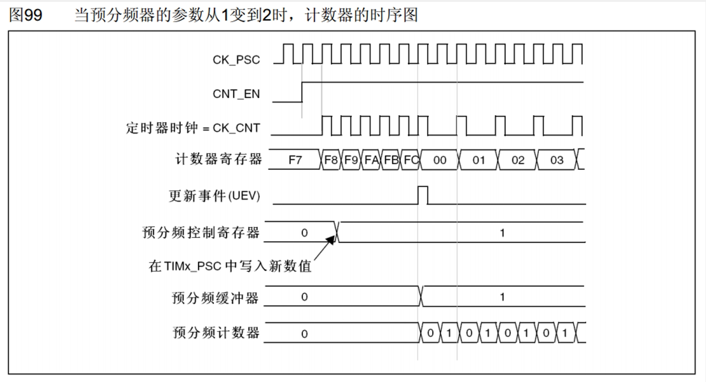

**TIM简介**  
- 定时器可以对输入的时钟进行计数，并在计数值达到设定值时触发中断  
- 16位计数器、预分频器、自动重装寄存器的时基单元，在72MHz计数时钟下可以实现最大59.65s的定时
- 不仅具备基本的定时中断功能，而且还包含内外时钟源选择、输入捕获、输出比较、编码器接口、主从触发模式等多种功能
- 根据复杂度和应用场景分为了高级定时器、通用定时器、基本定时器三种类型

**定时器类型**  

<table>
  <tbody>
    <tr>
      <td>类型</td>
      <td>编号</td>
      <td>总线</td>
      <td>功能</td>
    </tr>
    <tr>
      <td>高级定时器</td>
      <td>TIM1、TIM8</td>
      <td>APB2</td>
      <td>拥有通用定时器全部功能，并额外具有重复计数器、死区生成、<br>互补输出、刹车输入等功能</td>
    </tr>
    <tr>
      <td>通用定时器</td>
      <td>TIM2、TIM3、<br>TIM4、TIM5<br></td>
      <td>APB1</td>
      <td>拥有基本定时器全部功能，并额外具有内外时钟源选择、输入捕获、<br>输出比较、编码器接口、主从触发模式等功能</td>
    </tr>
    <tr>
      <td>基本定时器</td>
      <td>TIM6、TIM7<br></td>
      <td>APB1</td>
      <td>拥有定时中断、主模式触发DAC的功能</td>
    </tr>
  </tbody>
  <colgroup>
    <col style="width: 13.8889%;">
    <col style="width: 15.2222%;">
    <col style="width: 10.8889%;">
    <col style="width: 60%;">
  </colgroup>
</table>

>STM32F103C8T6定时器资源：TIM1、TIM2、TIM3、TIM4

**基本定时器框图**  
<div></div>  

PCS预分频器、自动重装载寄存器、CNT计时器构成了最基本的计时计数电路，这部分电路也称时基单元。  
基本定时器时钟只能选择内部时钟，频率一般是系统主频72Mhz。  
1. 预分频器寄存器写 $0$ 则为不分频，写 $1$ 则为 $2$ 分频，输出频率 $= 72/2 = 36Mhz$ 。以此类推，值为 $x$ 则为 $x+1$ 分频，分频后的频率为 $72/(x+1)Mhz$ 。
该分频器为16位，最大值为 ${2}^ {16}-1=65535$ ,最大分频系数为 $65536$ 。
2. 计数器可以对分频后的时钟进行计数，每遇到一个上升沿，计数器+1。该计数器为16为，最大计数值为65535。
3. 自动重装载寄存器存储我们的计数目标，该寄存器也为16位，可存储的最大值为65535。当计数器递增至等于自动重装值时，达到计时时间。此时产生中断信号(图中所示UI)，并清零计数器，自动开始下一次计数计时。
   这种计数值等于自动重装值产生的中断，称为"更新中断"。

**通用定时器框图**  
<div></div>  

相比于基本定时器，通用定时器主要多出的功能为"内外时钟源选择"(上半部分所示)和"输入捕获和输出比较"(下半部分所示)。  

**高级定时器框图**  
<div></div>  

> **注意:** 框图中带黑色阴影的寄存器都带有缓冲机制(即类似下面影子寄存器的效果)。

**定时中断基本结构**  
<div></div>  

**预分频器时序**  
<div></div>  

>预分频缓冲器(或称影子寄存器)才是真正起作用的寄存器。当在计数中途改变预分频控制寄存器的值时，频率并不会马上改变，而是等到本次计数结束，才将该值传递到影子寄存器，继而改变频率。  
>计数器计数频率:CK_CNT = CK_PSC/(PSC+1)

**计数器时序**  
<div></div>  

>计数达到自动重装载值时，计数器复位，产生更新事件，置位更新中断标志位，然后申请中断。
> **注意：** 中断标志位需要手动清零。
>计数器溢出频率: CK_CNT_OV = CK_CNT/(ARR + 1) = CK_PSC/(PSC + 1)/(ARR + 1)

**软件配置**  

根据定时中断基本结构，配置定时器可分为以下步骤：  
1. 开启RCC时钟
2. 选择时钟源(内部时钟的话可省略这步)
3. 配置时基单元
4. 使能中断
5. 开启时钟

**定时器定时中断代码**  
main.c  
```cpp
#include "stm32f10x.h"                  // Device header
#include "Timer.h"

uint16_t Num;

int main(void)
{
    OLED_Init();
    Timer_Init();
    
    OLED_ShowString(1, 1, "Num:");
    
    while (1)
    {
        OLED_ShowNum(1, 5, Num, 5);
        OLED_ShowNum(2,5,TIM_GetCounter(TIM2),5);
    }
}
```
Timer.h  
```cpp
#ifndef __TIMER_H
#define __TIMER_H

void Timer_Init(void);

#endif
```
Timer.c  
```cpp
#include "stm32f10x.h"                  // Device header
extern uint16_t Num;
void Timer_Init(void)
{
    /*1.开启时钟*/
    RCC_APB1PeriphClockCmd(RCC_APB1Periph_TIM2, ENABLE);
    
    /*2.选择时钟源*/
    TIM_InternalClockConfig(TIM2);
    
    /*3.配置时基单元*/
    TIM_TimeBaseInitTypeDef TIM_TimeBaseInitStructure;
    TIM_TimeBaseInitStructure.TIM_ClockDivision = TIM_CKD_DIV1;
    TIM_TimeBaseInitStructure.TIM_CounterMode = TIM_CounterMode_Up;
    TIM_TimeBaseInitStructure.TIM_Period = 10000 - 1;
    TIM_TimeBaseInitStructure.TIM_Prescaler = 7200 - 1;
    TIM_TimeBaseInitStructure.TIM_RepetitionCounter = 0;
    TIM_TimeBaseInit(TIM2, &TIM_TimeBaseInitStructure);
    
    /*在这里清除中断标志是因为刚上电时会进一次中断，导致Num从1开始计数*/
    TIM_ClearFlag(TIM2, TIM_FLAG_Update);
    TIM_ITConfig(TIM2, TIM_IT_Update, ENABLE);
    
    /*4.配置中断*/
    NVIC_PriorityGroupConfig(NVIC_PriorityGroup_2);
    
    NVIC_InitTypeDef NVIC_InitStructure;
    NVIC_InitStructure.NVIC_IRQChannel = TIM2_IRQn;
    NVIC_InitStructure.NVIC_IRQChannelCmd = ENABLE;
    NVIC_InitStructure.NVIC_IRQChannelPreemptionPriority = 2;
    NVIC_InitStructure.NVIC_IRQChannelSubPriority = 1;
    NVIC_Init(&NVIC_InitStructure);
    
    /*5.开启定时器*/
    TIM_Cmd(TIM2, ENABLE);
}
/*中断函数里执行Num++*/
void TIM2_IRQHandler(void)
{
    if (TIM_GetITStatus(TIM2, TIM_IT_Update) == SET)
    {
        Num ++;
        TIM_ClearITPendingBit(TIM2, TIM_IT_Update);    //清除中断标志
    }
}
```
