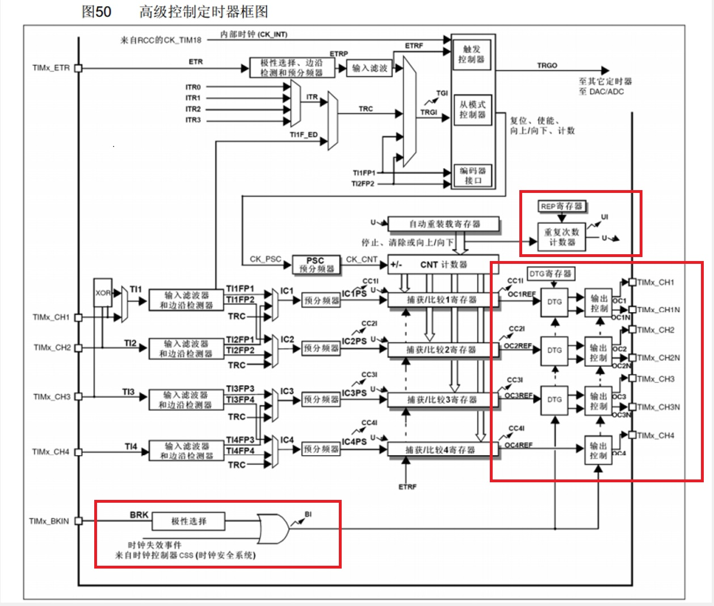
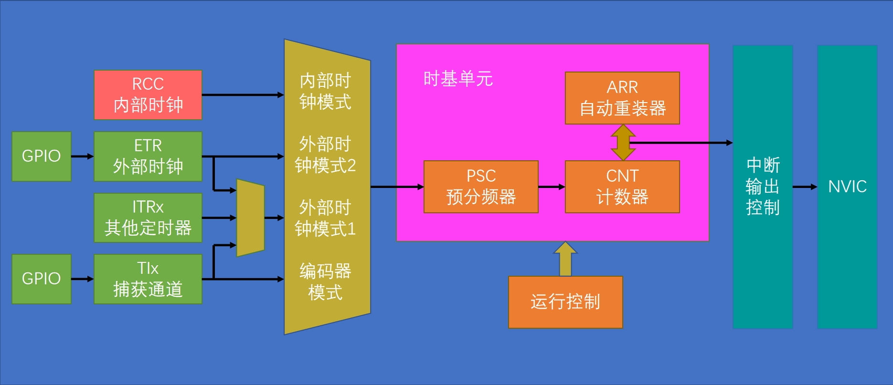
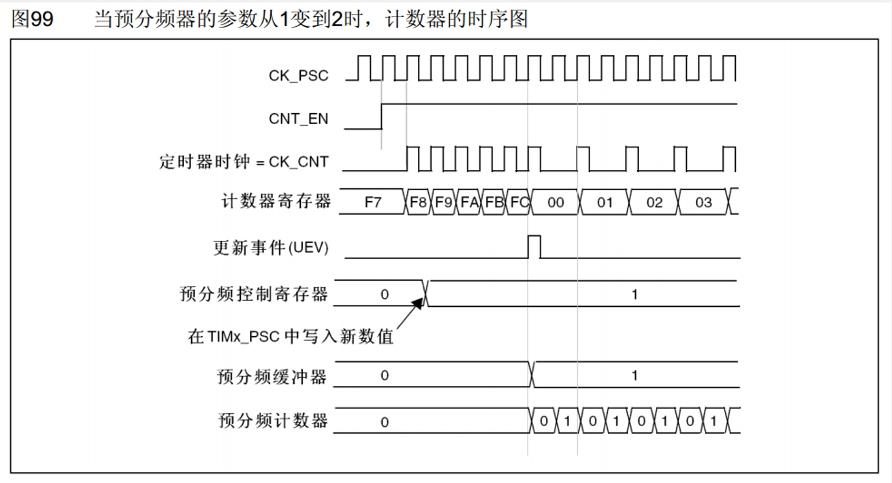

**TIM简介**  
- 定时器可以对输入的时钟进行计数，并在计数值达到设定值时触发中断  
- 16位计数器、预分频器、自动重装寄存器的时基单元，在72MHz计数时钟下可以实现最大59.65s的定时
- 不仅具备基本的定时中断功能，而且还包含内外时钟源选择、输入捕获、输出比较、编码器接口、主从触发模式等多种功能
- 根据复杂度和应用场景分为了高级定时器、通用定时器、基本定时器三种类型

**定时器类型**  

<table>
  <tbody>
    <tr>
      <td>类型</td>
      <td>编号</td>
      <td>总线</td>
      <td>功能</td>
    </tr>
    <tr>
      <td>高级定时器</td>
      <td>TIM1、TIM8</td>
      <td>APB2</td>
      <td>拥有通用定时器全部功能，并额外具有重复计数器、死区生成、 互补输出、刹车输入等功能</td>
    </tr>
    <tr>
      <td>通用定时器</td>
      <td>TIM2、TIM3、 TIM4、TIM5 </td>
      <td>APB1</td>
      <td>拥有基本定时器全部功能，并额外具有内外时钟源选择、输入捕获、 输出比较、编码器接口、主从触发模式等功能</td>
    </tr>
    <tr>
      <td>基本定时器</td>
      <td>TIM6、TIM7 </td>
      <td>APB1</td>
      <td>拥有定时中断、主模式触发DAC的功能</td>
    </tr>
  </tbody>
  <colgroup>
    <col style="width: 13.8889%;">
    <col style="width: 15.2222%;">
    <col style="width: 10.8889%;">
    <col style="width: 60%;">
  </colgroup>
</table>

>STM32F103C8T6定时器资源：TIM1、TIM2、TIM3、TIM4

**基本定时器框图**  

  

PCS预分频器、自动重装载寄存器、CNT计时器构成了最基本的计时计数电路，这部分电路也称时基单元。  
基本定时器时钟只能选择内部时钟，频率一般是系统主频72Mhz。  
1. 预分频器寄存器写 $0$ 则为不分频，写 $1$ 则为 $2$ 分频，输出频率 $= 72/2 = 36Mhz$ 。以此类推，值为 $x$ 则为 $x+1$ 分频，分频后的频率为 $72/(x+1)Mhz$ 。
该分频器为16位，最大值为 ${2}^ {16}-1=65535$ ,最大分频系数为 $65536$ 。
2. 计数器可以对分频后的时钟进行计数，每遇到一个上升沿，计数器+1。该计数器为16为，最大计数值为65535。
3. 自动重装载寄存器存储我们的计数目标，该寄存器也为16位，可存储的最大值为65535。当计数器递增至等于自动重装值时，达到计时时间。此时产生中断信号(图中所示UI)，并清零计数器，自动开始下一次计数计时。
   这种计数值等于自动重装值产生的中断，称为"更新中断"。

**通用定时器框图**  

  

相比于基本定时器，通用定时器主要多出的功能为"内外时钟源选择"(上半部分所示)和"输入捕获和输出比较"(下半部分所示)。  

**高级定时器框图**  

  

**定时中断基本结构**  

  

**预分频器时序**  

  

>预分频缓冲器(或称影子寄存器)才是真正起作用的寄存器。  
