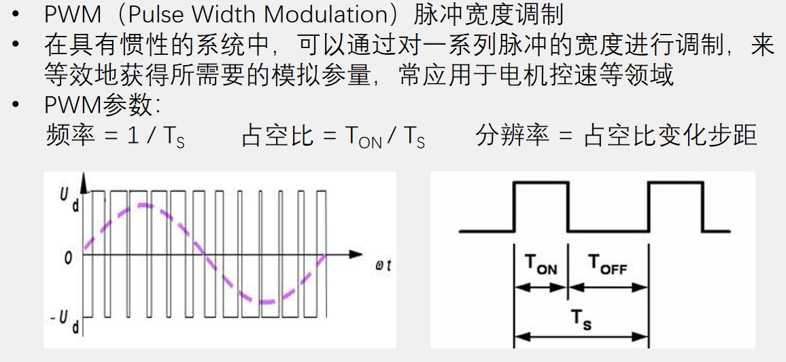
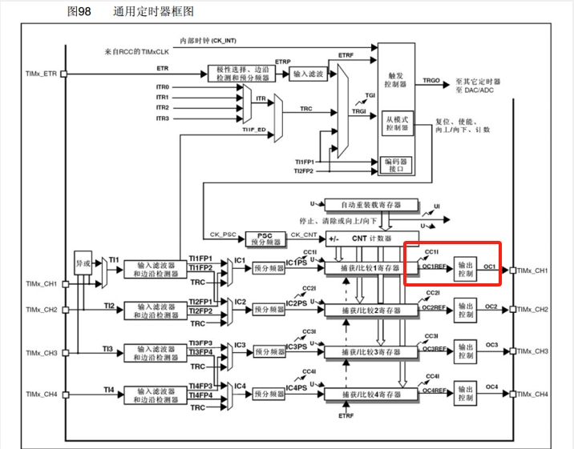

**输出比较简介**  
- 输出比较可以通过比较CNT与CCR寄存器值的关系，来对输出电平进行置1、置0或翻转的操作，用于输出一定频率和占空比的PWM波形  
- 每个高级定时器和通用定时器都拥有4个输出比较通道  
- 高级定时器的前3个通道额外拥有死区生成和互补输出的功能

**PWM简介**  

**通用定时器输出比较电路**  

  
该部分电路对应通用定时器的如下部分  

  
