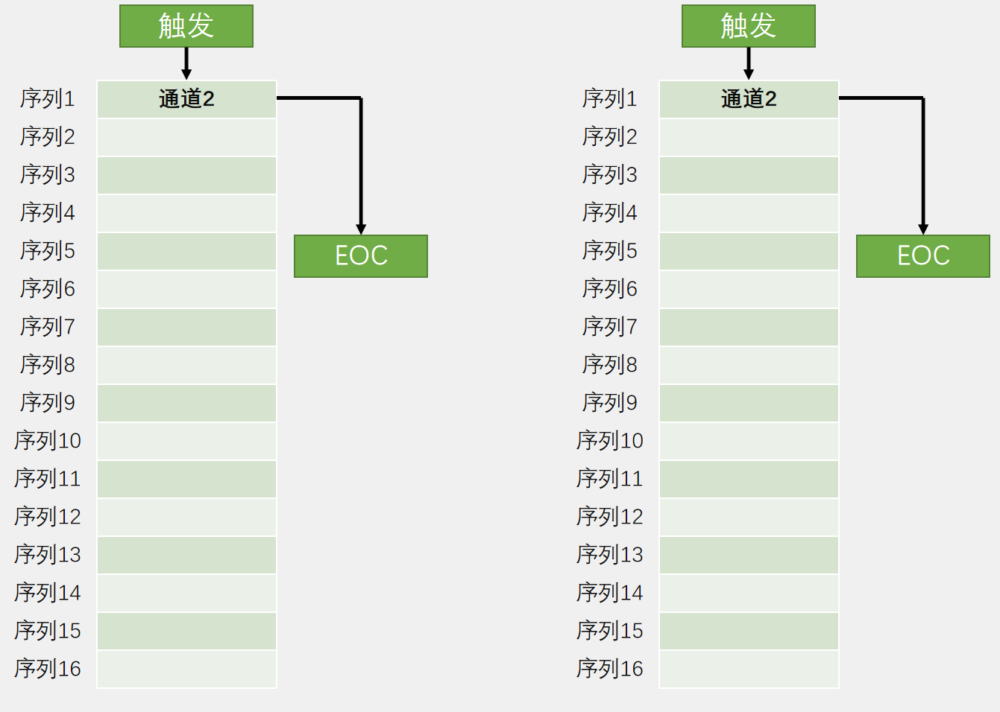
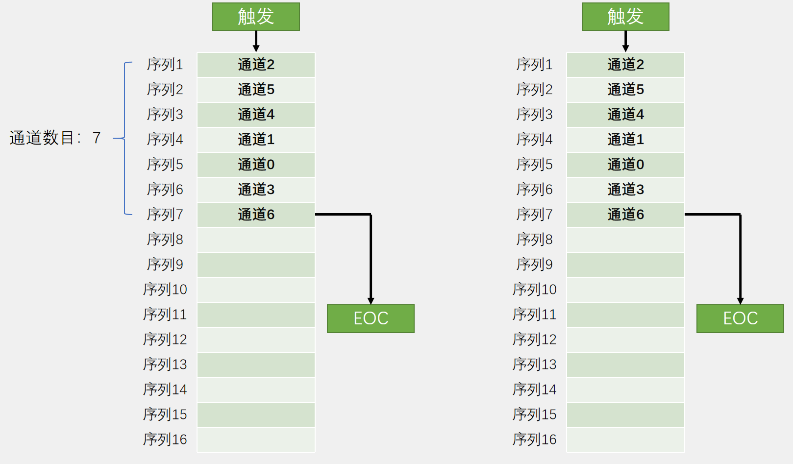
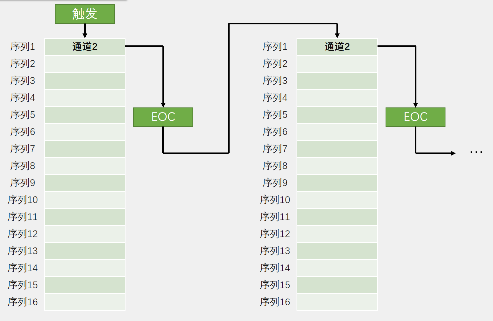
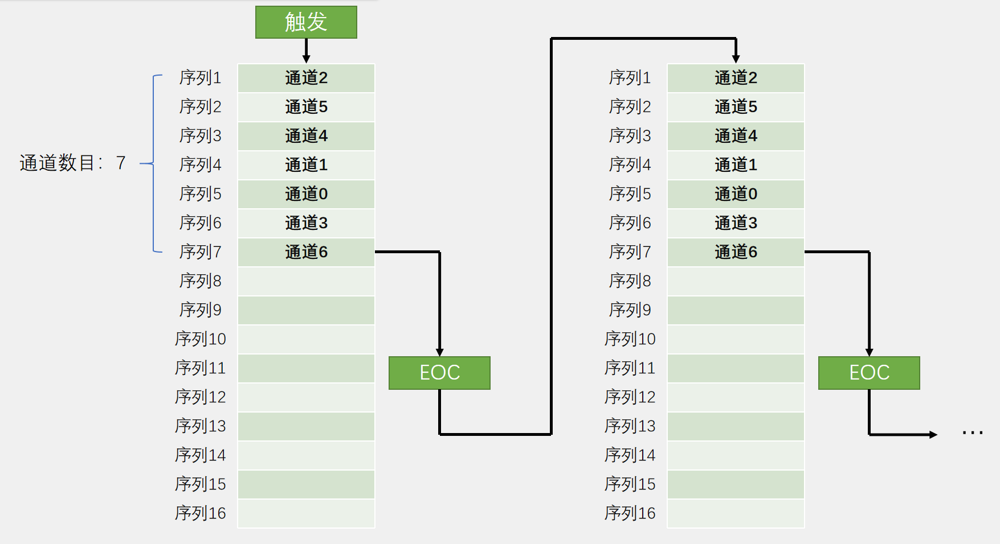
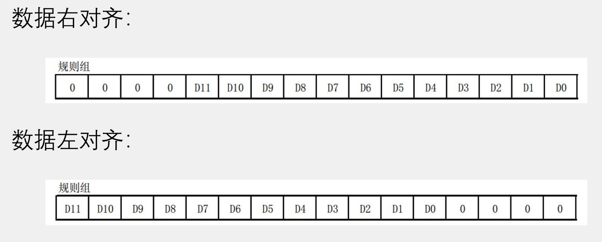
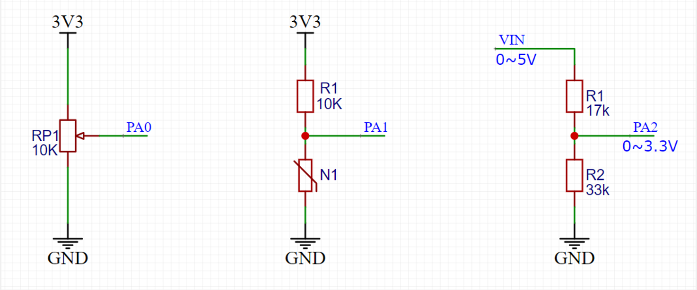

### 5.1 ADC简介  
- ADC（Analog-Digital Converter）模拟-数字转换器  
- ADC可以将引脚上连续变化的模拟电压转换为内存中存储的数字变量，建立模拟电路到数字电路的桥梁  
- 12位逐次逼近型ADC，1us转换时间  
- 输入电压范围：0 ~ 3.3V，转换结果范围：0~4095  
- 18个输入通道，可测量16个外部和2个内部信号源  
- 规则组和注入组两个转换单元  
- 模拟看门狗自动监测输入电压范围  

>STM32F103C8T6 ADC资源：ADC1、ADC2，10个外部输入通道  

### 5.2 逐次逼近型ADC介绍  
<div></div>  

CLOCK为该ADC时钟，当开始标志START有效时，对输入的某路信号和参考电压 ${V}_ {ref}$ 进行比较。通过逐次比较的方法得到与 ${V}_ {ref(+)}$ 最接近的电压(二进制形式)。
当转换完成时，置位EOC并输出转换结果。  

### 5.3 STM32ADC外设框图  
<div></div>  
<br/>

stm32ADC模块基本原理与逐次逼近型ADC相同。  
- **规则组与注入组：**  
规则组一次可以选择16个通道，但是转换结果寄存器只有一个。如果未及时取出转换结果，新数据会覆盖旧数据。一般配合DMA使用。  
注入组一次可以选择4个通道，有4个转换结果寄存器，不用担心数据覆盖。

- **触发源：**  
左下部分的外围电路为触发ADC采样的来源。分为硬件触发和软件触发，即为逐次逼近型ADC中START信号的来源。
硬件触发源一般来自定时器。**为避免频繁进中断，可选择触发源为定时器的TRGO输出，当定时器产生更新事件时，自动触发ADC转换。**  

- **时钟CLOCK**
ADC时钟来自APB2时钟经ADC预分频器分频后的时钟，且最大为14Mhz。分频系数可选择2,4,6,8。实际只能选择6和8(另外两个分频后大于14Mhz)。

### 5.4 ADC规则组的转换模式  
1. 单次转换，非扫描模式
<div></div>  

2. 单次转换，扫描模式
<div></div>  

3. 连续转换，非扫描模式
<div></div>  

4. 连续转换，扫描模式
<div></div>  

### 5.5 数据对齐  
由于ADC为12位，数据寄存器为16位，所以需要考虑数据对齐。  
<div></div>  

### 5.6 采样时间  

- AD转换的步骤：采样，保持，量化，编码

- STM32 ADC的总转换时间为：  
${T}_ {CONV}$ = 采样时间 + 12.5个ADC周期

- 例如：当ADCCLK = 14MHz，采样时间为1.5个ADC周期  
${T}_ {CONV}$ = 1.5 + 12.5 = 14个ADC周期 = 1μs  

### 5.7 校准  
- ADC有一个内置自校准模式。校准可大幅减小因内部电容器组的变化而造成的准精度误差。校准期间，在每个电容器上都会计算出一个误差修正码(数字值)，这个码用于消除在随后的转换中每个电容器上产生的误差

- 建议在每次上电后执行一次校准

- 启动校准前， ADC必须处于关电状态超过至少两个ADC时钟周期

### 5.8外围硬件电路  
<div></div>  

### 5.9 AD单通道单次非扫描代码
main.c  
```cpp
#include "stm32f10x.h"                  // Device header
#include "Delay.h"
#include "OLED.h"
#include "AD.h"

uint16_t ADValue;
float Voltage;

int main(void)
{
	OLED_Init();
	AD_Init();
	
	OLED_ShowString(1, 1, "ADValue:");
	OLED_ShowString(2, 1, "Volatge:0.00V");
	
	while (1)
	{
		ADValue = AD_GetValue();
		Voltage = (float)ADValue / 4095 * 3.3;
		
		OLED_ShowNum(1, 9, ADValue, 4);
		OLED_ShowNum(2, 9, Voltage, 1);
		OLED_ShowNum(2, 11, (uint16_t)(Voltage * 100) % 100, 2);
		
		Delay_ms(100);
	}
}
```
AD.h  
```cpp
#ifndef __AD_H
#define __AD_H

void AD_Init(void);
uint16_t AD_GetValue(void);

#endif
```
AD.c  
```cpp
#include "stm32f10x.h"                  // Device header

void AD_Init(void)
{
	RCC_APB2PeriphClockCmd(RCC_APB2Periph_ADC1, ENABLE);
	RCC_APB2PeriphClockCmd(RCC_APB2Periph_GPIOA, ENABLE);
	
	RCC_ADCCLKConfig(RCC_PCLK2_Div6);
	
	GPIO_InitTypeDef GPIO_InitStructure;
	GPIO_InitStructure.GPIO_Mode = GPIO_Mode_AIN;
	GPIO_InitStructure.GPIO_Pin = GPIO_Pin_0;
	GPIO_InitStructure.GPIO_Speed = GPIO_Speed_50MHz;
	GPIO_Init(GPIOA, &GPIO_InitStructure);
	
	ADC_RegularChannelConfig(ADC1, ADC_Channel_0, 1, ADC_SampleTime_55Cycles5);
	
	ADC_InitTypeDef ADC_InitStructure;
	ADC_InitStructure.ADC_Mode = ADC_Mode_Independent;
	ADC_InitStructure.ADC_DataAlign = ADC_DataAlign_Right;
	ADC_InitStructure.ADC_ExternalTrigConv = ADC_ExternalTrigConv_None;
	ADC_InitStructure.ADC_ContinuousConvMode = DISABLE;
	ADC_InitStructure.ADC_ScanConvMode = DISABLE;
	ADC_InitStructure.ADC_NbrOfChannel = 1;
	ADC_Init(ADC1, &ADC_InitStructure);
	
	ADC_Cmd(ADC1, ENABLE);
	
	ADC_ResetCalibration(ADC1);
	while (ADC_GetResetCalibrationStatus(ADC1) == SET);
	ADC_StartCalibration(ADC1);
	while (ADC_GetCalibrationStatus(ADC1) == SET);
}

uint16_t AD_GetValue(void)
{
	ADC_SoftwareStartConvCmd(ADC1, ENABLE);
	while (ADC_GetFlagStatus(ADC1, ADC_FLAG_EOC) == RESET);
	return ADC_GetConversionValue(ADC1);
}

```
