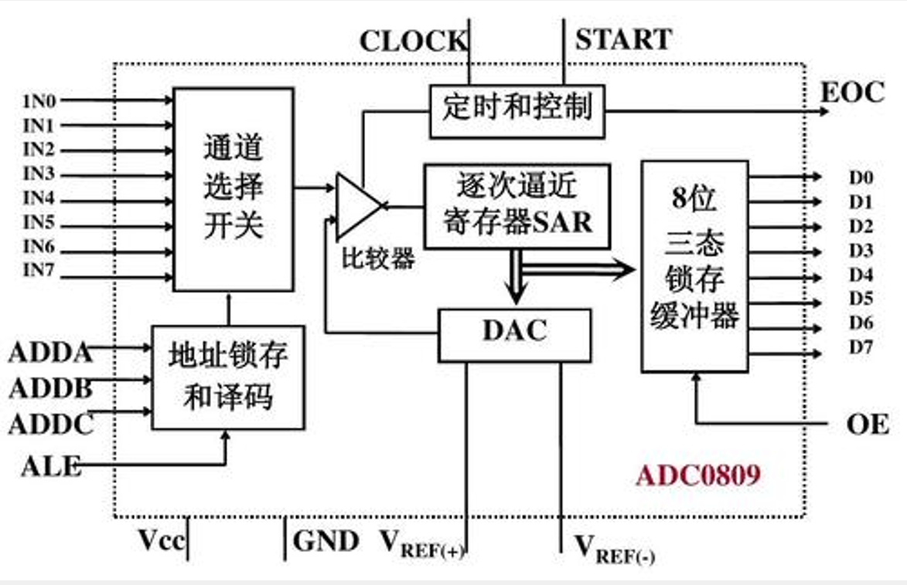
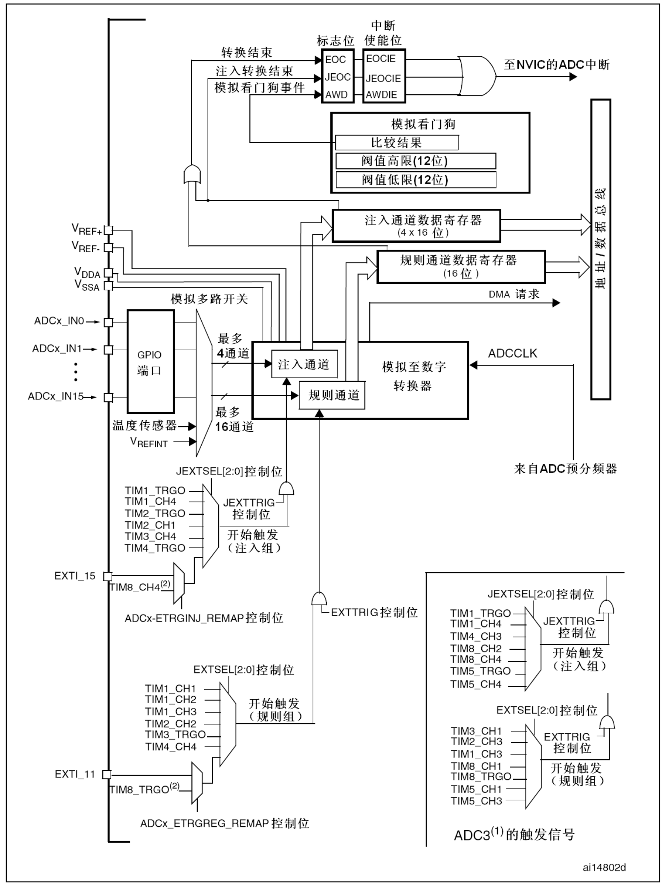

### ADC简介  
- ADC（Analog-Digital Converter）模拟-数字转换器  
- ADC可以将引脚上连续变化的模拟电压转换为内存中存储的数字变量，建立模拟电路到数字电路的桥梁  
- 12位逐次逼近型ADC，1us转换时间  
- 输入电压范围：0 ~ 3.3V，转换结果范围：0~4095  
- 18个输入通道，可测量16个外部和2个内部信号源  
- 规则组和注入组两个转换单元  
- 模拟看门狗自动监测输入电压范围  

>STM32F103C8T6 ADC资源：ADC1、ADC2，10个外部输入通道  

**逐次逼近型ADC介绍**  

  

CLOCK为该ADC时钟，当开始标志START有效时，对输入的某路信号和参考电压 ${V}_ {ref}$ 进行比较。通过逐次比较的方法得到与 ${V}_ {ref(+)}$ 最接近的电压(二进制形式)。
当转换完成时，置位EOC并输出转换结果。  

**STM32ADC外设框图**  

  

stm32ADC模块基本原理与逐次逼近型ADC相同。  
- **规则组与注入组：**  
规则组一次可以选择16个通道，但是转换结果寄存器只有一个。如果未及时取出转换结果，新数据会覆盖旧数据。一般配合DMA使用。  
注入组一次可以选择4个通道，有4个转换结果寄存器，不用担心数据覆盖。  
- **外围电路：**  
左下部分的外围电路为触发ADC采样的来源。分为硬件触发和软件触发，即为逐次逼近型ADC中START信号的来源。
硬件触发源一般来自定时器。**为避免频繁进中断，可选择触发源为定时器的TRGO输出，当定时器产生更新事件时，自动触发ADC转换。**  

