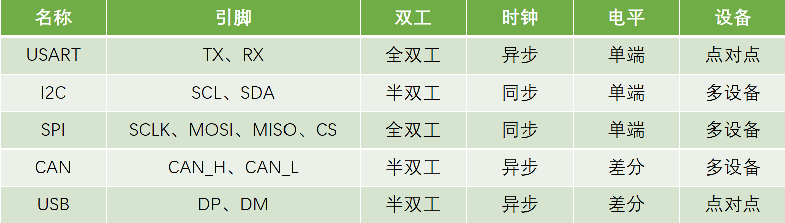
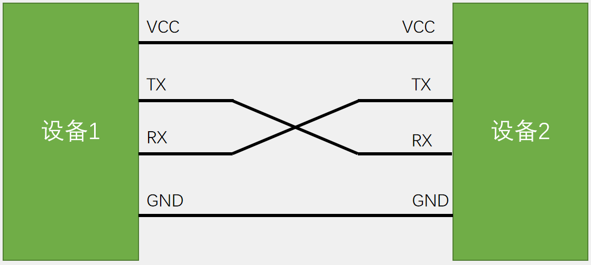
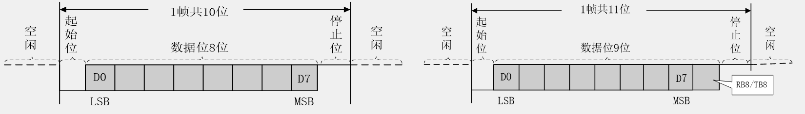
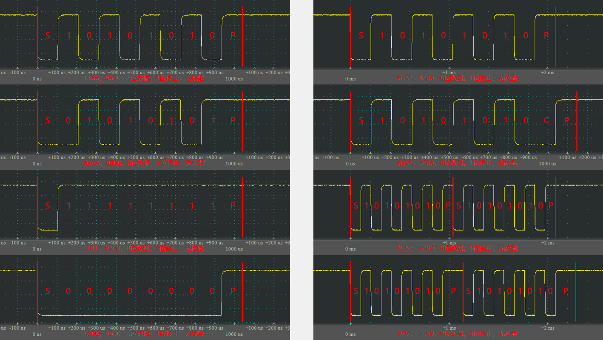

# 1.通信接口
 - 通信的目的：将一个设备的数据传送到另一个设备，扩展硬件系统。
 - 通信协议：制定通信的规则，通信双方按照协议规则进行数据收发。

以下是STM32F103C8T6支持的通信协议：

>全双工：可以同时收发 
>半双工：同一时刻只能收或发 
>单工：只支持收或者发 

# 2.串口通信
- 串口是一种应用十分广泛的通讯接口，串口成本低、容易使用、通信线路简单，可实现两个设备的互相通信。
- 单片机的串口可以使单片机与单片机、单片机与电脑、单片机与各式各样的模块互相通信，极大地扩展了单片机的应用范围，增强了单片机系统的硬件实力。

# 3.硬件电路
- 简单双向串口通信有两根通信线（发送端TX和接收端RX）
- TX与RX要交叉连接
- 当只需单向的数据传输时，可以只接一根通信线
- 当电平标准不一致时，需要加电平转换芯片

# 4.电平标准
- 电平标准是数据1和数据0的表达方式，是传输线缆中人为规定的电压与数据的对应关系，串口常用的电平标准有如下三种：

- TTL电平：+3.3V或+5V表示1，0V表示0
- RS232电平：-3~-15V表示1，+3~+15V表示0
- RS485电平：两线压差+2~+6V表示1，-2~-6V表示0（差分信号）

# 5.串口参数及时序
- 波特率：串口通信的速率
- 起始位：标志一个数据帧的开始，固定为低电平
- 数据位：数据帧的有效载荷，1为高电平，0为低电平，低位先行
- 校验位：用于数据验证，根据数据位计算得来
- 停止位：用于数据帧间隔，固定为高电平

>奇校验：保证1的个数为奇数。如数据为00001111，则校验位为1；如果数据为00001110，则校验位为0。 
>偶校验：保证1的个数为偶数。如数据为00001111，则校验位为0；如果数据为00001110，则校验位为1。 

# 6.串口实际波形演示

