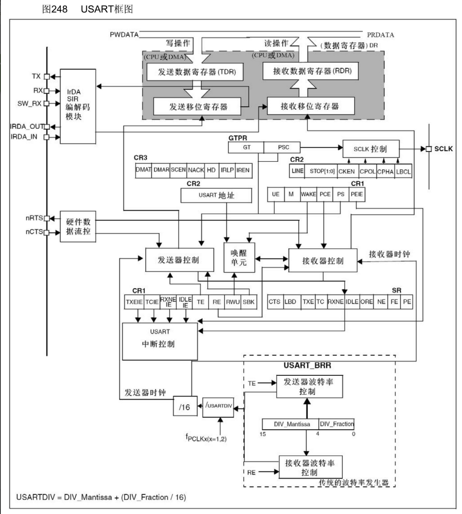
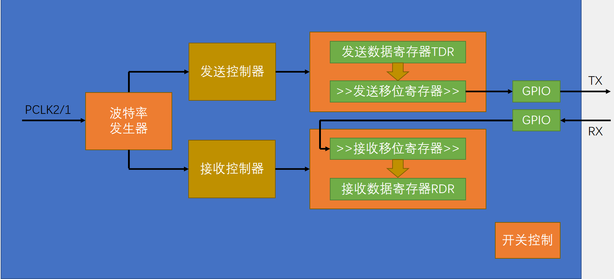
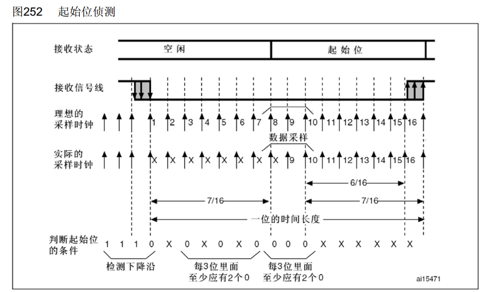
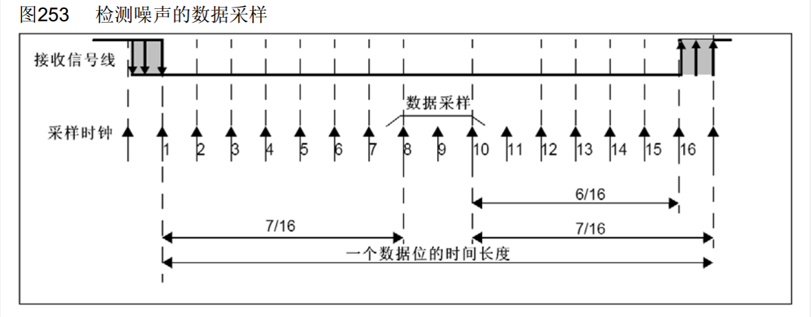
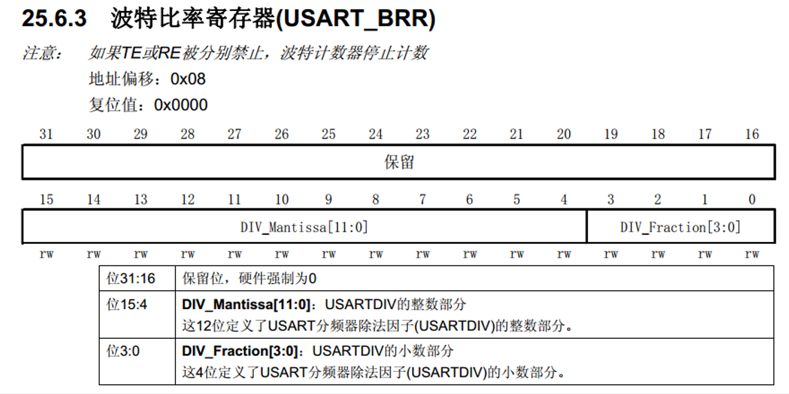

# 1.USART简介
- USART（Universal Synchronous/Asynchronous Receiver/Transmitter）通用同步/异步收发器
- USART是STM32内部集成的硬件外设，可根据数据寄存器的一个字节数据自动生成数据帧时序，从TX引脚发送出去，也可自动接收RX引脚的数据帧时序，拼接为一个字节数据，存放在数据寄存器里
- 自带波特率发生器，最高达4.5Mbits/s
- 可配置数据位长度（8/9）、停止位长度（0.5/1/1.5/2）
- 可选校验位（无校验/奇校验/偶校验）
- 支持同步模式、硬件流控制、DMA、智能卡、IrDA、LIN

>STM32F103C8T6 USART资源： USART1、 USART2、 USART3

# 2.USART框图

# 3.USART基本结构

# 4.起始位侦测和数据采样

>- 接收数据时，使用波特率的16倍频时钟对数据进行采样，当检测到下降沿后，后续进行的六次采样需至少保证每三次中有两个0，才认为检测到了起始位。如果三次采样中有1个1，会置噪声标志位。 
>- 数据的采样在第8、9、10次，尽量位于一位的中间时刻，防止边沿造成影响。 

# 5.波特率发生器
- 发送器和接收器的波特率由波特率寄存器BRR里的DIV确定 
- 计算公式：波特率 = fPCLK2/1 / (16 * DIV) 

