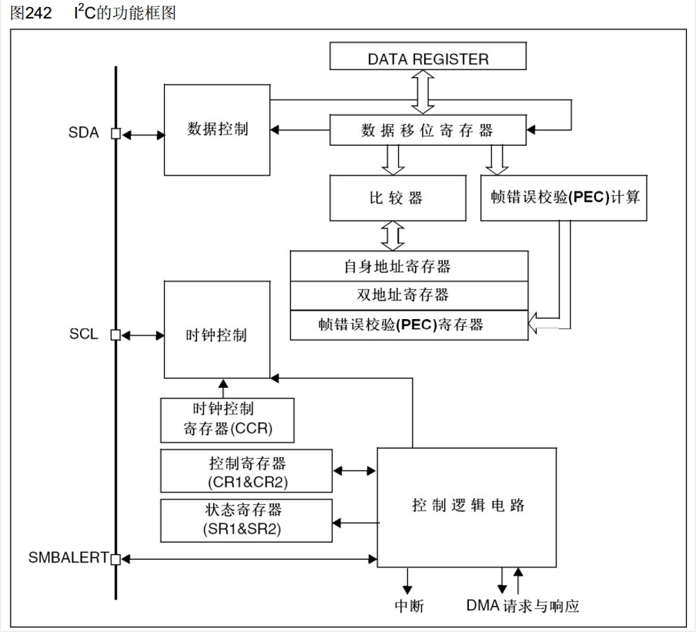
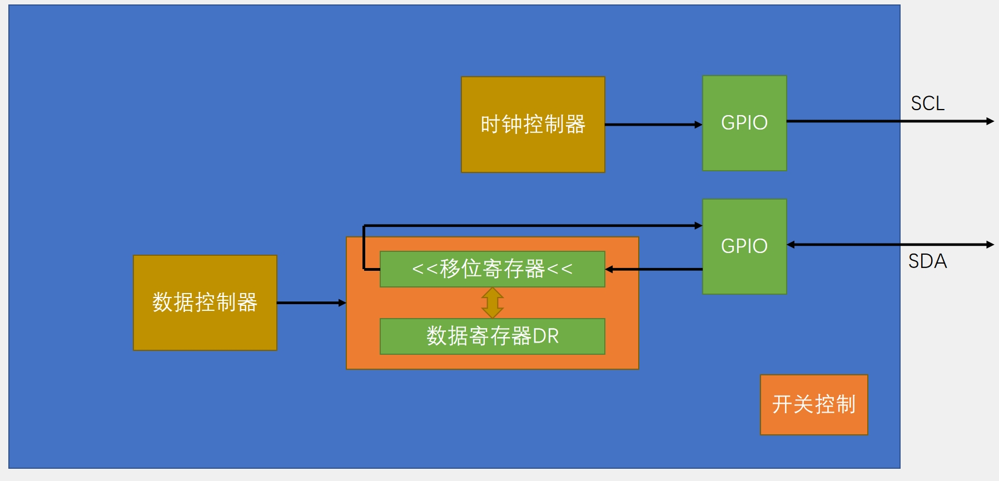
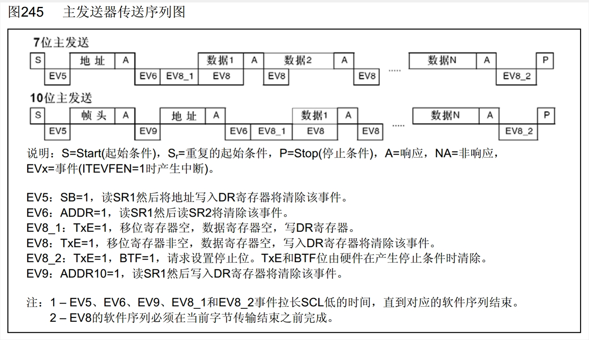
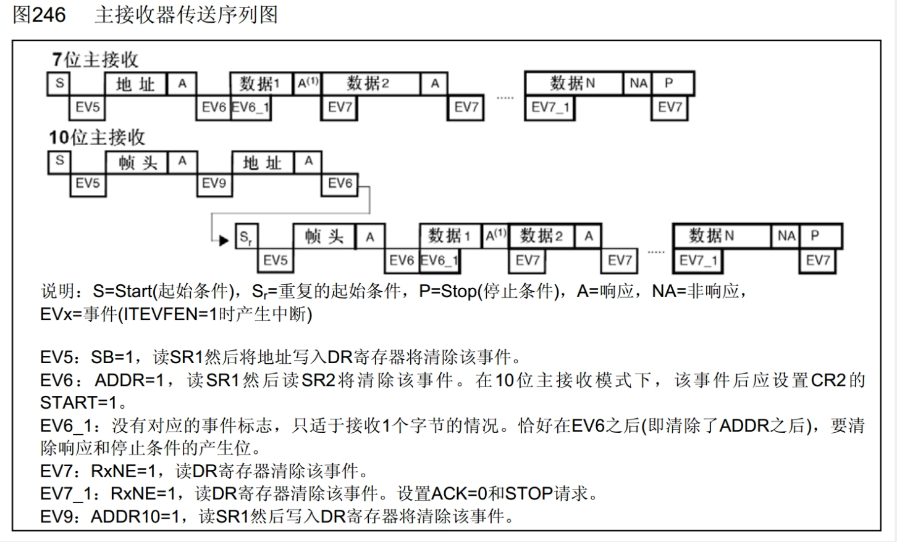
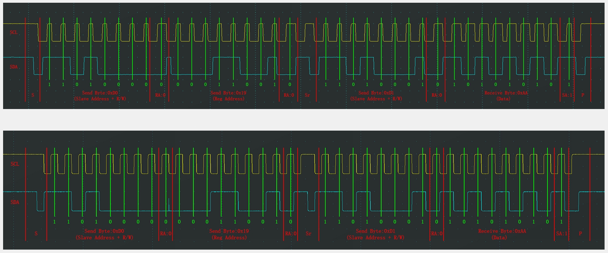

## 1 I2C外设简介
- STM32内部集成了硬件I2C收发电路，可以由硬件自动执行时钟生成、起始终止条件生成、应答位收发、数据收发等功能，减轻CPU的负担
- 支持多主机模型
- 支持7位/10位地址模式
- 支持不同的通讯速度，标准速度(高达100 kHz)，快速(高达400 kHz)
- 支持DMA
- 兼容SMBus协议

>STM32F103C8T6 硬件I2C资源：I2C1、I2C2

## 2 I2C框图
<br/>
<div></div>
<br/>

>- 要发送数据时，将数据放入DR寄存器，当数据移位寄存器空闲时，便会将DR寄存器的值挪到数据移位寄存器中，进而发送出去。移位过程中便可将下一个数据放入DR中。
当将DR内的数据放入数据移位寄存器时，便会置 $\color{orange}{发送寄存器为空标志位TXE}$ 。  
>- 接收数据时数据经由SDA挪到数据移位寄存器，当一个字节的数据收齐之后，整体会被挪到DR中，然后置 $\color{orange}{发送寄存器非空标志位RXNE}$ 。此时便可从DR中读取数据。  

## 2 I2C基本结构
<br/>
<div></div>
<br/>

##  接收发送流程及软硬件波形对比
**主机发送：**  
<br/>
<div></div>
<br/>

**主机接收：**  
<br/>
<div></div>
<br/>

>主机发送和就收的流程基本和8.1节的波形流程一致。  

**软硬件波形对比：**  
<br/>
<div></div>
<br/>

>软件模拟的时序不如硬件的规整。而且硬件向SDA放数据基本在时钟上升沿进行，读取数据基本在时钟下降沿进行。

## 3 硬件I2C读MPU6050代码
**main.c**
```cpp
#include "stm32f10x.h"                  // Device header
#include "Delay.h"
#include "OLED.h"
#include "MPU6050.h"

uint8_t ID;
int16_t AX, AY, AZ, GX, GY, GZ;

int main(void)
{
    OLED_Init();
    MPU6050_Init();
    
    OLED_ShowString(1, 1, "ID:");
    ID = MPU6050_GetID();
    OLED_ShowHexNum(1, 4, ID, 2);
    
    while (1)
    {
        MPU6050_GetData(&AX, &AY, &AZ, &GX, &GY, &GZ);
        OLED_ShowSignedNum(2, 1, AX, 5);
        OLED_ShowSignedNum(3, 1, AY, 5);
        OLED_ShowSignedNum(4, 1, AZ, 5);
        OLED_ShowSignedNum(2, 8, GX, 5);
        OLED_ShowSignedNum(3, 8, GY, 5);
        OLED_ShowSignedNum(4, 8, GZ, 5);
    }
}

```
**MPU6050.h**
```cpp
#ifndef __MPU6050_H
#define __MPU6050_H

void MPU6050_WriteReg(uint8_t RegAddress, uint8_t Data);
uint8_t MPU6050_ReadReg(uint8_t RegAddress);

void MPU6050_Init(void);
uint8_t MPU6050_GetID(void);
void MPU6050_GetData(int16_t *AccX, int16_t *AccY, int16_t *AccZ, 
                        int16_t *GyroX, int16_t *GyroY, int16_t *GyroZ);

#endif

```
**MPU6050.c**
```cpp
#include "stm32f10x.h"                  // Device header
#include "MPU6050_Reg.h"

#define MPU6050_ADDRESS        0xD0

/*带超时退出机制的事件等待函数*/
void MPU6050_WaitEvent(I2C_TypeDef* I2Cx, uint32_t I2C_EVENT)
{
    uint32_t Timeout;
    Timeout = 10000;
    while (I2C_CheckEvent(I2Cx, I2C_EVENT) != SUCCESS)
    {
        Timeout --;
        if (Timeout == 0)
        {
            break;
        }
    }
}

/*指定地址写时序*/
void MPU6050_WriteReg(uint8_t RegAddress, uint8_t Data)
{
    //起始位
    I2C_GenerateSTART(I2C2, ENABLE);
    MPU6050_WaitEvent(I2C2, I2C_EVENT_MASTER_MODE_SELECT);

    //设备地址+写
    I2C_Send7bitAddress(I2C2, MPU6050_ADDRESS, I2C_Direction_Transmitter);
    MPU6050_WaitEvent(I2C2, I2C_EVENT_MASTER_TRANSMITTER_MODE_SELECTED);

    //寄存器地址
    I2C_SendData(I2C2, RegAddress);
    MPU6050_WaitEvent(I2C2, I2C_EVENT_MASTER_BYTE_TRANSMITTING);

    //数据
    I2C_SendData(I2C2, Data);
    MPU6050_WaitEvent(I2C2, I2C_EVENT_MASTER_BYTE_TRANSMITTED);

    //停止位
    I2C_GenerateSTOP(I2C2, ENABLE);
}

/*指定地址读时序*/
uint8_t MPU6050_ReadReg(uint8_t RegAddress)
{
    uint8_t Data;

    //起始位
    I2C_GenerateSTART(I2C2, ENABLE);
    MPU6050_WaitEvent(I2C2, I2C_EVENT_MASTER_MODE_SELECT);

    //设备地址+写
    I2C_Send7bitAddress(I2C2, MPU6050_ADDRESS, I2C_Direction_Transmitter);
    MPU6050_WaitEvent(I2C2, I2C_EVENT_MASTER_TRANSMITTER_MODE_SELECTED);

    //寄存器地址
    I2C_SendData(I2C2, RegAddress);
    MPU6050_WaitEvent(I2C2, I2C_EVENT_MASTER_BYTE_TRANSMITTED);

    //起始位
    I2C_GenerateSTART(I2C2, ENABLE);
    MPU6050_WaitEvent(I2C2, I2C_EVENT_MASTER_MODE_SELECT);

    //设备地址+读
    I2C_Send7bitAddress(I2C2, MPU6050_ADDRESS, I2C_Direction_Receiver);
    MPU6050_WaitEvent(I2C2, I2C_EVENT_MASTER_RECEIVER_MODE_SELECTED);

    //发送非应答+停止位，注意这两个时序要在接收最后一字节数据之前
    I2C_AcknowledgeConfig(I2C2, DISABLE);
    I2C_GenerateSTOP(I2C2, ENABLE);

    //等待接收完成+读数据
    MPU6050_WaitEvent(I2C2, I2C_EVENT_MASTER_BYTE_RECEIVED);
    Data = I2C_ReceiveData(I2C2);

    //将应答位复位为默认应答
    I2C_AcknowledgeConfig(I2C2, ENABLE);
    
    return Data;
}

void MPU6050_Init(void)
{
    RCC_APB1PeriphClockCmd(RCC_APB1Periph_I2C2, ENABLE);
    RCC_APB2PeriphClockCmd(RCC_APB2Periph_GPIOB, ENABLE);
    
    GPIO_InitTypeDef GPIO_InitStructure;
    GPIO_InitStructure.GPIO_Mode = GPIO_Mode_AF_OD;
    GPIO_InitStructure.GPIO_Pin = GPIO_Pin_10 | GPIO_Pin_11;
    GPIO_InitStructure.GPIO_Speed = GPIO_Speed_50MHz;
    GPIO_Init(GPIOB, &GPIO_InitStructure);
    
    I2C_InitTypeDef I2C_InitStructure;
    I2C_InitStructure.I2C_Mode = I2C_Mode_I2C;
    I2C_InitStructure.I2C_ClockSpeed = 50000;
    I2C_InitStructure.I2C_DutyCycle = I2C_DutyCycle_2;
    I2C_InitStructure.I2C_Ack = I2C_Ack_Enable;
    I2C_InitStructure.I2C_AcknowledgedAddress = I2C_AcknowledgedAddress_7bit;
    I2C_InitStructure.I2C_OwnAddress1 = 0x00;
    I2C_Init(I2C2, &I2C_InitStructure);
    
    I2C_Cmd(I2C2, ENABLE);
    
    MPU6050_WriteReg(MPU6050_PWR_MGMT_1, 0x01);
    MPU6050_WriteReg(MPU6050_PWR_MGMT_2, 0x00);
    MPU6050_WriteReg(MPU6050_SMPLRT_DIV, 0x09);
    MPU6050_WriteReg(MPU6050_CONFIG, 0x06);
    MPU6050_WriteReg(MPU6050_GYRO_CONFIG, 0x18);
    MPU6050_WriteReg(MPU6050_ACCEL_CONFIG, 0x18);
}

uint8_t MPU6050_GetID(void)
{
    return MPU6050_ReadReg(MPU6050_WHO_AM_I);
}

void MPU6050_GetData(int16_t *AccX, int16_t *AccY, int16_t *AccZ, 
                        int16_t *GyroX, int16_t *GyroY, int16_t *GyroZ)
{
    uint8_t DataH, DataL;
    
    DataH = MPU6050_ReadReg(MPU6050_ACCEL_XOUT_H);
    DataL = MPU6050_ReadReg(MPU6050_ACCEL_XOUT_L);
    *AccX = (DataH << 8) | DataL;
    
    DataH = MPU6050_ReadReg(MPU6050_ACCEL_YOUT_H);
    DataL = MPU6050_ReadReg(MPU6050_ACCEL_YOUT_L);
    *AccY = (DataH << 8) | DataL;
    
    DataH = MPU6050_ReadReg(MPU6050_ACCEL_ZOUT_H);
    DataL = MPU6050_ReadReg(MPU6050_ACCEL_ZOUT_L);
    *AccZ = (DataH << 8) | DataL;
    
    DataH = MPU6050_ReadReg(MPU6050_GYRO_XOUT_H);
    DataL = MPU6050_ReadReg(MPU6050_GYRO_XOUT_L);
    *GyroX = (DataH << 8) | DataL;
    
    DataH = MPU6050_ReadReg(MPU6050_GYRO_YOUT_H);
    DataL = MPU6050_ReadReg(MPU6050_GYRO_YOUT_L);
    *GyroY = (DataH << 8) | DataL;
    
    DataH = MPU6050_ReadReg(MPU6050_GYRO_ZOUT_H);
    DataL = MPU6050_ReadReg(MPU6050_GYRO_ZOUT_L);
    *GyroZ = (DataH << 8) | DataL;
}

```

�
�
�
�
�
�
�
�
�
�
�
�
�
�
�
�
�
�
�
�
�
�
�
�
�
�
�
�
�
�
�
�
�
�
�
�
�
�
�
�
�
�
�
�
�
�
�
�
�
�
�
�
�
�
�
�
�
�
�
�
�