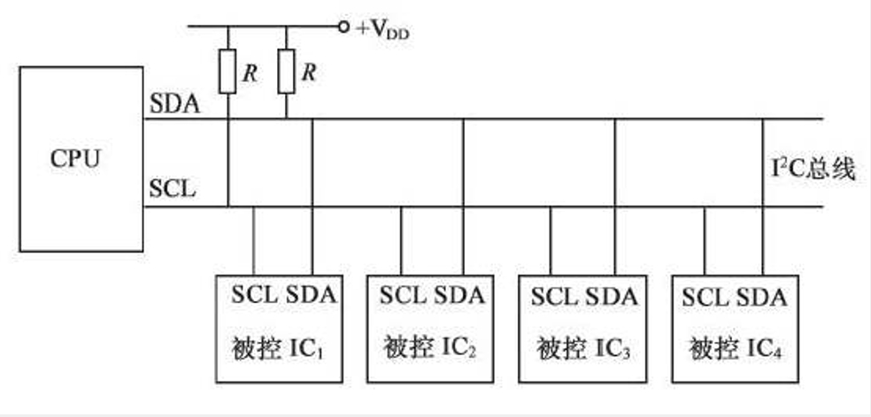
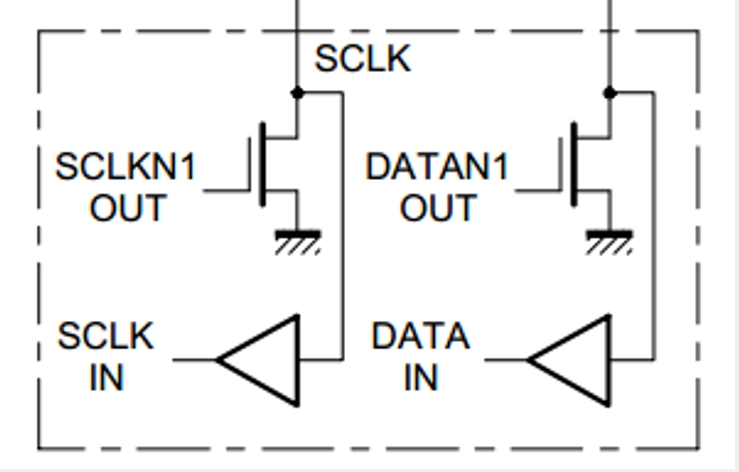
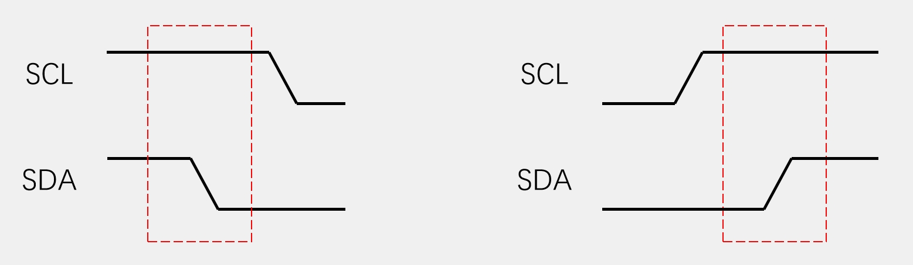
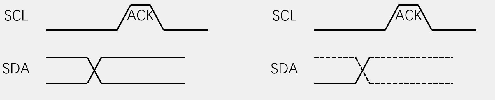
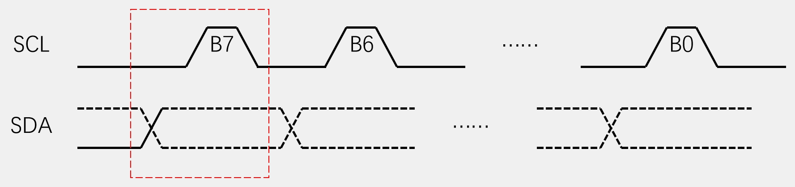
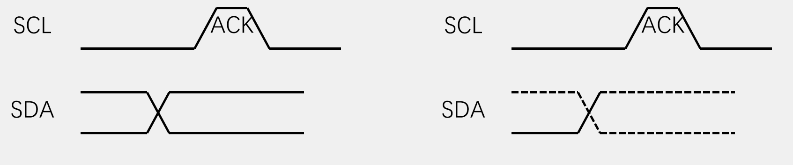
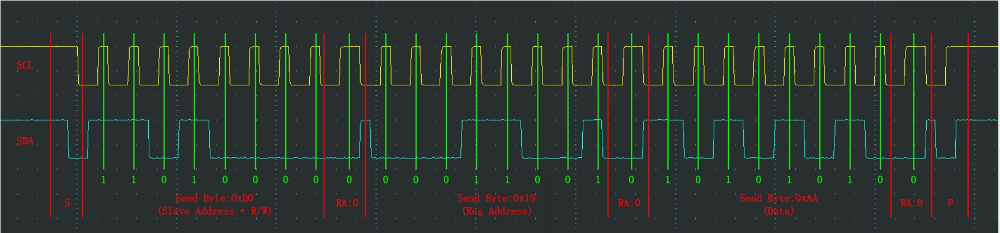
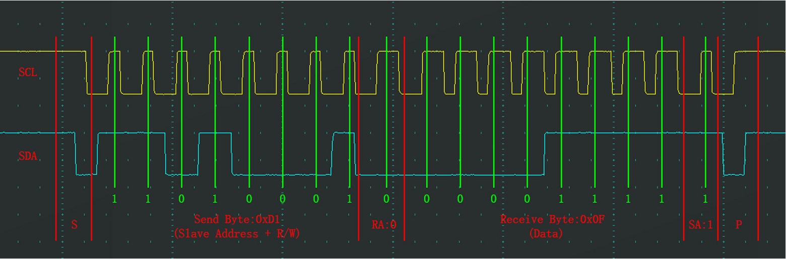

## 1 I2C简介
- I2C（Inter IC Bus）是由Philips公司开发的一种通用数据总线
- 两根通信线：SCL（Serial Clock）、SDA（Serial Data）
- 同步，半双工
- 带数据应答
- 支持总线挂载多设备（一主多从、多主多从）

## 2 硬件电路
<table border="0" margin-left: auto margin-right: auto>
  <tr>
     <td> </img></td>
     <td> </img></td>
  </tr>
</table>

- 所有I2C设备的SCL连在一起，SDA连在一起
- 设备的SCL和SDA均要配置成开漏输出模式
- SCL和SDA各添加一个上拉电阻，阻值一般为4.7KΩ左右
- 对于SCL线，主机(CPU)有绝对的控制权，从机不允许控制，在任何时候都只能被动地读取
- 对于SDA线，除从机应答、主机读取从机时有控制权，其余时候只能被动读取

## 3 I2C时序基本单元
### 3.1 起始和终止

- 起始条件：SCL高电平期间，SDA从高电平切换到低电平
- 终止条件：SCL高电平期间，SDA从低电平切换到高电平
- 一个完整的数据帧，总是以起始条件开始，以终止条件结束，起始和终止条件只能由主机产生

### 3.2 发送

- 发送一个字节：SCL低电平期间，主机将数据位依次放到SDA线上（高位先行），然后释放SCL，从机将在SCL高电平期间读取数据位，
所以SCL高电平期间SDA不允许有数据变化，依次循环上述过程8次，即可发送一个字节

### 3.3 接收

- 接收一个字节：SCL低电平期间，从机将数据位依次放到SDA线上（高位先行），然后释放SCL，主机将在SCL高电平期间读取数据位，
所以SCL高电平期间SDA不允许有数据变化，依次循环上述过程8次，即可接收一个字节（主机在接收之前，需要释放SDA）

### 3.4 应答

- 发送应答：主机在接收完一个字节之后，在下一个时钟发送一位数据，数据0表示应答，数据1表示非应答
- 接收应答：主机在发送完一个字节之后，在下一个时钟接收一位数据，判断从机是否应答，数据0表示应答，数据1表示非应答（主机在接收之前，需要释放SDA）

## 4 I2C时序
### 4.1 指定地址写

- 对于指定设备（Slave Address），在指定地址（Reg Address）下，写入指定数据（Data）
- 上面示例表示，主机往从机 $\color{orange}{1101 000}$ 的地址 $\color{orange}{0001 1001}$ 下 $\color{orange}{写入}$ 
(紧跟在设备ID后的一位，0:写，1:读)数据 $\color{orange}{10101010}$ ，  
每个字节后跟一应答位 $\color{orange}{RA}$ (0:有应答，1:无应答)
-  $\color{orange}{S}$ 表示起始条件， $\color{orange}{P}$ 表示结束条件

### 4.2 当前地址读

- 对于指定设备（Slave Address），在当前地址指针指示的地址下，读取从机数据（Data）
- 上面示例表示，主机往从机 $\color{orange}{1101 000}$ 当前地址 $\color{orange}{读取}$ 
(紧跟在设备ID后的一位，0:写，1:读)数据 $\color{orange}{0000 1111}$ ，  
每个字节后跟一应答位 $\color{orange}{RA}$ (0:有应答，1:无应答)
- 由于不能指定地址，从机返回的是其当前地址指针指向的数据

### 4.2 指定地址读

- 对于指定设备（Slave Address），在指定地址（Reg Address）下，读取从机数据（Data）
- 将指定地址写的时序舍弃掉写的数据，结合当前地址读的时序，就是指定地址读时序
- 将指定地址写的时序舍弃掉写入的数据，就是将地址指针指向指定地址
- 上面示例表示，主机往从机 $\color{orange}{1101 000}$ 的地址 $\color{orange}{0001 1001}$ 下 $\color{orange}{读取}$ 
(紧跟在设备ID后的一位，0:写，1:读)数据 $\color{orange}{10101010}$ ，  
每个字节后跟一应答位 $\color{orange}{RA}$ (0:有应答，1:无应答)

>如果想读取或写入多个字节，将读取数据部分或发送数据部分时序重复若干次即可，注意由于地址指针会自增1，则会读取或写入若干个连续的寄存器地址  
>主机可以通过给从机发非应答，表示读取结束  
