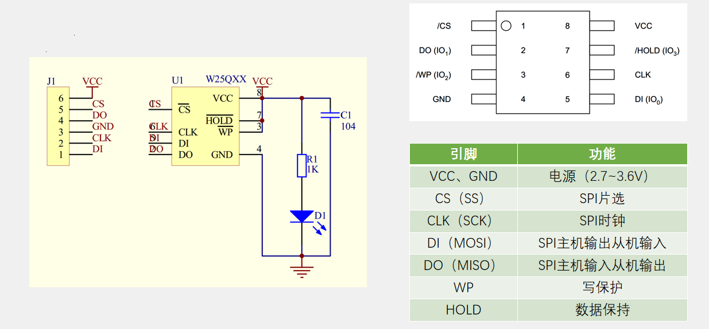
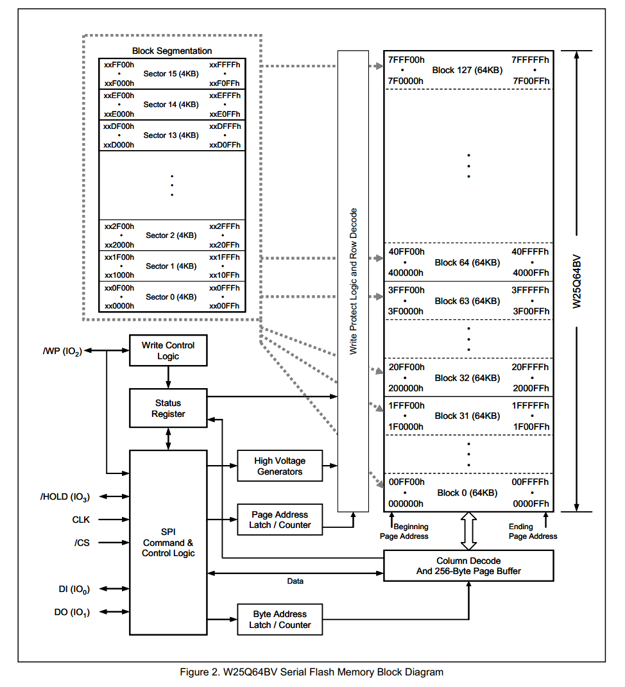

# 1.W25Q64介绍
## 1.1.W25Q64介绍简介
- W25Qxx系列是一种低成本、小型化、使用简单的非易失性存储器，常应用于数据存储、字库存储、固件程序存储等场景
- 存储介质：Nor Flash（闪存）
- 时钟频率：80MHz / 160MHz (Dual SPI) / 320MHz (Quad SPI)
- 存储容量（24位地址）：  
	W25Q40：	  4Mbit / 512KByte  
	W25Q80：	  8Mbit / 1MByte  
	W25Q16：	  16Mbit / 2MByte  
	W25Q32：	  32Mbit / 4MByte  
	W25Q64：	  64Mbit / 8MByte  
	W25Q128：  128Mbit / 16MByte  
	W25Q256：  256Mbit / 32MByte  
>双重SPI (Dual SPI) ,MISO和MOSI都可以进行数据的收发  
>四重SPI (Quad SPI) ,使用四根线作为通信线，都可以进行数据收发  
# 1.2.硬件电路

 

>左斜杠表示低电平有效

# 1.3.W25Q64框图

 

>- 8MB的地址空间，每64KB划分为一个块（Block）,共分为128块。
>- 每一块又划分为16个扇区（Sector）,每个扇区4KB。  
>- 每一扇区，又划分为16页，每页256Byte。

# 1.4.Flash操作注意事项
**写入操作时：**  
- 写入操作前，必须先进行写使能  
- 每个数据位只能由1改写为0，不能由0改写为1  
- 写入数据前必须先擦除，擦除后，所有数据位变为1  
- 擦除必须按最小擦除单元进行(W25Q64芯片为一个扇区（4KB）)  
- 连续写入多字节时，最多写入一页的数据，超过页尾位置的数据，会回到页首覆盖写入
>因为W25Q64的缓存区只有256Byte  
- 写入操作结束后，芯片进入忙状态，不响应新的读写操作  
>此时芯片在把缓存区的数据写入flash里

**读取操作时：**  
- 直接调用读取时序，无需使能，无需额外操作，没有页的限制，读取操作结束后不会进入忙状态，但不能在忙状态时读取  
