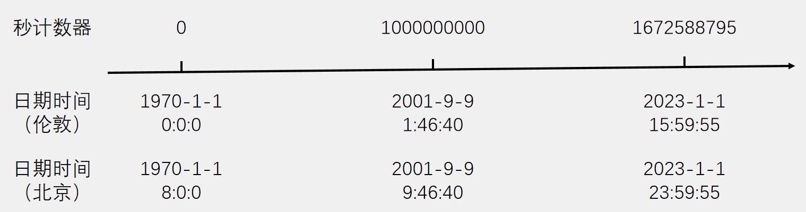
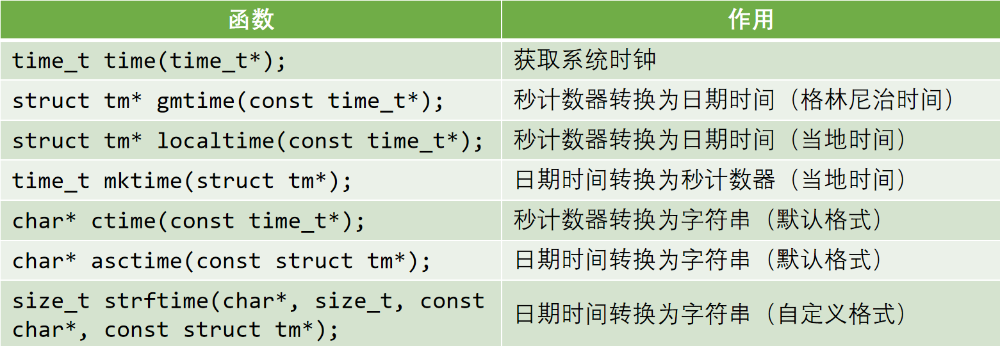
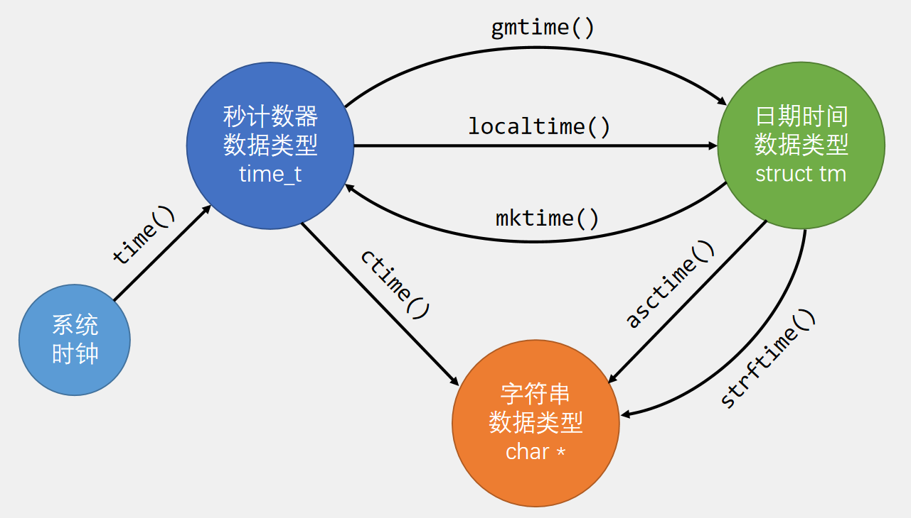

# 1.Unix时间戳
- Unix 时间戳（Unix Timestamp）定义为从UTC/GMT的1970年1月1日0时0分0秒开始所经过的秒数，不考虑闰秒
- 时间戳存储在一个秒计数器中，秒计数器为32位/64位的整型变量
- 世界上所有时区的秒计数器相同，不同时区通过添加偏移来得到当地时间

# 2.UTC/GMT
- GMT（Greenwich Mean Time）格林尼治标准时间是一种以地球自转为基础的时间计量系统。它将地球自转一周的时间间隔等分为24小时，以此确定计时标准

- UTC（Universal Time Coordinated）协调世界时是一种以原子钟为基础的时间计量系统。它规定铯133原子基态的两个超精细能级间在零磁场下跃迁辐射9,192,631,770周所持续的时间为1秒。当原子钟计时一天的时间与地球自转一周的时间相差超过0.9秒时，UTC会执行闰秒来保证其计时与地球自转的协调一致

# 3.时间戳转换
- C语言的time.h模块提供了时间获取和时间戳转换的相关函数，可以方便地进行秒计数器、日期时间和字符串之间的转换

>mktime函数的参数类型为srruct tm*，当传入时间结构体中的星期成员值没有时，该函数会计算星期成员值，所以参数类型没有限制为const
# 4.时间戳转换

