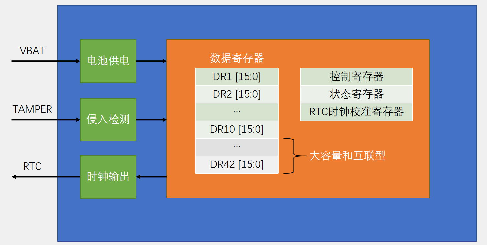
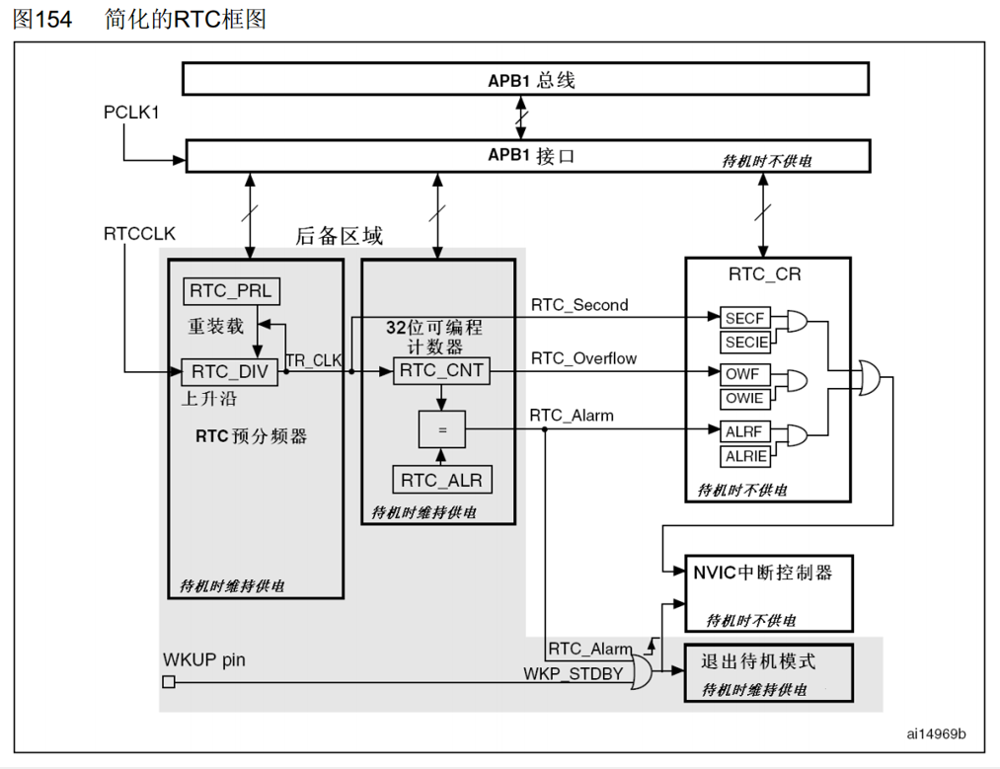
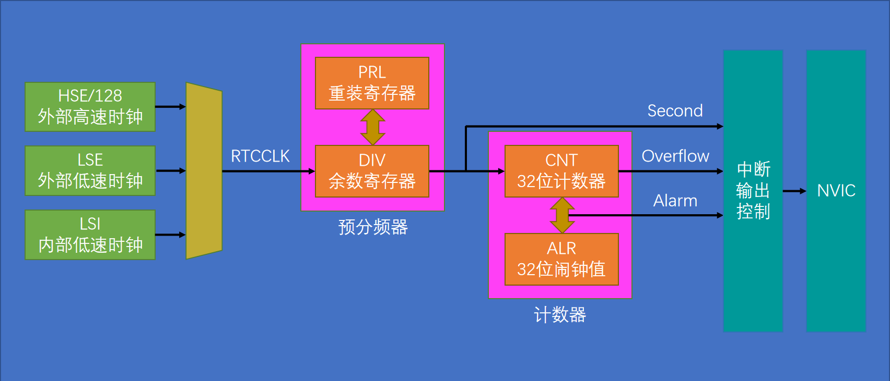
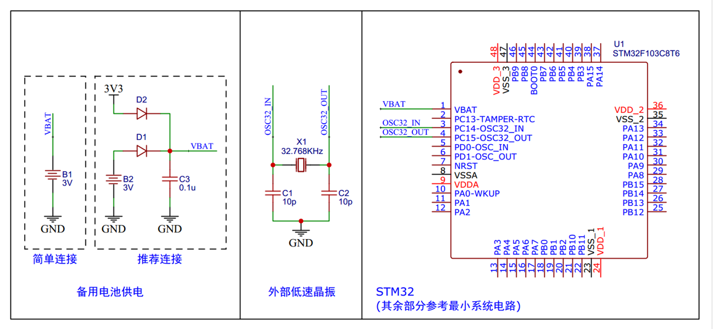

# 1.BKP（Backup Registers）备份寄存器
## 1.1.BKP简介
- BKP可用于存储用户应用程序数据。当VDD（2.0~3.6V）电源被切断，他们仍然由VBAT（1.8~3.6V）维持供电。当系统在待机模式下被唤醒，或系统复位或电源复位时，他们也不会被复位
- TAMPER引脚产生的侵入事件将所有备份寄存器内容清除
- RTC引脚输出RTC校准时钟、RTC闹钟脉冲或者秒脉冲
- 存储RTC时钟校准寄存器
- 用户数据存储容量：  
    20字节（中容量和小容量）/ 84字节（大容量和互联型）

## 1.2.BKP基本结构

# 2.RTC（Real Time Clock）实时时钟
## 2.1.RTC简介
- RTC是一个独立的定时器，可为系统提供时钟和日历的功能
- RTC和时钟配置系统处于后备区域，系统复位时数据不清零，VDD（2.0~3.6V）断电后可借助VBAT（1.8~3.6V）供电继续走时
- 32位的可编程计数器，可对应Unix时间戳的秒计数器
- 20位的可编程预分频器，可适配不同频率的输入时钟
- 可选择三种RTC时钟源：  
	HSE时钟除以128（通常为8MHz/128）  
	LSE振荡器时钟（通常为32.768KHz）  
	LSI振荡器时钟（40KHz）  

## 2.2.RTC框图

>灰色区域表示处于后备区域，可以在主电源掉电后可以使用备用电池继续工作。

## 2.3.RTC基本结构

>DIV余数寄存器为一个自减计数器，PRL重装计数器存储计数目标，当DIV余数寄存器从PRL值计数到0时，输出1Hz的秒脉冲信号，通向32位CNT计数器，一秒自增一次。  
>32位闹钟寄存器ALR可以设定闹钟，输出闹钟信号。当输出闹钟信号后，该值失效，如需再次产生闹钟信号，需要重新写该寄存器。  

## 2.4.RTC硬件电路
RTC模块还需一些外部电路：  

## 2.5.RTC操作注意事项
- 执行以下操作将使能对BKP和RTC的访问：  
    设置RCC_APB1ENR的PWREN和BKPEN，使能PWR和BKP时钟  
    设置PWR_CR的DBP，使能对BKP和RTC的访问  
- 若在读取RTC寄存器时，RTC的APB1接口曾经处于禁止状态，则软件首先必须等待RTC_CRL寄存器中的RSF位（寄存器同步标志）被硬件置1
    >即需要APB总线时钟和RTC时钟同步，否则读取数据会出错  
- 必须设置RTC_CRL寄存器中的CNF位，使RTC进入配置模式后，才能写入RTC_PRL、RTC_CNT、RTC_ALR寄存器
- 对RTC任何寄存器的写操作，都必须在前一次写操作结束后进行。可以通过查询RTC_CR寄存器中的RTOFF状态位，判断RTC寄存器是否处于更新中。仅当RTOFF状态位是1时，才可以写入RTC寄存器
