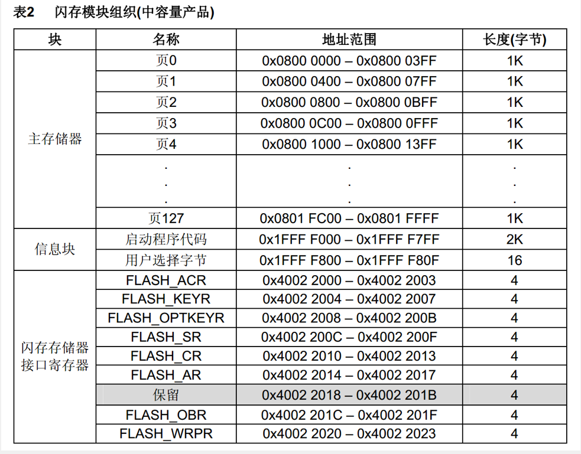

# 1.FLASH简介
- STM32F1系列的FLASH包含程序存储器、系统存储器和选项字节三个部分，通过闪存存储器接口（外设）可以对程序存储器和选项字节进行擦除和编程
- 读写FLASH的用途：
  - 利用程序存储器的剩余空间来保存掉电不丢失的用户数据
  - 通过在程序中编程（IAP），实现程序的自我更新
- 在线编程（In-Circuit Programming – ICP）用于更新程序存储器的全部内容，它通过JTAG、SWD协议或系统加载程序（Bootloader）下载程序
- 在程序中编程（In-Application Programming – IAP）可以使用微控制器支持的任一种通信接口下载程序
- 读写FLASH会中断CPU的执行
# 2.内存模块组织

# 3.FLASH基本结构

# 4.FLASH解锁
- FPEC共有三个键值：  
	RDPRT键 = 0x000000A5  
  KEY1 = 0x45670123  
	KEY2 = 0xCDEF89AB  

- 解锁：  
	复位后，FPEC被保护，不能写入FLASH_CR  
	在FLASH_KEYR先写入KEY1，再写入KEY2，解锁  
	错误的操作序列会在下次复位前锁死FPEC和FLASH_CR  

- 加锁：  
	设置FLASH_CR中的LOCK位锁住FPEC和FLASH_CR  

# 5.程序存储器擦除和编程
# 5.1 使用指针访问存储器
- 使用指针读指定地址下的存储器：  
	``uint16_t Data = *((__IO uint16_t *)(0x08000000));``  

- 使用指针写指定地址下的存储器：  
	``*((__IO uint16_t *)(0x08000000)) = 0x1234;``  

- 其中：  
	``#define    __IO    volatile``

# 5.2.程序存储器全擦除

# 5.3.程序存储器页擦除

# 5.4.程序存储器编程

  

>注意：在编程之前要先执行擦除，否则stm32不会执行写入，除非写入的数据为全0。  
>注意：如果要写入8位数据，可以将整页数据读入SRAM,更新后再整页写入FLASH。

# 6.选项字节编程和擦除
## 6.1 选项字节

  

- RDP：写入RDPRT键（0x000000A5）后解除读保护  
- USER：配置硬件看门狗和进入停机/待机模式是否产生复位  
- Data0/1：用户可自定义使用  
- WRP0/1/2/3：配置写保护，每一个位对应保护4个存储页（中容量）

>注意：USER和nUSER为反码关系。其他类似。  

## 6.2 选项字节擦除流程
1. 检查FLASH_SR的BSY位，以确认没有其他正在进行的闪存操作  
2. 解锁FLASH_CR的OPTWRE位（选项字节的锁）  
3. 设置FLASH_CR的OPTER位为1（擦除命令）  
4. 设置FLASH_CR的STRT位为1  
5. 等待BSY位变为0  
6. 读出被擦除的选择字节并做验证  

## 6.2 选项字节写入流程
1. 检查FLASH_SR的BSY位，以确认没有其他正在进行的编程操作  
2. 解锁FLASH_CR的OPTWRE位（选项字节的锁）  
3. 设置FLASH_CR的OPTPG位为1（写入命令）  
4. 写入要编程的半字到指定的地址  
5. 等待BSY位变为0  
6. 读出写入的地址并验证数据  

# 7.电子签名
电子签名存放在闪存存储器模块的系统存储区域，包含的芯片识别信息在出厂时编写，不可更改，使用指针读指定地址下的存储器可获取电子签名

- 闪存容量寄存器：  
	基地址：0x1FFF F7E0  
	大小：16位  

- 产品唯一身份标识寄存器：  
	基地址： 0x1FFF F7E8  
	大小：96位  
>使用ID号可限制程序在指定设备上运行，防止程序被盗。  

