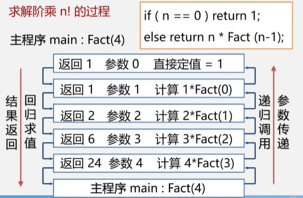

**递归问题解决思路**  
　　分治法:对于一个较为复杂的问题，能够分解成几个相对简单的且**解法相同或类似**的子问题来求解。  
>必备的三个条件  
>1、能将一个问题转变成一个新问题，而新问题与原问题的解法相同或类同，  
>　不同的仅是处理的对象，且这些处理对象是变化有规律的。  
>2、可以通过上述转化而使问题简化。  
>3、必须有一个明确的递归出口，或称递归的边界。  

**分治法求解递归问题算法的一般形式**  
```cpp
void p(参数表){
    (递归结束条件) 可直接求解步骤;    -----基本项
    else p(较小的参数);              ------归纳项
```
例如:
```cpp
long Fact(long n){
    if(n == 0) return 1;        //基本项
    else return n*Fact(n-1);    //归纳项
}
```
上面的示例的调用过程如下所示：  
  

>通常，递归程序由于调用层次多，时间开销大。一般可将递归程序转为非递归程序。

**尾递归->循环结构**  
```cpp
long Fact(long n){
    if(n == 0) return 1;        //基本项
    else return n*Fact(n-1);    //归纳项
}
```
**————>**  
```cpp
long Fact(long n){
    t = i;
    for(i=1; i<=n; i++) t = t*i;
    return t;
}
```
**单向递归->循环结构**  
```cpp
long Fib (long n){ // Fibonacci数列
    if(n == 1 || n == 2) return 1;
    else return Fib(n-1) + Fib(n-2);
}
```
**————>**  
```cpp
long Fib(long n){
    if(n == 1 || n == 2) return 1;
    else{
        t1 = 1; t2 = 1;
        for(i=3; i<=n; i+){
            t3 = t1 + t2;
            t1 = t2;
            t2 = t3;
        }
    }
    return t3;
}
```
