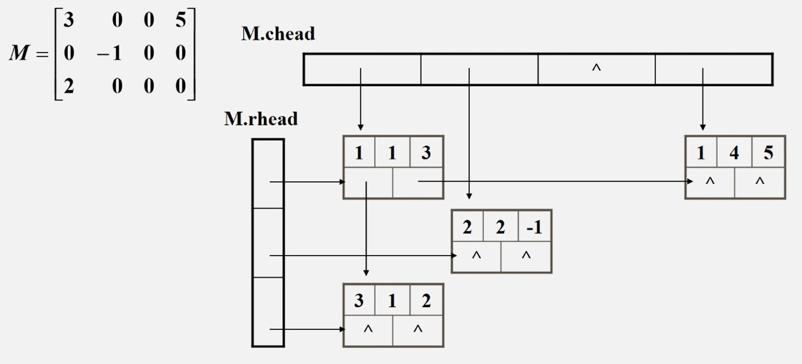

## 1.关于数组的一些个人理解

## 2.矩阵的压缩存储  
### 1.对称矩阵
　　关于对角线对称的矩阵，只存储一边即可。对于下面的 $5\times5$ 的对称矩阵，只需 $1+2+3+4+5 = \frac {(1+5)\times 5} {2}=15$ 个空间。  
更一般的，对于 $n\times n$ 的矩阵，只需 $\frac {(1+n)\times n} {2}$ 个空间。  
 
$$
\begin{bmatrix}
1 & 5 & 1 & 3 & 7\\
5 & 0 & 8 & 0 & 0\\
1 & 8 & 9 & 2 & 6\\
3 & 0 & 2 & 5 & 1\\
7 & 0 & 6 & 1 & 3\\
\end{bmatrix}
$$  

对于 $n\times n$ 的对称矩阵，用大小为 $\frac {(1+n)\times n} {2}$ 的一维数组存储。那 ${a}_ {ij}$ 在一维数组的那个位置呢？  
比如如下存储：  

|元素| ${a}_ {11}$ | ${a}_ {21}$ | ${a}_ {22}$ | ${a}_ {31}$ | ${a}_ {32}$ | ${a}_ {33}$ |....| ${a}_ {n1}$ |....| ${a}_ {nn}$ |  
|----|-------------|-------------|-------------|-------------|-------------|-------------|----|-------------|----|-------------|
|下标|0            |1            |2            |3            |4            |5            |....|$\frac{(1+n-1)\times(n-1)}{2}$|....| $\frac {(1+n)\times n} {2}-1$ |

很容易算出 ${a}_ {ij}$ 的下标为 $\frac{(1+i-1)\times(i-1)}{2} + j-1$ 。  

### 2.三角矩阵
　　对角线以下(或者以上)的数据元素(不包括对角线)全部为常数C。对于 $n\times n$ 的三角矩阵，需要 $\frac {(1+n)\times n} {2} + 1$ 个空间。  

$$
\begin{bmatrix}
1 & 1 & 1 & 1 & 1\\
5 & 0 & 1 & 1 & 1\\
1 & 8 & 9 & 1 & 1\\
3 & 0 & 2 & 5 & 1\\
7 & 0 & 6 & 1 & 3\\
\end{bmatrix}
$$ 

存储方法同上，不在赘述。  

### 3.对角矩阵
　　在 $n\times n$ 的矩阵中，所有非零元素都集中在以在对角线为中心的带状区域中，区域外的值全为0，则称为对角矩阵。常见的有三对角矩阵、五对角矩阵、七对角矩阵等。  
一个三对角矩阵如下所示：  

$$
\begin{bmatrix}
1 & 2 & 0 & 0 & 0\\
5 & 5 & 5 & 0 & 0\\
0 & 8 & 9 & 3 & 0\\
0 & 0 & 2 & 5 & 7\\
0 & 0 & 0 & 1 & 3\\
\end{bmatrix}
$$ 

老师讲的感觉有点怪怪的......先不管这个了 :sleeping: :sleeping:  

### 4.稀疏矩阵
　　设在 $m\times n$ 的矩阵中有 $t$ 个非零元素。令 $δ = t/(m\times n)$ 当 $δ≤0.05$ 时称为稀疏矩阵。  
以下是一个稀疏矩阵示例：  

$$
\begin{bmatrix}
0 & 0 & 0 & 2 & 0 & 0 & 0 & 0 & 0\\
0 & 0 & 0 & 0 & 0 & 0 & 0 & 0 & 0\\
0 & 0 & 7 & 0 & 0 & 0 & 0 & 0 & 0\\
0 & 0 & 0 & 0 & 0 & 0 & 0 & 0 & 0\\
0 & 0 & 0 & 0 & 0 & 0 & 0 & 0 & 0\\
0 & 0 & 0 & 3 & 0 & 0 & 0 & 0 & 0\\
0 & 0 & 0 & 0 & 0 & 0 & 9 & 0 & 0\\
0 & 0 & 0 & 0 & 0 & 0 & 0 & 0 & 0\\
0 & 8 & 0 & 0 & 0 & 0 & 0 & 0 & 0\\
0 & 0 & 0 & 0 & 0 & 0 & 0 & 0 & 0\\
\end{bmatrix}
$$ 

压缩存储原则:存各非零元素的值、行列位置和矩阵的行列数。  

**方法一：三元组顺序表**  
>注意:为更可靠描述，通常再加一个“总体”信息:即总行数、总列数、非零元素总个数。可存在数组第零行

可用二维数组存储如下：  
|第i行|行|列|元素|
|-|-|-|-|
|0|10|10|5|
|1|1|4|2|
|2|3|3|7|
|3|6|4|3|
|4|7|7|9|
|5|9|2|8|

>三元组顺序表的优点:非零元在表中按行序有序存储，因此便于进行依行顺序处理的矩阵运算。  
>三元组顺序表的缺点:不能随机存取若按行号存取某一行中的非零元，则需从头开始进行查找。

**方法二：十字链表法**  

- 优点:它能够灵活地插入因运算而产生的新的非零元素，删除因运算而产生的新的零元素，实现矩阵的各种运算。  
- 在十字链表中，矩阵的每一个非零元素用一个结点表示。该结点除了(row，col，value)以外，还要有两个域：  
    - right: 用于链接同一行中的下一个非零元素  
    - down:用以链接同一列中的下一个非零元素。
- 十字链表中结点的结构示意图:

|**left**|**row**|value|**col**|**right**|
|----------------------|-------------------|-----|-------------------|-----------------------|

具体操作如下图所示：  

  
