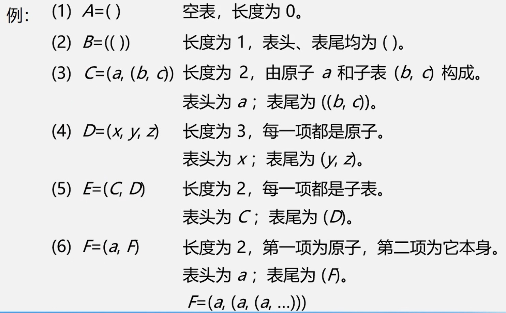
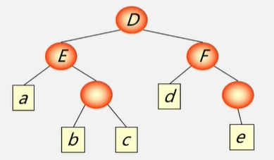

## 1.广义表基本概念
- **广义表** (又称列表 Lists)是 $n≥0$ 个元素 ${a}_ {0},{a}_ {1},...,{a}_ {n** 的有限序列，其中每一个 ${a}_ {i** 或者是原子，或者是一个广义表。  
- **广义表** 通常记为  $LS = ({a}_ {0},{a}_ {1},...,{a}_ {n})$  
　　其中 $LS$ 为表名， $n$ 为表的长度，每一个 ${a}_ {i** 为表的元素。习惯上，一般用大写字母表示广义表，小写字母表示原子。
- **表头** :若 $LS$ 非空 $(n≥1)$ ，则其第一个元素 ${a}_ {1** 就是表头。  
　　记作 $head(LS)= {a}_ {1** 。
>表头可以是原子，也可以是子表。

- **表尾** :除表头之外的其它元素组成的表。  
　　记作 $tail(LS)= ({a}_ {2},...,{a}_ {n})$ 。  
>表尾不是最后一个元素，而是一个子表。

下面是几个示例：  
  

## 2.广义表的性质
(1)广义表中的数据元素有相对次序; 一个直接前驱和一个直接后继  
(2)广义表的 **长度** 定义为最外层所包含元素的个数。  
>如: $C=(a,(b,c))$ 是长度为 2 的广义表。

(3)广义表的 **深度** 定义为该广义表展开后所含括号的重数;  
> $A=(b, c)$ 的深度为 1， $B=(A, d)$ 的深度为 2， $C=(f, B, h)$ 的深度为 3。  
>注意: **原子** 的深度为 0; **空表** 的深度为1。  

(4)广义表可以为其他广义表 **共享** 。  
>如:广义表 $B$ 就共享表 $A$ 。在 $B$ 中不必列出 $A$ 的值，而是通过名称来引用， $B=(A)$

(5)广义表可以是一个 **递归** 的表。如: $F=(a, F)=(a,(a(a, ...)))$   
>注意:递归表的深度是无穷值，长度是有限值。

(6)广义表是多层次结构，广义表的元素可以是单元素，也可以是子表，而子表的元素还可以是子表，…  可以用图形象地表示。  
>例: $D=(E, F)$ 其中: $E=(a,(b,c))$ ， $F=(d,(e))$

可以用树状结构表示：  
  
