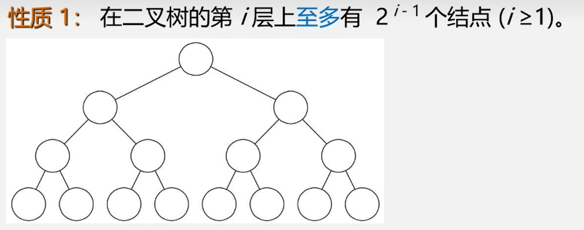
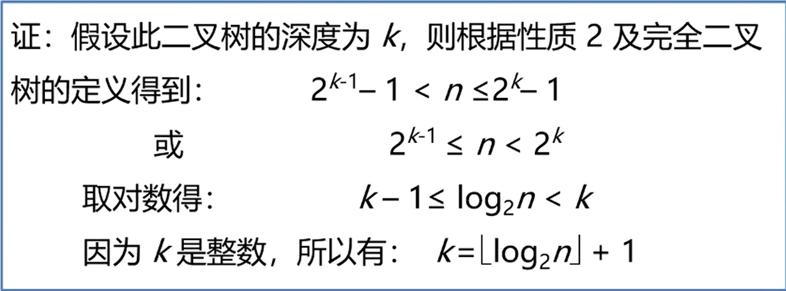
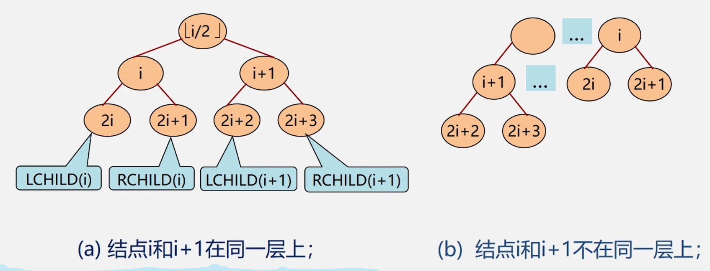

### $\color{red}{性质1}$  
　
 </img>
  
 
>某层最大的结点数为上一层的2倍，故第*i*层至多有 $2^{i-1}$ 个结点。  
 
### $\color{red}{性质2}$  
　深度为 k的二叉树至多有 $2^{k}-1$ 个结点(k≥1)。  
> 1... $2^{k-1}$ 的等比数列求和。

### $\color{red}{性质3}$  
　对任何一棵二叉树 *T*,如果其叶子数为 $n_0$，度为 2 的结点数为 $n_2$，则  **$n_0$ = $n_2$+ 1** 。  
>一颗二叉树的结点分为三类：度为0的 $n_0$ (叶子结点)，度为1的 $n_1$，度为2的 $n_2$。设总结点数为n，总边数为B。  
>从下往上算，除根节点外每个节点都有一条边，则B=n-1。  
>从上往下算，总边数B = 2 $\times{n_2}$ + $n_1$ + 0 $\times{n_0}$ = 2 $\times{n_2}$ + $n_1$。  
>同时 n = $n_0$ + $n_1$ + $n_2$。  
>联立以上可得 **$n_0$ = $n_2$+ 1** 。

## 两种特殊形式的二叉树  
**满二叉树：**  
　一颗深度为 k且有 $2^{k}-1$ 个结点的二叉树称为满二叉树，即为性质１图示中的二叉树。　　

**完全二叉树：**  
　深度为k的具有 n个结点的二叉树，当且仅当其每一 个结点都与深度为k的满二叉树中编号为 1~n的结点一一对应时，称之为完全二又树。  
>　即相比满二叉树，可以缺少结点，但缺少的结点只能在最底层的最右边连续若干个。
 

 </img>

>**特点：**  
>　1.叶子结点只能分布在层次最大的两层上。  
>　2.对任一结点，其左子树比右子树深度大1或0。

### $\color{red}{性质4}$  
　具有n个结点的完全二叉树的深度为 $\lfloor$ $log_2n$ $\rfloor$ +1。　(向下取整)   

 </img>

### $\color{red}{性质5}$  
　如果对一棵有n个结点的完全二叉树　(深度为 $\lfloor$ $log_2n$ $\rfloor$ +1)　的结点按层序编号(从第1层到第 $\lfloor$ $log_2n$ $\rfloor$ +1层，每层从左到右)，  
则对任一结点i(1≤i≤n)，有:  
　(1)如果i=1，则结点i是二叉树的根，无双亲;如果i>1，则其双亲是结点 $\lfloor$ i/2 $\rfloor$ 。  
　(2)如果 2i≥n，则结点 i为叶子结点，无左孩子;否则,其左孩子是结点 2i。  
　(3)如果 2i+1>n，则结点i无右孩子:否则，其右孩子是结点 2i + 1。  
>**证明：**

>
 </img>

>
>由数学归纳法可以证明，两种情况下对于性质(2)(3)均成立。
