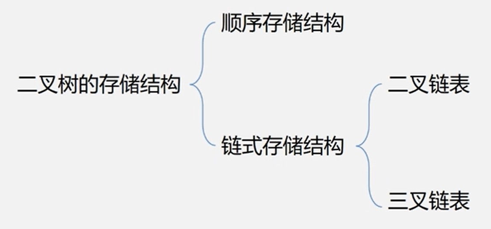
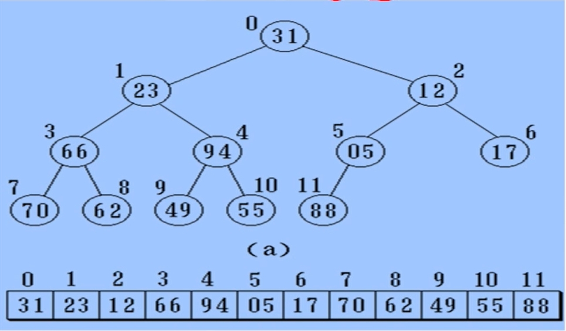
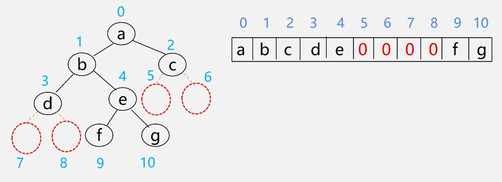
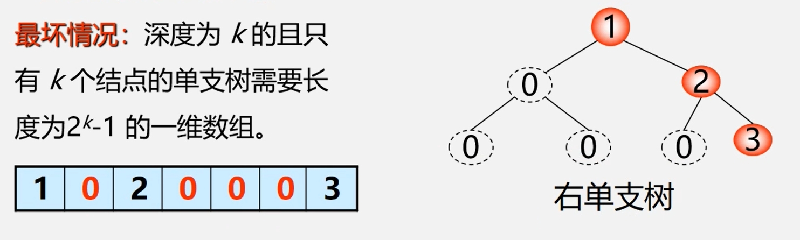
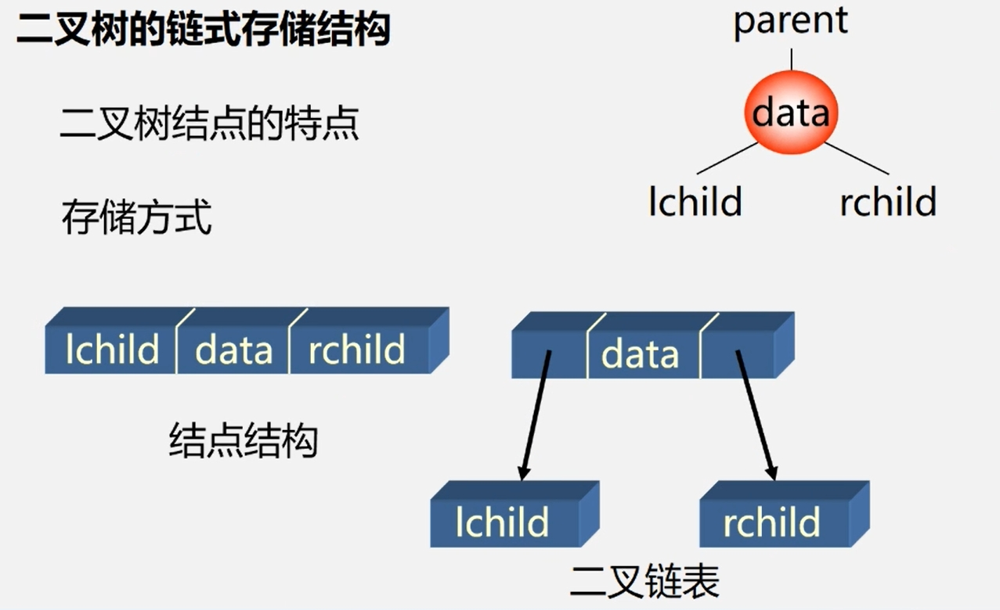
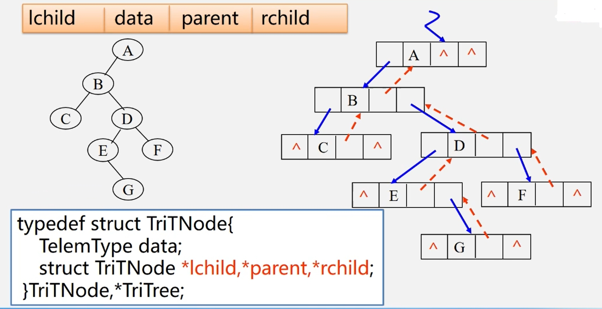

**二叉树的存储结构：**  
　
## 顺序存储
**顺序存储结构实现：**  
　　按满二叉树的结点层次编号，依次存放二叉树中的数据元素。  
　
　

 **二叉树顺序存储表示：**
```cpp
//二叉树顺序存储表示
#define MAXTSIZE 100;
Typedef TElemType SqBiTree[MAXSTIZE];
SqBiTree bt;
```
**二叉树顺序存储缺点：**  

　
## 链式存储
**链式存储结构实现：**  

　

  **二叉树链式存储表示：**
```cpp
typedef struct BiNode{
    TElemType data;
    struct BiNode *lchild,*rchild; //左右孩子指针
}BiNode,*BiTree
```

>三叉链表(多一个节点存放指向父节点的指针)
>
>
