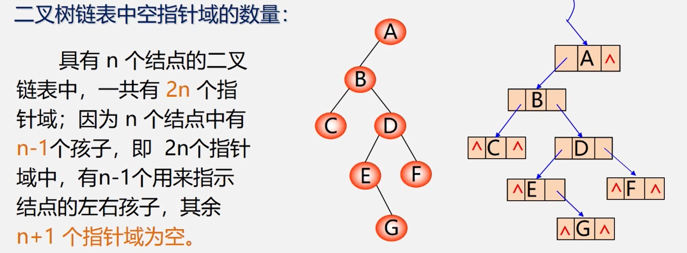
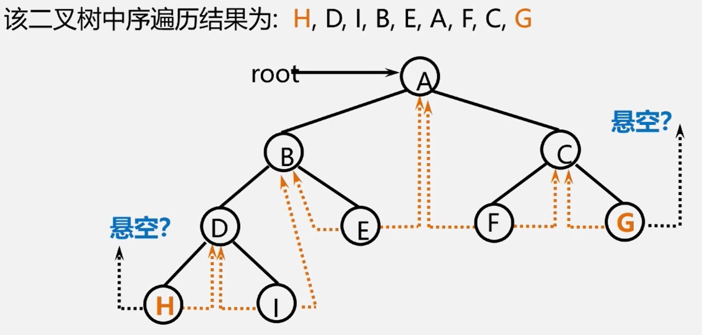
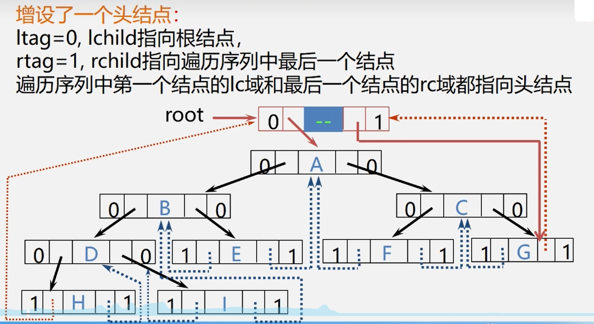

## 研究目的
为什么研究线索二叉树？  
>当用二叉链表作为二叉树的存储结构时可以很方便地找到某个结点的左右孩子;  
>但一般情况下，无法直接找到该结点在某种遍历序列中的前驱和后继结点。  

## 解决方法  
>1、通过遍历寻找--费时间。  
>2、再增设前驱、后继指针域--增加了存储负担。  
>3、****利用二又链表中的空指针域**** 。

<div> </img></div>  

利用二又链表中的空指针域  
　如果某个结点的左孩子为空，则将空的左孩子指针域改为指向其前驱  
　如果某个结点的右孩子为空，则将空的右孩子指针域改为指向其后继  
　——这种 **改变指向的指针** 称为 **线索**  
　加上了线索的二又树称为 **线索二叉树(Threaded Binary Tree)**  
　对二叉树按某种遍历次序使其变为线索二叉树的过程叫 **线索化**。  

 如何确定某个指针是不是**线索**？  
>对二又链表中每个结点增设两个标志域 **ltag** 和 **rtag** ，并约定:   
>**ltag** = 0　　lchild指向该结点的左孩子  
>**ltag** = 1　　lchild 指向该结点的前驱  
>**rtag** = 0　　rchild 指向该结点的右孩子  
>**rtag** = 1　　rchild 指向该结点的后继  

所以，线索二叉树的结构为：  
|   lchild    | **ltag** |  data    | **rtag** |rchild      |
| ----------- | -----------------------| -------- | ---------------------- | ---------- |
```cpp
typedef struct BiThrNode{
    int data;
    int ltag, rtag;
    struct BiThrNode *lchild, rchild;
}BiThrNode,*BiThrTree ;
```
## 改造线索二叉树
<div> </img></div>  

　对于一棵二叉树的中序线索二叉树，其中序遍历序列的第一个结点的左指针会悬空，最后一个结点的右指针会悬空。  
为充分利用空指针，可做以下操作：

><div> </img></div>
>如此便可由最左下或最右下的结点快速返回到根节点
