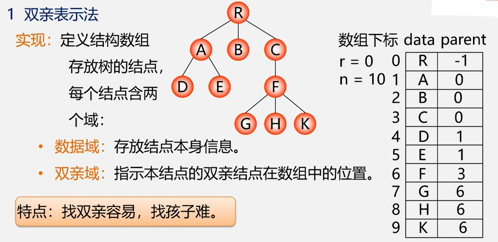
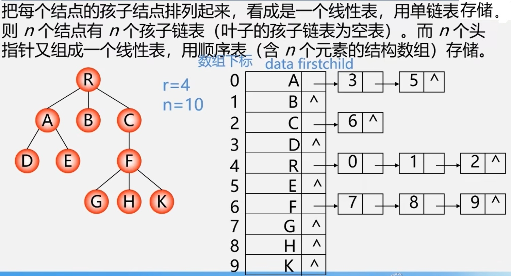
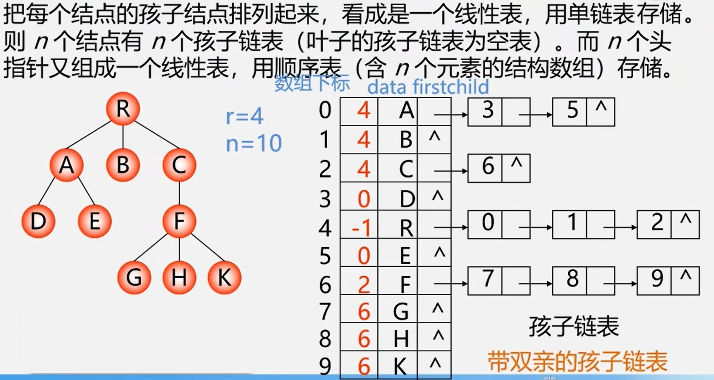
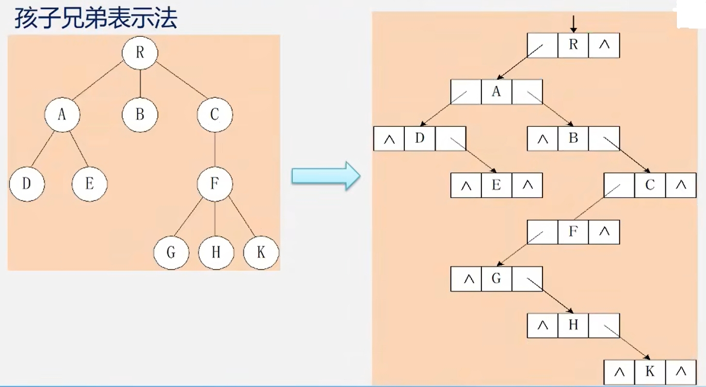

## 1.双亲表示法  
  

**结点结构**
```cpp
typedef struct PTNode{
    TElemType data;
    int parent;//双亲位置域
} PTNode;
```
**树结构**
```cpp
#define MAX_TREE_SIZE 100
typedef struct{
    PTNode nodes[MAX_TREE_SIZE];
    int r,n;// 根结点的位置和结点个数
} PTree;
```
## 2.孩子链表  
  

>找孩子容易，找双亲难

**孩子结点结构**
```cpp
typedef struct CTNode{
    int child;
    struct CTNode *next;
}*ChildPtr;
```
**双亲结点结构**
```cpp
typedef struct{
    TElemType data;
    ChildPtr firstchild;// 孩子链表头指针
} CTBox;
```
**树结构**
```cpp
typedef struct{
    CTBox nodes[MAX_TREE_SIZE];
    int n, r;//结点数和根结点的位置
}CTree;
```
如果需要方便地访问双亲，可以在双亲结点的结构上再加一个数据，用于记录双亲结点的下标。
  

## 3.孩子兄弟表示法(二叉树表示法，二又链表表示法)
　实现:用二叉链表作为树的存储结构，链表中每个结点的两个指针域分别指向其第一个孩子结点和下一个兄弟结点。  
 ```cpp
typedef struct CSNode{
    ElemType data;
    struct CSNode *firstchild,*nextsibling;
}CSNode,*CSTree;
```
**示例：**

