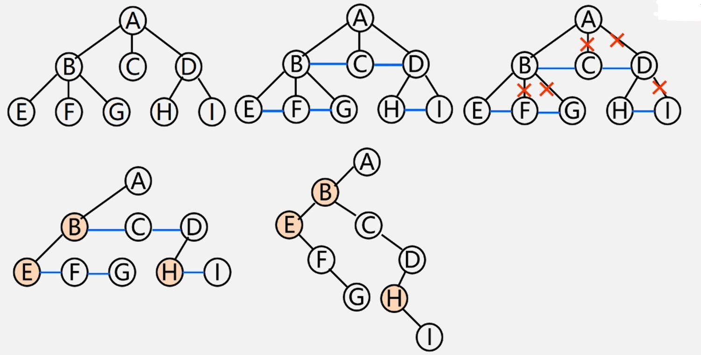
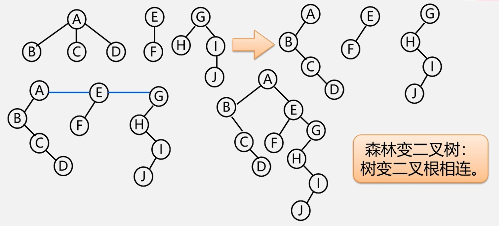
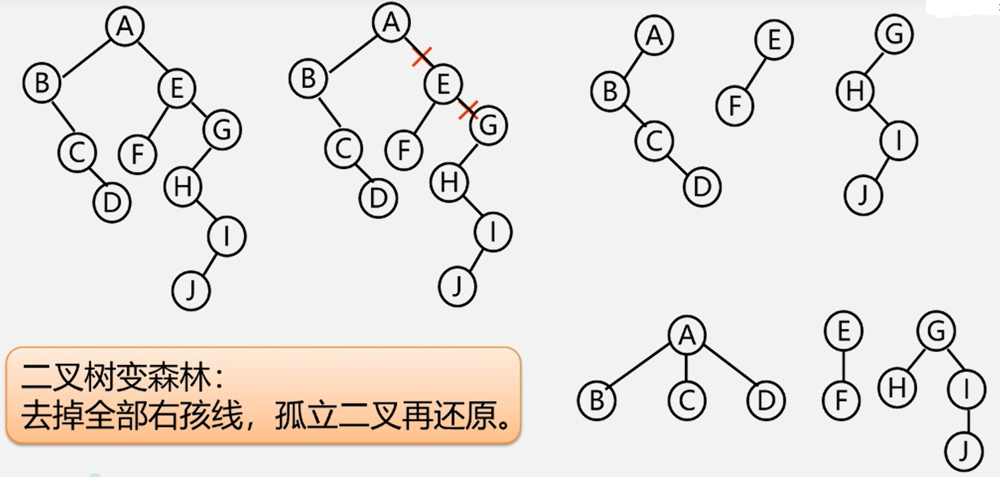

## 1.树转换成二叉树  
由上节的[树的孩子兄弟表示法](https://github.com/Minichiellon/MyNotes/blob/main/%E6%95%B0%E6%8D%AE%E7%BB%93%E6%9E%84/5.%E6%A0%91/5.7%E6%A0%91%E7%9A%84%E5%AD%98%E5%82%A8%E7%BB%93%E6%9E%84.md)
可以看出，一棵树有其对应的唯一二叉树。  
树和二叉树的转换正是通过这种方式。观察规律，可得出以下具体操作：  
>(1)加线:在兄弟之间加一连线  
>(2)抹线:对每个结点，除了其左孩子外，去除其与其余孩子之间的关系。  
>(3)旋转:以树的根结点为轴心，将整树顺时针转45°。  

**示例**  
  

## 2.二叉树转换成树  
反过来，二叉树转换成树操作如下：  
>(1)加线:若p结点是双亲结点的左孩子，则将p的右孩子，右孩子的右孩子.….沿分支找到的所有右孩子，都与p的双亲用线连起来。  
>(2)抹线:抹掉原二叉树中双亲与右孩子之间的连线。  
>(3)调整:将结点按层次排列，形成树结构。  

**示例**  
  

## 3.森林转换成二叉树  
操作如下：  
>(1)将各棵树分别转换成二叉树。  
>(2)将每棵树的根结点用线相连。  
>(3)以第一棵树根结点为二又树的根，再以根结点为轴心，顺时针旋转构成二叉树型结构。

**示例**  
  

## 4.二叉树转换成森林  
操作如下：  
(1)抹线:将二叉树中根结点与其右孩子连线，及沿右分支搜索到的所有右孩子间连线全部抹掉，使之变成孤立的二又树。  
(2)还原:将孤立的二又树还原成树。  

**示例**  
  

## 5.树的三种遍历方式  
先根(次序)遍历:  
>若树不空，则先访问根结点，然后依次先根遍历各棵子树。

后根(次序)遍历:  
>若树不空，则先依次后根遍历各棵子树，然后访问根结点。

按层次遍历:  
>若树不空，则自上而下自左至右访问树中每个结点。

森林的遍历这里不再展开，[点此了解](https://www.bilibili.com/video/BV1nJ411V7bd?p=100&spm_id_from=pageDriver&vd_source=118ad2466a5a4a8b06a7b6552954cba9)
