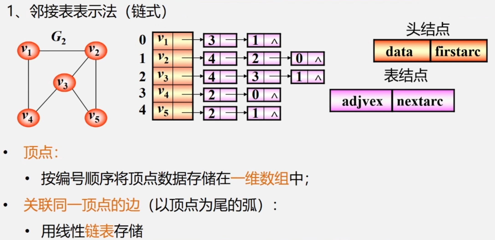
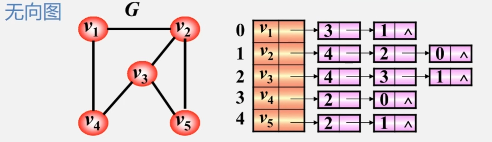
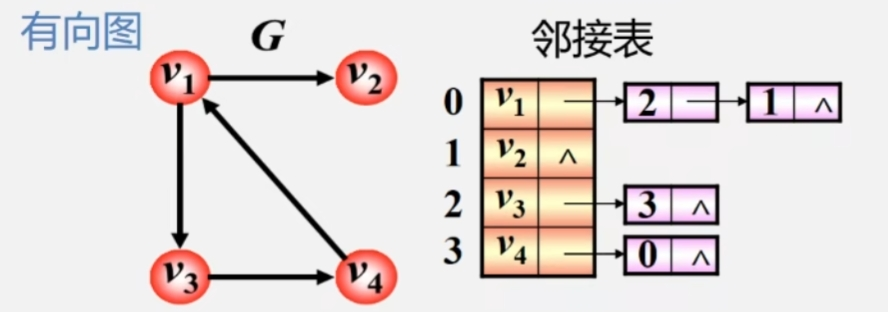
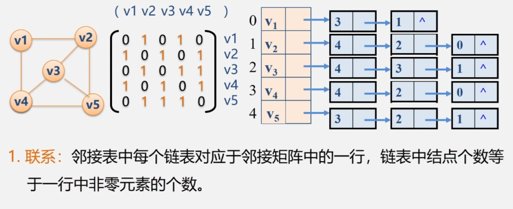

## 1 临接表表示法


### 1.1 无向图邻接表示例


>- 邻接表不唯一。  
>- 若无向图中有 $n$ 个顶点、 $e$ 条边，则其邻接表需 $n$ 个头结点和 $2e$ 个表结点。适宜存储稀疏图。
>- 顶点 $v_i$ 的度为第 $i$ 个单链表中的结点数。

### 1.2 有向图邻接表示例


>- 每个结点的单链表只记录从该结点发出的边。  
>- 顶点 $v_i$ 的出度为第 $i$ 个单链表中的结点个数。  
>- 顶点 $v_i$ 的入度为整个单链表中邻接点域值是 $i-1$ 的结点个数。
>- 或者结点 $v_i$ 的单链表也可记录其他结点发出到 $v_i$ 的边，称为逆邻接表。
>- 邻接表找出度容易，找入度难。逆邻接表找入度容易，找出度难。

## 2 图的邻接表存储表示
### 2.1 数据类型表示
```cpp
//顶点结构
typedef struct VNode
{
    VerTexType data;    //顶点信息
    ArcNode* firstarc;    //指向第一条依附该顶点的边的指针
}VNode, AdjList[MVNum]; //AdjList表示邻接表类型

//边结点
#define MVNum 100        //最大顶点数
typedef struct ArcNode    //边结点
{
    int adjvex;                //该边所指向的顶点的位置
    struct ArcNode* nextarc;    //指向下一条边的指针
    Otherlnfo info;            //和边相关的信息
}ArcNode;

//图结构
typedef struct
{
    AdjList vertices;     //vertices--vertex的复数
    int vexnum,arcnum;    //图的当前顶点数和弧数
}ALGraph;
```
### 2.2 建立邻接表
```cpp
Status CreateUDG(ALGraph &G)    //采用邻接表表示法，创建无向图G
{
    cin >> G.vexnum >> G.arcnum;        //输入总顶点数，总边数
    for(i = 0 ; i < G.vexnum ; ++i)    //输入各点，构造表头结点表
    {
        cin >> G.vertices[i].data;        //输入顶点值
        G.vertices[i].firstarc = NULL;    //初始化表头结点的指针域
    }//for
    
    for(k = 0 ; k < G.arcnum ; ++k)    //输入各边，构造邻接表
    {
        cin >> v1 >> v2;        //输入一条边依附的两个顶点
        i = LocateVex(G, v1);
        j = LocateVex(G, v2);

        p1 = new ArcNode;    //生成一个新的边结点*p1
        p1->adjvex = j;    //邻接点序号为j
        p1->nextarc = G.vertices[i].firstarc;
        G.vertices[i].firstarc = p1;    //将新结点*p1插入顶点vi的边表头部

        p2 = new ArcNode;    //生成另一个对称的新的边结点*p2
        p2->adjvex = i;    //邻接点序号为i
        p2->nextarc = G.vertices[j].firstarc;
        G.vertices[i].firstarc = p2;    //将新结点*p2插入顶点vj的边表头部
    }//for

    return Ok;
}//CreateUDG

```
## 3 临接表优缺点及与临接矩阵关系
### 3.1 优点
1. 方便找任一顶点的所有**邻接点**。  
2. 节约稀疏图的空间。需要 N 个头指针和 2E 个结点(每个结点至少2个域)。  
3. 无向图方便计算度。  
### 3.2 缺点
1. 有向图不方便计算结点的度。  
2. 不方便检查任意两个结点之间是否有边。
### 3.3 邻接表和临接矩阵关系
**联系**  


**区别**  
1. 对于任一确定的无向图，邻接矩阵是唯一的(行列号与顶点编号一致)，但邻接表不唯一(链接次序与顶点编号无关)。  
2. 邻接矩阵的空间复杂度为 $O(n^2)$ ,而邻接表的空间复杂度为 $O(n+e)$ 。

**用途**  
矩阵多用于稠密图，邻接表多用于稀疏图。
