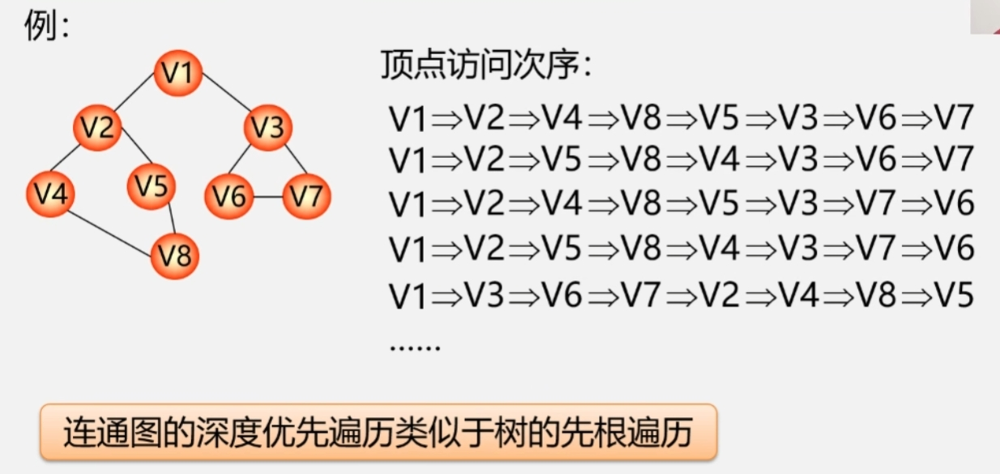
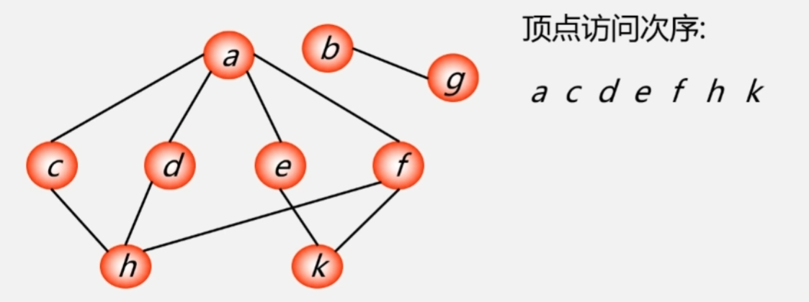

## 1 深度优先遍历(Depth First Search, DFS)
### 1.1 DFS思想
1. 在访问图中某一起始顶点 **v** 后，由 **v** 出发，访问它的任一邻接顶点 **w_1**  
2. 再从 **w_1** 出发，访问 **与w_1邻接** 但还 **未被访问过** 的顶点 **w_2**   
3. 然后再从 **w_2** 出发，进行类似的访问，...   
4. 如此进行下去，直至到达所有的邻接顶点都被访问过的顶点 **u** 为止。  
5. 接着，退回一步，退到前一次刚访问过的顶点，看是否还有其它没有被访问的邻接顶点。  
5.1 如果有，则访问此顶点，之后再从此顶点出发，进行与前述类似的访问;  
5.2 如果没有，就再退回一步进行搜索。重复上述过程，直到连通图中所有顶点都被访问过为止。  
>一条道走到黑

### 1.2 DFS示例
<div></div>

### 1.3 无向图的临接矩阵DFS实现
```cpp
void DFS(AMGraph G, int v)    //图G为邻接矩阵类型
{
    cout << v;
    visited[v] = true;    //访问第v个顶点

    for(w = 0 ; w < G.vexnum ; w++)//依次检查邻接矩阵v所在的行
        if((G.arcs[v][w] != 0) && (!visited[w]))
            DFS(G, w);
    //w是v的邻接点，如果w未访问，则递归调用DFS
}
```

### 1.4 DFS算法效率分析
- 用邻接矩阵来表示图，遍历图中每一个顶点都要 **从头扫描** 该顶点所在行，时间复杂度为 **O(n^2)** 。 
- 用邻接表来表示图，虽然有 **2e** 个表结点，但只需扫描 **e** 个结点即可完成遍历，加上访问 **n** 个头结点的时间，时间复杂度为 **O(n+e)** 。
- 空间复杂度 **O(n)** 。

## 2 广度优先遍历(Brandth First Search, BFS)
### 2.1 BFS思想
1. 从图的某一结点出发，首先依次访问该结点的所有邻接顶点 $V_{i1},V_{i2},V_{i3},...$ ,再按这些顶点被访问的先后次序依次访问与它们相邻接的所有未被访问的顶点。  
2. 重复此过程，直至所有顶点均被访问为止。
>一层一层访问
>
### 2.2 BFS示例
<div></div>

### 2.3 无向图的临接表BFS实现
```cpp
void BFS(Graph G, int v)    //按广度优先非递归遍历连通图G
{
    cout << v;
    visited[v] = true;    //访问第v个顶点
    InitQueue(Q);        //辅助队列Q初始化，置空
    EnQueue(Q, v);        //v进队
    while(!QueueEmpty(Q))    //队列非空
    {
        DeQueue(Q, u);        //队头元素出队并置为u
        for(w = FirstAdjVex(G, u); w >= 0 ; w = NextAdjVex(G, u, w))
        {
            if(!visited[w])    //w为u的尚未访问的邻接顶点
            {
                cout << w;
                visited[w] = true;
                EnQueue(Q, w);     //w进队
            }//if
        }
    }//while
}//BFS
```

### 2.4 BFS算法效率分析
- 如果使用邻接矩阵，则BFS对于每一个被访问到的顶点，都要循环检测矩阵中的整整一行(n个元素)，总的时间代价为 **O(n^2)**  
- 用邻接表来表示图，虽然有 **2e** 个表结点，但只需扫描 **e** 个结点即可完成遍历，加上访问 **n** 个头结点的时间，时间复杂度为 **O(n+e)** 。
- 空间复杂度 **O(n)** 。 
