## 6.1 生成树概念及性质
**生成树** ：所有顶点均由边连接在一起，但不存在回路的图。具有以下性质：  
>- 一个图可以有许多棵不同的生成树  
>- 生成树的顶点个数与图的顶点个数相同  
>- 生成树是图的极小连通子图，去掉一条边则非连通  
>- 一个有 n 个顶点的连通图的生成树有 n-1 条边  
>- 在生成树中再加一条边必然形成回路
>- 生成树中任意两个顶点间的路径是唯一的
>- 含 n个顶点 n-1 条边的图不一定是生成树

**示例**
<table border="0" margin-left: auto margin-right: auto>
  <tr>
      <td style="text-align: center;">图</td>
      <td style="text-align: center;">生成树1</td>
      <td style="text-align: center;">生成树2</td>
      <td style="text-align: center;">生成树3</td>
      <td style="text-align: center;">不是生成树</td>
  </tr>
  <tr>
     <td>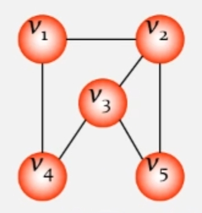 </img></td>
     <td>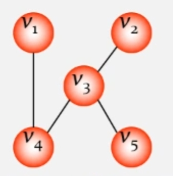 </img></td>
     <td>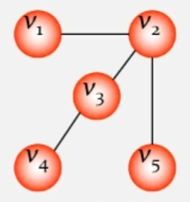 </img></td>
     <td>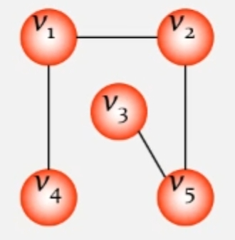 </img></td>
     <td>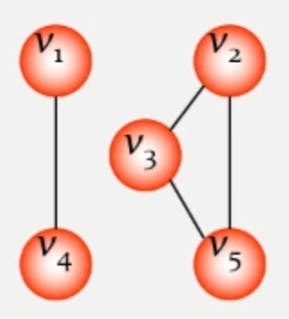 </img></td>
  </tr>
</table>

## 6.2 生成方法
设图 **G = (V, E)** 是个连通图，当从图任一顶点出发遍历图 **G** 时，将边集 **E(G)** 分成两个集合 **T(G)** 和 **B(G)** 。
其中 **T(G)** 是遍历图时所经过的边的集合， **B(G)** 是遍历图时未经过的边的集合。显然， **G1(V, T)** 是图 **G** 的极小连通子图。
即 **子图 G1** 是 **连通图 G 的生成树** 。

**示例**
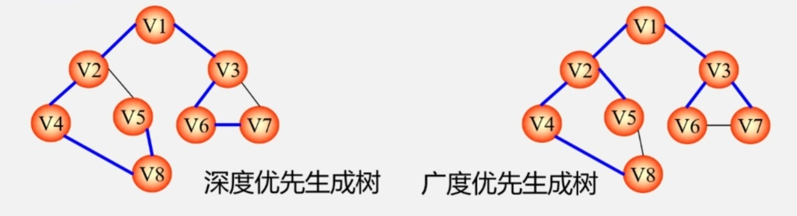

## 6.3 最小生成树(Minimum Spanning Tree)
给定一个无向网络，在该网的所有生成树中，使得各边权值之和最小的那棵生成树称为该网的 **最小生成树** 也叫 **最小代价生成树** 

**示例**
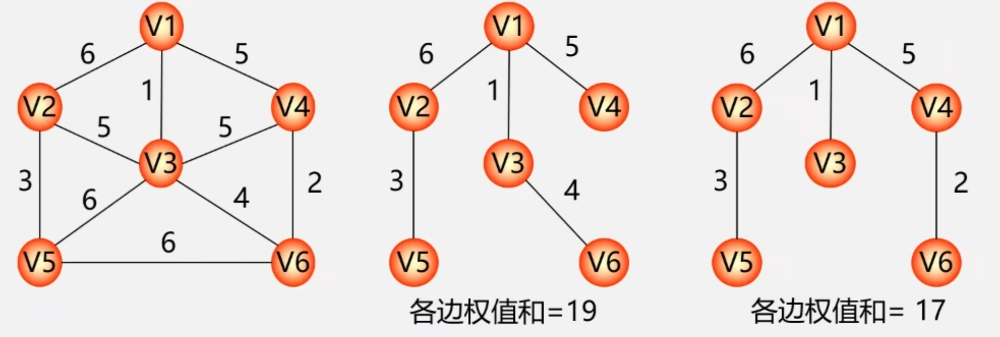

## 6.4 MST性质
设 **N = (V, E)** 是一个连通网, **U** 是顶点集 **V** 的一个非空子集。若边 **(u,v)** 是一条具有最小权值的边，
其中 **u\in U** ， **v\in V-U** ，则必存在一棵包含边 **(u,v)** 的最小生成树。  

**示例**  
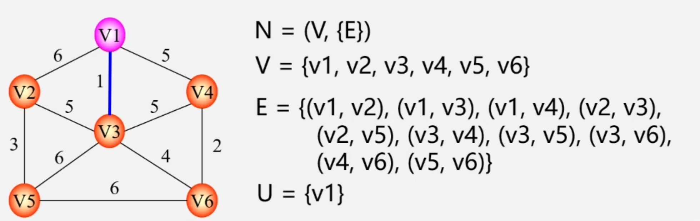

**MST性质解释**
在生成树的构造过程中，图中 $n$ 个顶点分属两个集合：  
- 已落在生成树上的顶点集:  $U$   
- 尚未落在生成树上的顶点集: $V-U$  

接下来则应在所有连通 $U$ 中顶点和 $V-U$ 中顶点的边中选取权值最小的边  
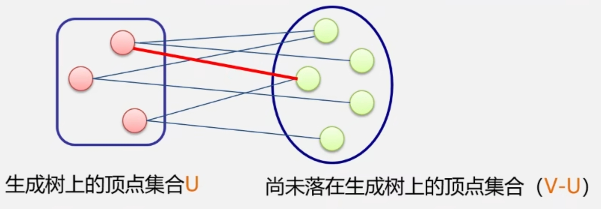

## 6.5 最小生成树算法
### 6.5.1 普里姆(Prim)算法
1. 任选一顶点，放入集合 $U$ 中，然后选择 **U中顶点** 到 **V-U中顶点** 的 **最短的一条边** ，
将 **该边关联的V-U中顶点** 放入 **U** 中。  
2. 循环上述过程，直到所有顶点都被包含到 $U$ 中。  

**prim算法示例**
算法
1. 首先去掉顶点集 $V$ 的所有边
2. 然后依次选择权值最小的边，连接顶点集中的关联顶点。选取最小边时不能产生回路，若产生回路则舍弃该条边。
3. 循环第二步，直到所有顶点连通。

>可能最小生成树不唯一，因为若在选取过程中有权值一样大且均不会产生回路的边，则都满足要求。

**kruskal算法示例**
![](./images/prim1.png" width = 30%>

上述图生成最小生成树的过程如下所示：
<table border="0" margin-left: auto margin-right: auto>
  <tr>
     <td>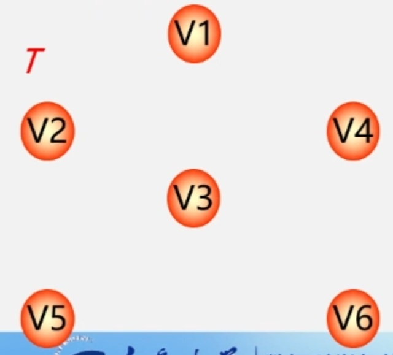 </img></td>
     <td>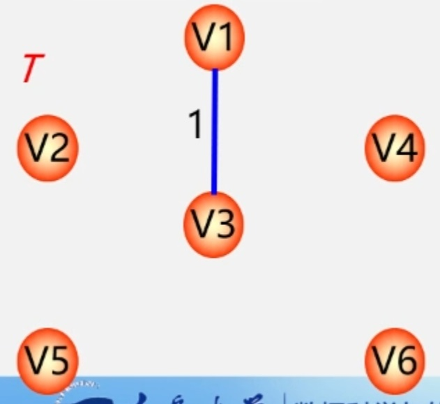 </img></td>
     <td>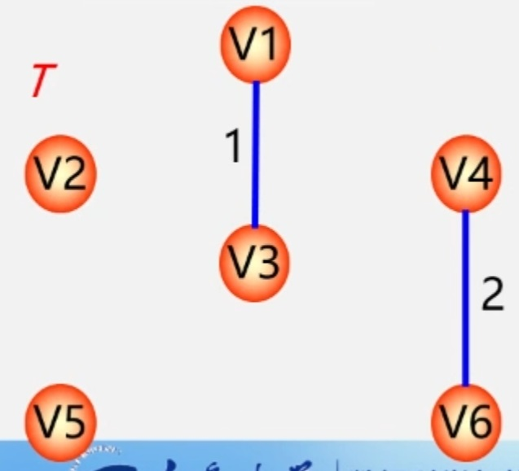 </img></td>
  </tr>
  <tr>
     <td>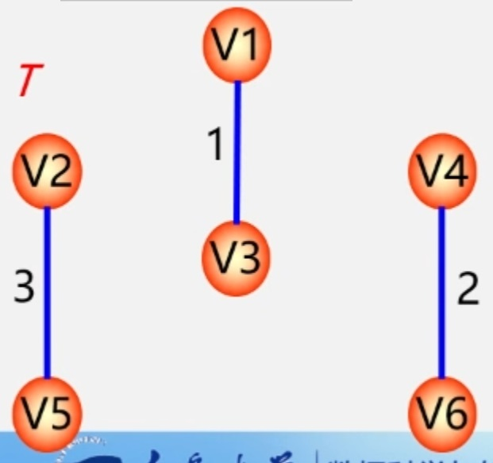 </img></td>
     <td>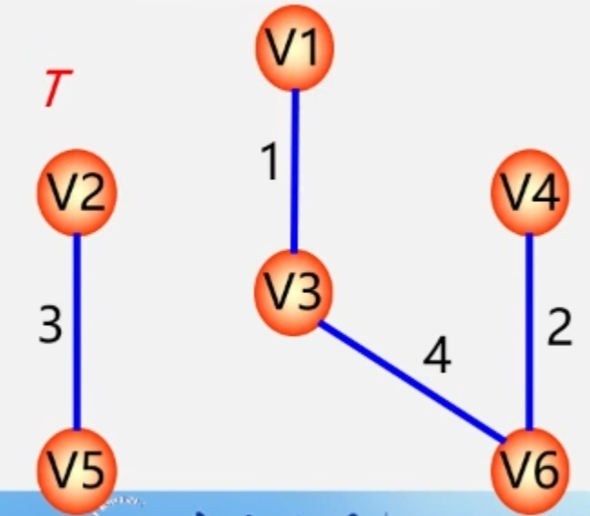 </img></td>
     <td>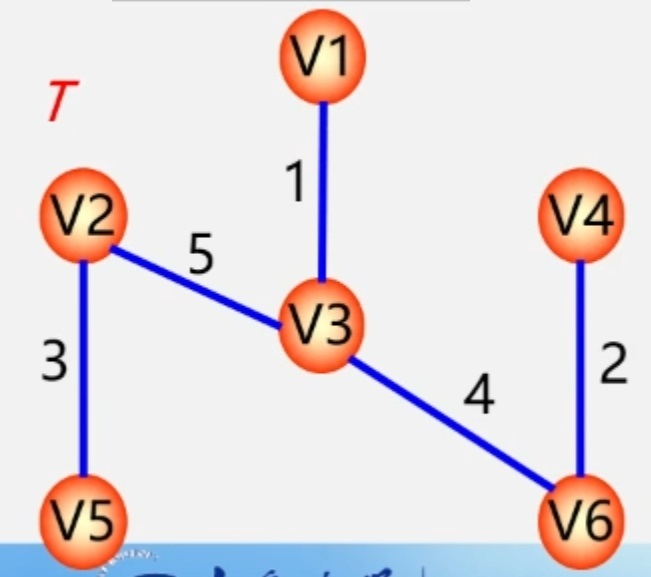 </img></td>
  </tr>
</table>

## 6.6 两种算法比较  
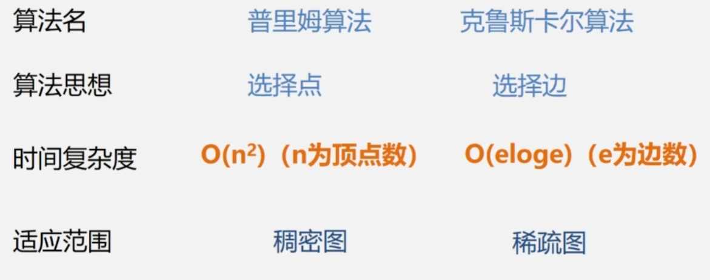
