## 7.1 迪杰斯特拉(Dijkstra)算法
### 7.1.1 算法思想
1. 初始化：先找出从源点 **v_0** 到各终点 **v_k** 的直达路径 **(v_0, v_k)** ，即通过一条弧到达的路径。
2. 选择：从这些路径中找出一条长度最短的路径 **(v_0, u)** 。
3. 更新：若在图中存在弧 **(u, v_k)** ，且 **(v_0, u) + (u, v_k) < (v_0, v_k)** , 则以路径 **(v_0, u, v_k)** 代替 **(v_0, v_k)** 。
4. 在调整后的各条路径中，再找长度最短的路径，依此类推。

### 7.1.2 算法步骤
1. 初始时令 $S =$ { ${v}_{0}$ } , $T =$ {其余顶点} 。
2. $T$ 中顶点对应的距离值用辅助数组 $D$ 存放。 $D[i]$ 初值：若 $<{v}_ {0},{v}_ {i}>$ 存在，则为其权值；否则为 $\infty$ 。
3. 从 $T$ 中选取一个其距离值最小的顶点 $v_j$ ，加入 $S$ 。
4. 对 $T$ 中顶点的距离值进行修改：若加进 $v_j$ 作中间顶点，从 $v_0$ 到 $v_i$ 的距离值比不加 $v_j$ 的路径要短，则修改此距离值。
5. 重复上述步骤，直到 $S = V$ 为止。

### 7.1.3 算法示例

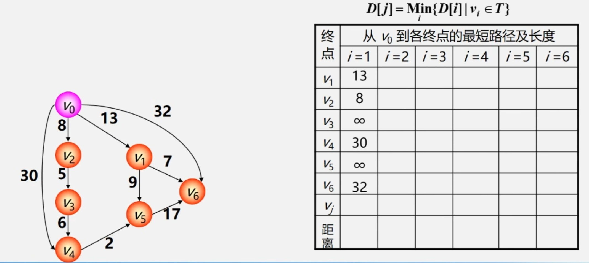

 

> **初始化：** $v_0$ 可直达 $v_1$ 、 $v_2$ 、 $v_4$ 、 $v_6$ ，不可直达 $v_3$ 、 $v_5$ ，因此 $v_0$ 到 $v_3$ 、 $v_5$ 的距离初始化为 $\infty$ 。

 

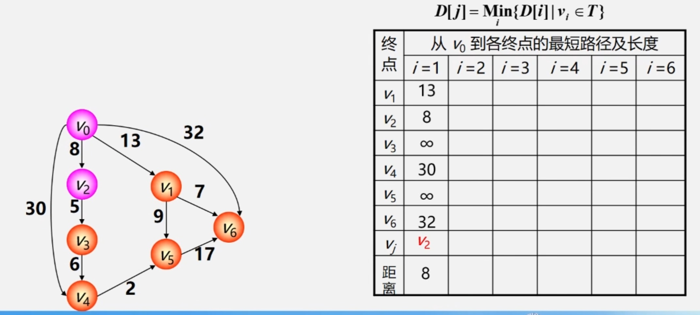

 

> 由于此时 $v_0$ 到 $v_2$ 的距离最短，因此将 $v_2$ 加入 $S$ ，记录 $v_0$ 到 $v_2$ 的最短距离 8 。

 

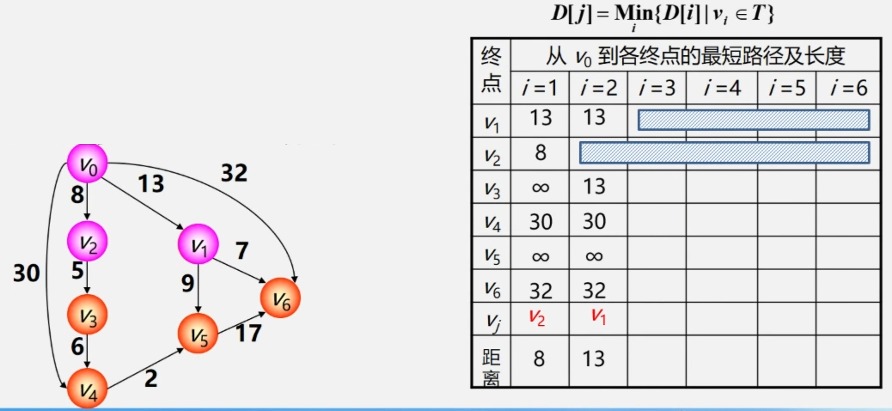

 

>- 加入 $v_2$ 后， $v_0$ 可经 $v_2$ 达到 $v_3$ ， $<{v}_ {0},{v}_ {2},{v}_ {3}>$ 距离为 13 ， $13<\infty$ ，更新 $v_0$ 到 $v_3$ 的最短距离。  
>- 此时 $v_0$ 到  $v_1$ 、 $v_3$ 距离最短，选择 $v_1$ 加入 $S$ ，记录 $v_0$ 到 $v_1$ 的最短距离 13 。

 

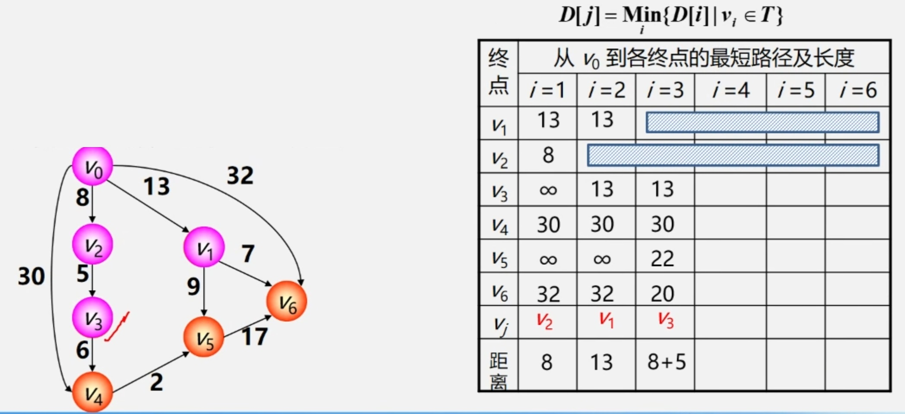

 

>- 加入 $v_1$ 后， $v_0$ 可经 $v_1$ 达到 $v_5$ 、 $v_6$ ， $<{v}_ {0},{v}_ {1},{v}_ {5}>$ 距离为 22 ， $22<\infty$ ，更新 $v_0$ 到 $v_5$ 的最短距离。
> $<{v}_ {0},{v}_ {1},{v}_ {6}>$ 距离为 20 ， $20<32$ ，更新 $v_0$ 到 $v_6$ 的最短距离。  
>- 此时 $v_0$ 到 $v_3$ 距离最短，选择 $v_3$ 加入 $S$ ，记录 $v_0$ 到 $v_3$ 的最短距离 13 。

 

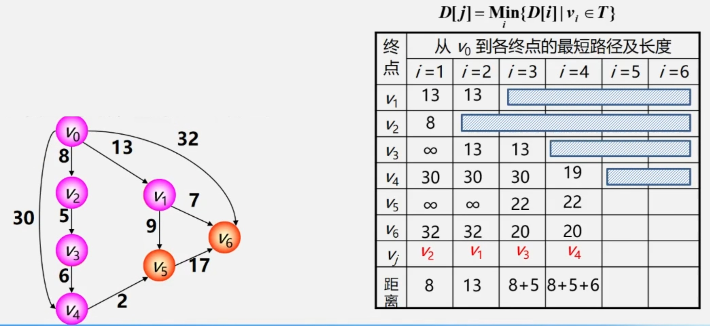

 

>- 加入 $v_3$ 后， $v_0$ 可经 $v_2$ 、 $v_3$ 达到 $v_4$ ， $<{v}_ {0},{v}_ {2},{v}_ {3},{v}_ {4}>$ 距离为 19 ， $19<30$ ，更新 $v_0$ 到 $v_4$ 的最短距离。  
>- 此时 $v_0$ 到 $v_4$ 距离最短，选择 $v_4$ 加入 $S$ ，记录 $v_0$ 到 $v_4$ 的最短距离 19 。

 

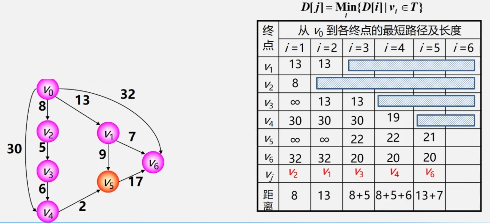

 

>- 加入 $v_4$ 后， $v_0$ 可经 $v_2$ 、 $v_3$ 、 $v_4$ 达到 $v_5$ ，或者经 $v_4$ 到达 $v_5$ 。 $<{v}_ {0},{v}_ {2},{v}_ {3},{v}_ {4},{v}_ {5}>$ 距离为 21 ，
> $<{v}_ {0},{v}_ {4},{v}_ {5}>$ 距离为 32 。 $21<22$ ，更新 $v_0$ 到 $v_5$ 的最短距离。  
>- 此时 $v_0$ 到 $v_6$ 距离最短，选择 $v_6$ 加入 $S$ ，记录 $v_0$ 到 $v_6$ 的最短距离 20 。

 

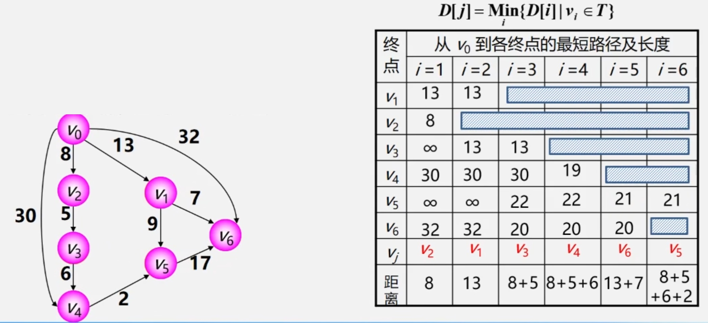

 

>- 加入 $v_6$ 后， $v_0$ 不可经 $v_6$ 达到其余顶点，不用更新最短距离。  
>- 此时 $v_0$ 到 $v_5$ 距离最短，选择 $v_5$ 加入 $S$ ，记录 $v_0$ 到 $v_5$ 的最短距离 21 。此时所有顶点加入 $S$ ，算法结束。

 

## 7.2 弗洛伊德(Floyd)算法
逐个顶点试探，从 $v_i$ 到 $v_j$ 的所有可能存在的路径中选出一条长度最短的路径。 

**示例**  
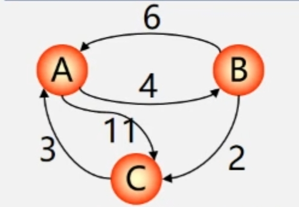

 

对于上面的有向网，使用Floyd算法求各个顶点之间的最短路径算法如下所示： 

 

<table border="0" margin-left: auto margin-right: auto>
  <tr>
     <td>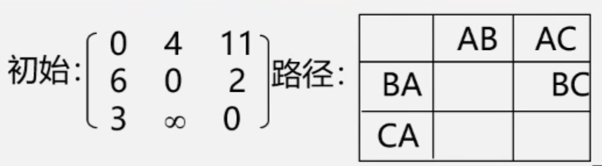 </img></td>
     <td>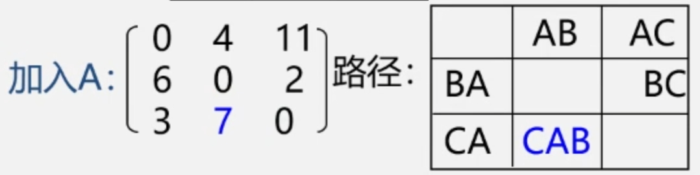 </img></td>
  </tr>
  <tr>
     <td>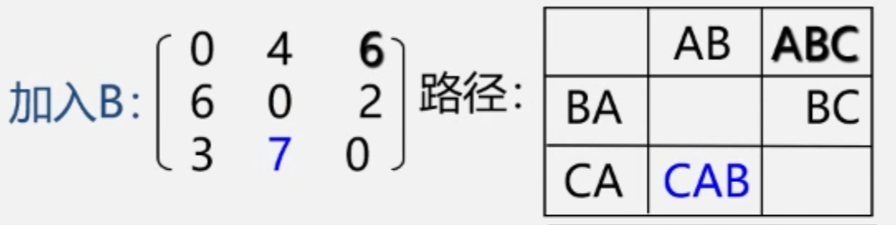 </img></td>
     <td>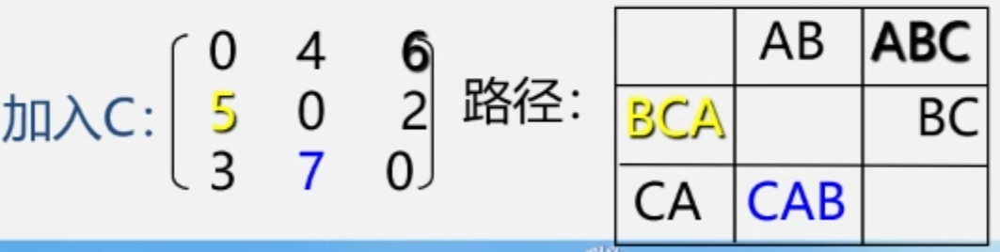 </img></td>
  </tr>
</table>
