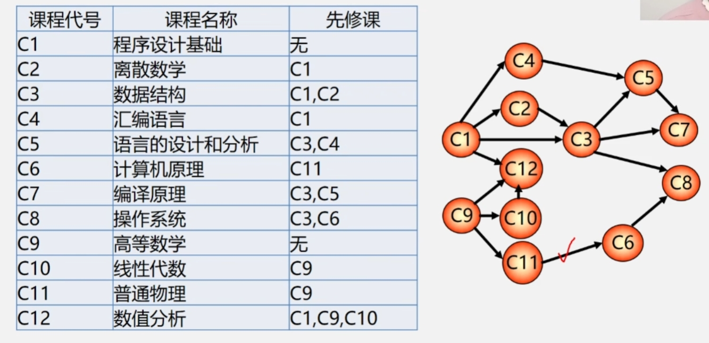
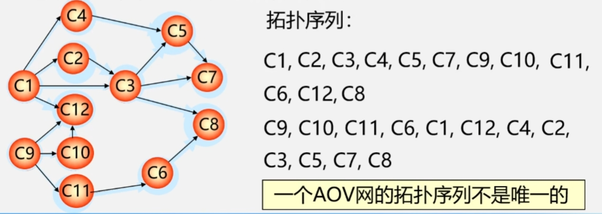

## 8.1 前言——有向无环图及其应用
**有向无环图：** 无环的有向图，简称 DAG图(Directed Acycline Graph)
 

 

- 有向无环图常用来描述一个工程或系统的进行过程。(通常把计划、施工、生产、程序流程等当成是一个工程)
- 一个工程可以分为若干个子工程，只要完成了这些子工程(活动)就可以导致整个工程的完成。

使用有向无环图表示一个工程，根据表示方法不同，可分为AOV网和AOE网。  

 **AOV网** :  
　　用一个有向图表示一个工程的各子工程及其相互制约的关系，其中以 **顶点表示活动** ，弧表示活动之间的优先制约关系，称这种有向图为顶点表示活动的网，简称 AOV网(Activity On Vertex network)  
>用于解决拓扑排序问题

**AOE网** :  
　　用一个有向图表示一个工程的各子工程及其相互制约的关系，以 **弧表示活动** ，以顶点表示活动的开始或结束事件，称这种有向图为边表示活动的网，简称为AOE网(Activity On Edge)。  
>用于解决关键路径问题

## 8.2 拓扑排序
### 8.2.1 示例
 

 

>- AOV 网中不允许有回路，因为如果有回路存在，则表明某项活动以自己为先决条件，显然这是荒谬的。  
>- **如何判断 AOV 网中没有环?**

### 8.2.2 拓扑排序
在 AOV 网没有回路的前提下，我们将全部活动排列成一个线性序列，使得若 AOV 网中有弧 < i , j > 存在，则在这个序列中， i 一定排在 j 的前面，
具有这种性质的线性序列称为 **拓扑有序序列** ，相应的拓扑有序排序的算法称为 **拓扑排序** 。  

### 8.2.3 拓扑排序方法
1. 在有向图中选一个没有前驱的顶点且输出之。
2. 从图中删除该顶点和所有以它为尾的弧。
3. 重复上述两步，直至全部顶点均已输出;或者当图中不存在无前驱的顶点为止。

### 8.2.4 拓扑排序示例
 

 

### 8.2.5 拓扑排序应用——检测 AOV 网中是否有环
对有向图构造其顶点的拓扑有序序列，若网中所有顶点都在它的拓扑有序序列中，则该 AOV 网必定不存在环。
