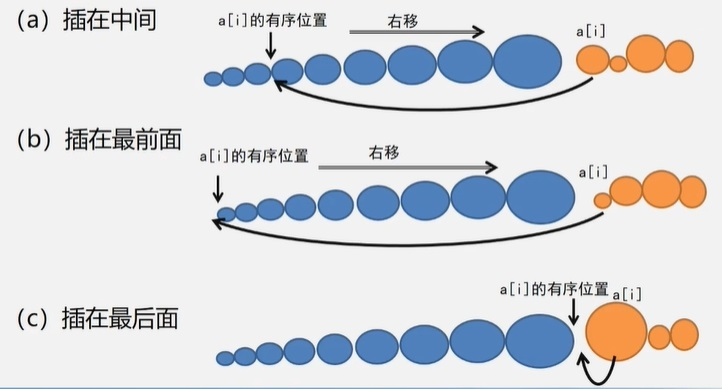
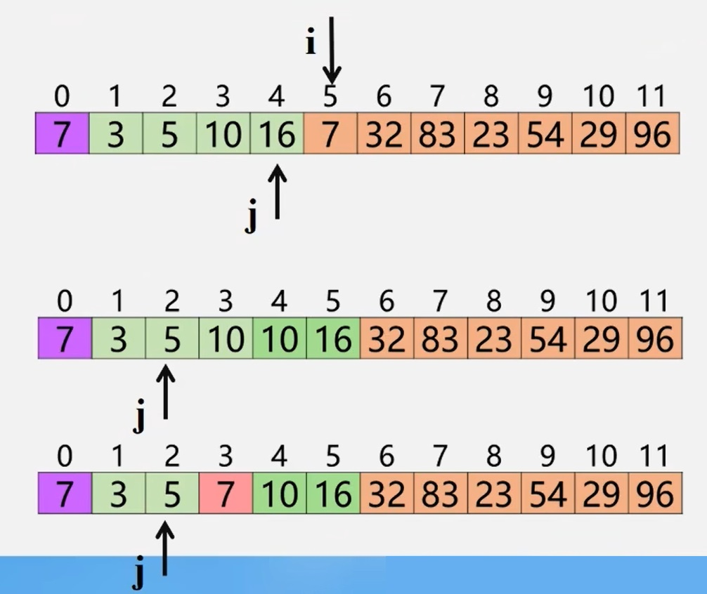
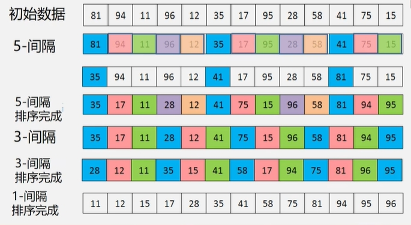

以下排序算法都基于下列的顺序表：  
```cpp
#define MAXSIZE 20//设记录不超过20个
typedef int KeyType; //设关键字为整型量(int型)

Typedef struct{ //定义每个记录(数据元素)的结构
    KeyType key;//关键字
    InfoType otherinfo;//其它数据项
}RedType ; //Record Type

Typedef struct {//定义顺序表的结构
    RedType r[ MAXSIZE +1 ];/存储顺序表的向量//r[0]一般作哨兵或缓冲区
    int length ;//顺序表的长度
}SqList ;
```
**插入法思想**  
<div></div>  

按照找插入位置的方法不同，有下列三种插入方法：  
 - 直接插入排序：顺序法定位插入位置
 - 二分插入排序：二分法定位插入位置
 - 希尔排序：缩小增量多遍插入排序

>**注意：** 以下P指当前要插入的元素  

### 1.1直接插入排序  
1. 如果P比已排好的最后一个元素小，则需要插入。将该元素复制至哨兵位置。  
2. 从后往前查找插入位置。若P小于当前位置元素，则将该位置元素向后移。
3. 找到正确位置并插入。

<div></div>  

```cpp
void insertSort( SqList &L){
    int i,j;
    for (i = 2;i <= L.length; ++i){
        if(L.r[i].key < L.r[i-1].key){     // 若"<",需将L.r[i]插入有序子表
            L.r[0] = L.r[i];                // 复制为哨兵
            for (j = i-1; L.r[0].key < L.r[j].key;--j){
                L.r[j+1] = L.r[j];// 记录后移
            }
            L.r[j+1] = L.r[0];    // 插入到正确位置
        }
    }
}
```
### 1.2折半插入排序  
```cpp
void BinsertSort(SqList &L){
    for(i = 2; i <= L.length;++i){     //依次插入第2~第n个元素
        L.r[0] = L.r[];     // 当前插入元素存到“哨兵”位置
        low = 1;
        high = i-1;
        while ( low <= high ){    //采用二分查找法查找插入位置
            mid = (low + high)/2;
            if(L.r[0].key < L.r[mid].key ) high = mid -1 ;
            else low = mid + 1;
        }//循环结束，high+1则为插入位置
        for(j = i-1;j >= high + 1; --j) L.r[j+1] = L.r[j]; //移动元素
        L.r[high + 1]= L.r[0];//插入到正确位置
    }
}// BInsertSort
```
### 1.3希尔排序  
　　先将整个待排记录序列分割成 **若干子序列** ，分别进行 **直接插入排序** 。
待整个序列中的记录 **基本有序** 时，再对全体记录进行一次直接插入排序。  
**希尔排序示例**  
<div></div>  

**希尔排序特点**  
- 一次移动，移动位置较大，跳跃式地接近排序后的最终位置  
- 最后一次只需要少量移动  
- 增量序列必须是递减的，最后一个必须是1  
- 增量序列应该是互质的

```cpp
void ShellSort(Sqlist &L, int dlta[], int t){
    //按增量序列dlta[0..t-1]对顺序表L作希尔排序。
    for(k = 0;k < t; ++k)
        ShellInsert(L，dlta[k]);    //一趟增量为dlta[k]的插入排序
} //ShellSort

void ShellInsert(SqList &L, int dk){
    for(i = dk + 1;i <= L.length; ++i){
        if(r[i].key < r[i-dk].key){
            r[0]=r[i];
            for(j = i - dk; j > 0 && (r[0].key < r[j].key); j = j - dk)
                r[j + dk] = r[j];
            r[j + dk] = r[0];
        }
    }
}
```
