### 3.1 简单选择排序  

**基本思想:** 在待排序的数据中选出最大(小)的元素放在其最终的位置。  
**基本操作:** 
1. 首先通过n-1次关键字比较，从n个记录中找出关键字最小的记录，将它与第一个记录交换  
2. 再通过n-2次比较，从剩余的n-1个记录中找出关键字次小的记录，将它与第二个记录交换  
3. 重复上述操作，共进行n-1趟排序后，排序结束

```cpp
void SelectSort(SqList &L){
    for (i = 1 ; i < L.length ; ++i){
        k = i;
        for(j = i + 1 ; j <= L.length ; j++)
            if(L.r[j].key <L.r[k].key)
                k = j;    //记录最小值位置
        if(k != i)
            swap(L.r[i],L.r[k]);    //交换
    }
}
```
### 3.2 堆排序  
**堆的简介**  
若n个元素的序列{ $a_1,a_2,...,a_n$ }满足 ${a}_ {i}\leq {a}_ {2i}$ 且 ${a}_ {i}\leq {a}_ {2i+1}$ ,则称该序列为 $\color{orange}{小根堆}$ 。  
若满足 ${a}_ {i}\geq {a}_ {2i}$ 且 ${a}_ {i}\geq {a}_ {2i+1}$ ,则称该序列为 **大根堆** 。  
>从堆的定义可以看出，堆实质是满足如下性质的完全二叉树:  
>二叉树中任一非叶子结点均小于(大于)它的孩子结点

**堆排序**  
若在输出堆顶的最小值(最大值)后，使得剩余n-1个元素的序列重又建成一个堆，则得到n个元素的次小值(次大值)…如此反复，便能得到一个有序序列，这个过程称之为堆排序。  

实现堆排序需解决两个问题：  
1. 如何由一个无序序列建成一个堆?  
2. 如何在输出堆顶元素后，调整剩余元素为一个新的堆?

如何在输出堆顶元素后，调整剩余元素为一个新的堆?  
**小根堆:** 
>1. 输出堆顶元素之后，以堆中 **最后一个元素替代之**   
>2. 然后将根结点值与左、右子树的根结点值进行比较，并与其中 **小者** 进行交换  
>3. 重复上述操作，直至叶子结点，将得到新的堆, 称这个从堆顶至叶子的调整过程为 **筛选**

>大根堆思路相同

该操作步骤如下所示：  
<table border="0" margin-left: auto margin-right: auto>
  <tr>
     <td>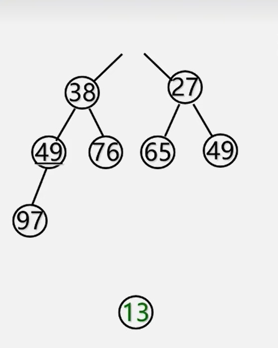 </img></td>
     <td>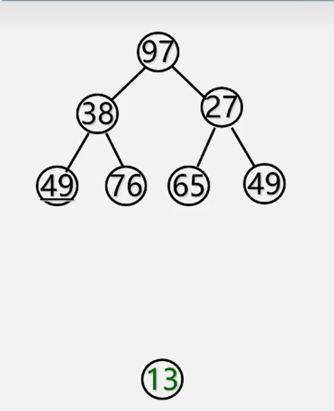 </img></td>
     <td>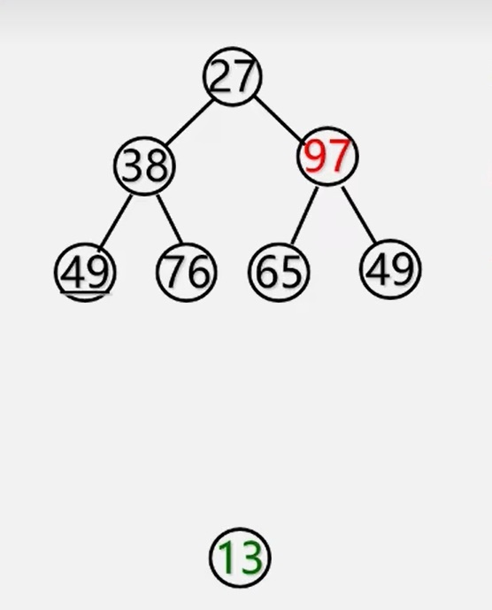 </img></td>
     <td>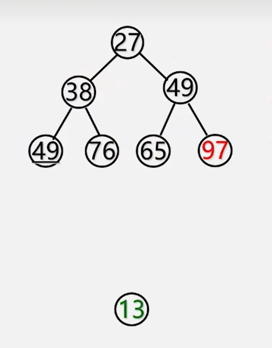 </img></td>
  </tr>
</table>

**堆的调整代码：**  
```cpp
void HeapAdjust(elem R[], int s, int m){
/*已知R[s..m]中记录的关键字除R[S]之外均满足堆的定义，本函数调整R[S]的关键字，使R[s..m]成为一个大根堆*/
    rc = R[s];
    for(j = 2*s ; j <= m ; j *= 2){// 沿key较大的孩子结点向下筛选
        if(j < m && R[j]< R[j+1]) ++j; //j为key较大的记录的下标
        if(rc >= R[j] ) break;
        R[s] = R[j];
        s = j;        //rc应插入在位置s上
    }//for
    R[s] = rc; // 插入
}// HeapAdjust
```
可以看出:
对一个无序序列反复**筛选**就可以得到一个堆，即: 从一个无序序列建堆的过程就是一个**反复筛选**的过程。  

显然:  
　　单结点的二叉树是堆;  
　　在完全二叉树中所有以叶子结点(序号i>n/2)为根的子树是堆。  
这样，我们只需依次将以序号为n/2，n/2-1，......, 1的结点为根的子树均调整为堆即可。  
由于堆实质上是一个线形表，那么可以用数组顺序存储一个堆。  

**堆的建立示例**  
<table border="0" margin-left: auto margin-right: auto>
  <tr>
     <td>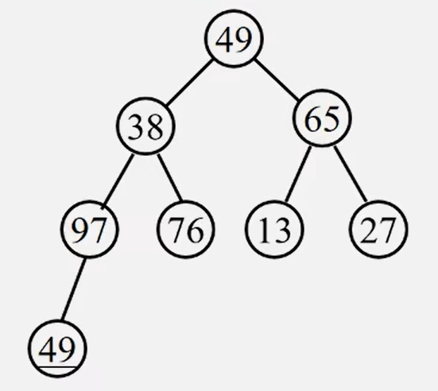 </img></td>
     <td>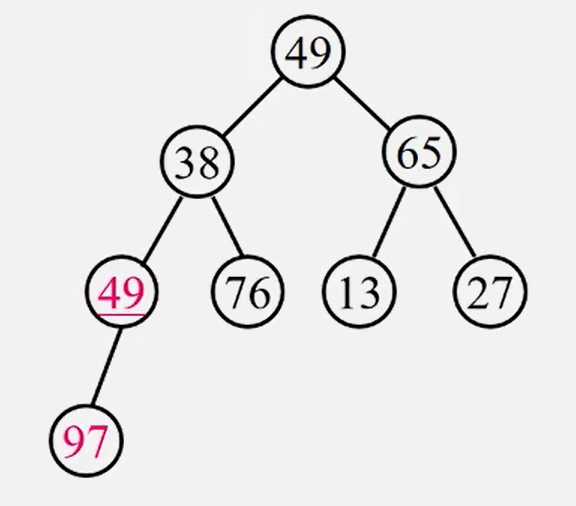 </img></td>
     <td>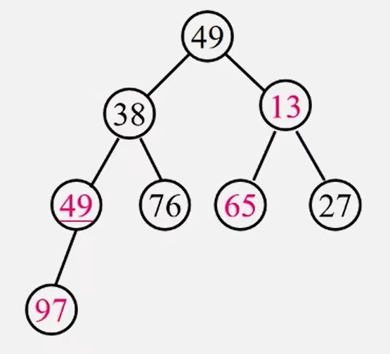 </img></td>
  </tr>
  <tr>
     <td>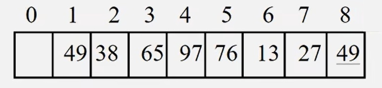 </img></td>
     <td>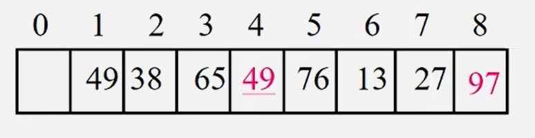 </img></td>
     <td>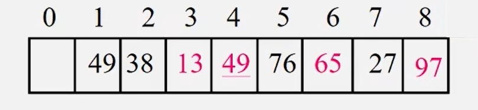 </img></td>
  </tr>
  <tr>
     <td>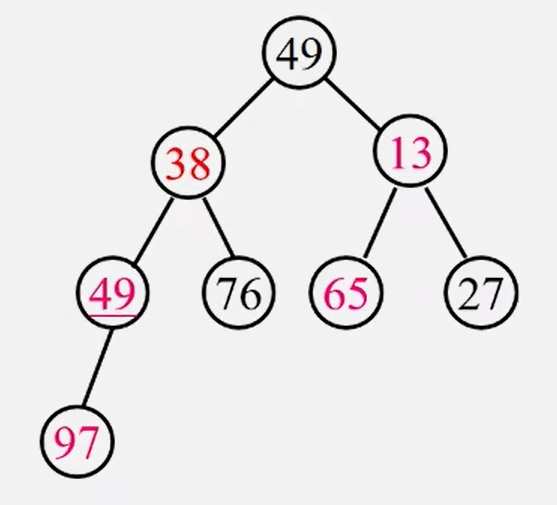 </img></td>
     <td>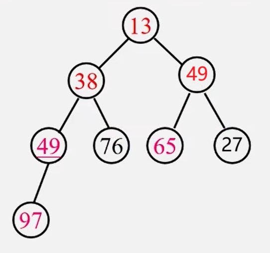 </img></td>
     <td>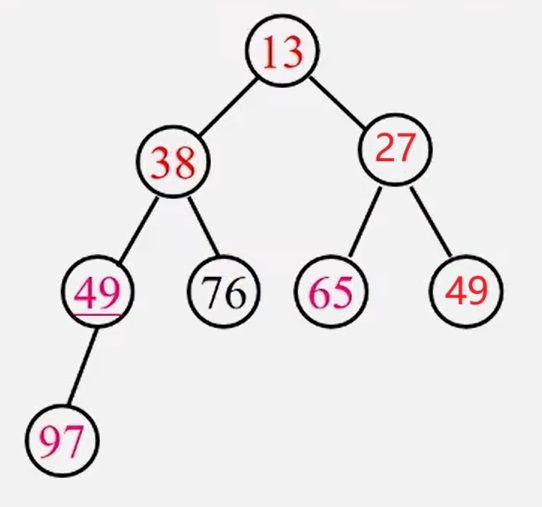 </img></td>
  </tr>
  <tr>
     <td>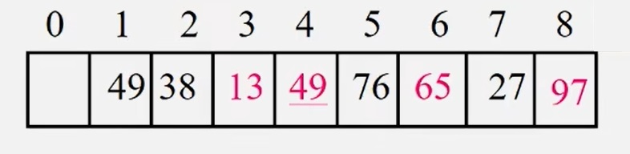 </img></td>
     <td>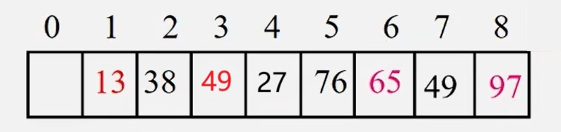 </img></td>
     <td>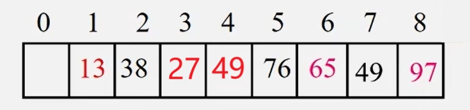 </img></td>
  </tr>
</table>


由以上分析知:  
若对一个无序序列建堆，然后输出根。重复该过程就可以由一个无序序列输出有序序列。  
>实质上，堆排序就是利用完全二叉树中父结点与孩子结点之间的内在关系来排序的。  

**堆的建立实现**  
```cpp
void HeapSort(elem R[]){         //对R[1]到R[n]进行堆排序
    int i;
    for(i = n/2 ; i >= 1 ; i--)
        HeapAdjust(R,i,n);        //建初始堆
    for(i = n ; i > 1 ; i--){    //进行n-1趟排序
        Swap(R[1]，R[i]);         //根与最后一个元素交换
        HeapAdjust(R,1,i-1);    //对R[1]到R[i -1]重新建堆
    }
} //HeapSort
```
