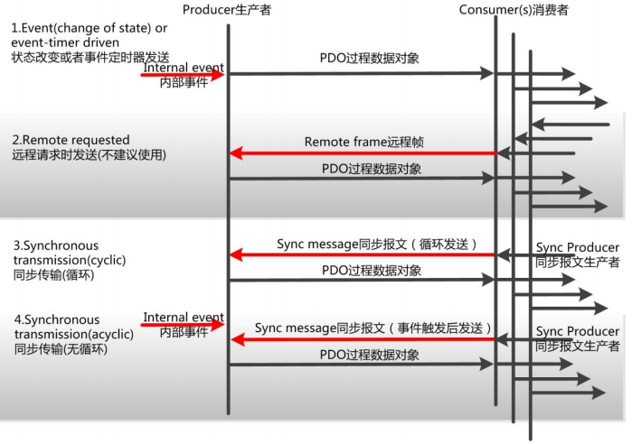
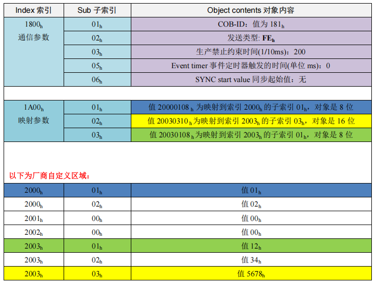

如前文所述 **PDO 属于过程数据用来传输实时数据，即单向传输，无需接收节点回应
CAN 报文来确认，从通讯术语上来说是属于“生产消费”模型 PDO，就像
食品销售柜台，生产者摆出“食品”，但只有“需要”的消费者才会来买，没有指向性。**

数据长度被限制为 1~8 字节。最多只要 1 帧就可以把一条信息或者一个变量传递结束。

## 5.1 PDO的CAN-ID定义

PDO 通信比较灵活，广义上只要符合 PDO 范围内的所有 CANID 都可以作为节点自身
的 TPDO 或者 RPDO 使用，也称为 COB-ID，不受功能码和 Node-ID 限制，如下图所示。

而在 PDO 预定义中，人为规定了 TPDO 和 RPDO，规定了 Node-ID 在 PDO 中的位置，
规定了 PDO 的编号，如下表所示。

**PDO 分为 TPDO（发送 PDO）和RPDO(接收 PDO)，发送和接收是以 CANopen 节点自身
为参考**（如果 CAN 主站或者其他从站就相反）。**TPDO 和 RPDO 分别有 4 个数据对象，每
种数据对象就是 1 条 CAN 报文封装**，这些都是数据收发的容器，水果箩
筐为使用者准备好，就看使用者在里面放什么水果了。

当然，如果某个节点需要传递的资源特别多，则有出现例如 TPDO5 之类的数据对象，
而它们的 CAN-ID 定义就需要打破预定义的规则，比如**我们可以定义 Node-ID 为 1 的节点
中 TPDO5 是 182h**，这里的 PDO 的 COB-ID 中的低 7 位不再是表示 Node-ID。其实所有的
PDO 的 COB-ID 与 Node-ID 无必然规则上的联系。

## 5.2 PDO的传输形式

PDO 的两种传输方式：同步传输和异步传输。 如下图所示，1、2 为异步传输，3、4
为同步传输。

 

- **异步传输（由特定事件触发）**
  
其触发方式可有两种，第一种是由设备子协议中规定的对象特定事件来触发（例如，定
时传输，数据变化传输等）。第二种是通过发送与 PDO 的 COB-ID 相同的远程帧来触发 PDO
的发送。**目前应用中的异步传输基本都采用第一种。**

- **同步传输（通过接收同步对象实现同步）**  

**同步传输就是通过同步报文让所有节点能在同一时刻进行上传数据或者执行下达的应
用指令**，可以有效避免异步传输导致的应用逻辑混乱和总线负载不平衡的问题。一般发送同
步报文的节点是 NMT 主机。

同步传输又可分为周期传输（循环）和非周期传输（无循环）。周期传输则是通过接收
同步对象（SYNC）来实现，可以设置 1~240 个同步对象触发。 非周期传输是由远程帧预
触发或者由设备子协议中规定的对象特定事件预触发传送。

## 5.3 PDO的通信参数

PDO 通信参数，定义了该设备所使用的 COB-ID、传输类型、定时周期等。RPDO 通讯
参数位于对象字典索引的 1400h to 15FFh，TPDO 通讯参数位于对象字典索引的 1800h to
19FFh。每条索引代表一个 PDO 的通信参数集，其中的子索引分别指向具体的各种参数。如下
表所示。

 

- **Number of entries 参数条目数量**：即本索引中有几条参数；
- **COB-ID**：即这个 PDO 发出或者接收的对应 CAN 帧 ID；
- **发送类型**：即这个 PDO 发送或者接收的传输形式，通常使用循环同步和异步制造
商特定事件较多；
- **Inhibit time 生产禁止约束时间**(1/10ms)：约束 PDO 发送的最小间隔，避免导致总
线负载剧烈增加，比如数字量输入过快，导致状态改变发送的 TPDO 频繁发送，
总线负载加大，所以需要一个约束时间来进行“滤波”，这个时间单位为 0.1ms；
- **Event timer 事件定时器触发的时间**(单位 ms)：定时发送的 PDO，它的定时时间，
如果这个时间为 0，则这个 PDO 为事件改变发送。
- **SYNC start value 同步起始值**：同步传输的 PDO，收到诺干个同步包后，才进行发
送，这个同步起始值就是同步包数量。比如设置为 2，即收到 2 个同步包后才进行
发送。

## 5.4 PDO的映射参数

**PDO 映射参数是初学者学习 CANopen 时的一个难点**，它包含了一个对象字典中的对
象列表，这些对象映射到相应的 PDO，其中包括数据的长度（单位，位），对于生产者和
消费者都必须要知道这个映射参数，才能够正确的解释 PDO 内容。就是**将通信参数、应用
数据和具体 CAN 报文中数据联系起来**。

RPDO 通讯参数 1400h to 15FFh，映射参数 1600h to 17FFh，数据存放为 2000h 之后厂商
自定义区域；TPDO 通讯参数 1800h to 19FFh，映射参数 1A00h to 1BFFh，数据存放为 2000h 之后厂商自定义区域。

为了更加直观地表现映射，下表模拟 TPDO1，将参数、应用数据、CAN 报文数据联
合起来展示，不同的映射采用不同的颜色。

 

CAN transmission( CAN 发送报文)  
TPDO1（CAN-ID = 181h） Data field：数据域 4 个字节

 

请读者阅读 3 遍以上，如果还是无法理解。请打开广州致远电子的 CANopen 主站卡管
理软件 CANManager for CANopen，导入 XGate-COP10 模块从站协议栈模块的 EDS 文件，
来真实感受一下。点击配置从站，“高级”中进行感性认识。