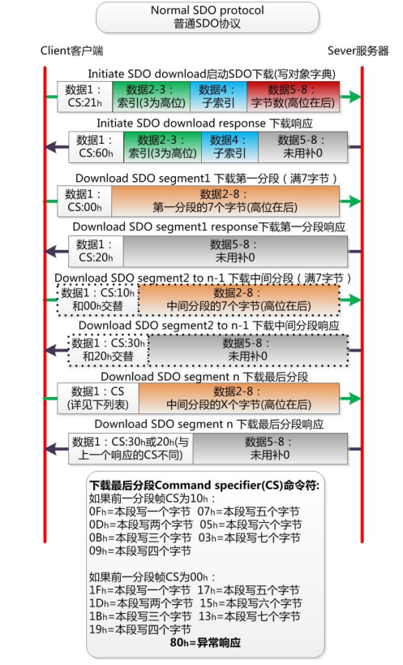

SDO 主要用于 CANopen 主站对从节点的参数配置。**服务确认是 SDO 的最大的特点，
为每个消息都生成一个应答，确保数据传输的准确性**。就像快递，需要
收方签收后，给寄方发送一个已经签收的确认才算完成一次投递。

在一个 CANopen 系统中，通常 **CANopen 从节点作为 SDO 服务器，CANopen 主节点
作为客户端**（称为 CS 通讯）。SDO 客户端通过索引和子索引，能够访问 SDO 服务器上的对
象字典。这样 CANopen 主节点可以访问从节点的任意对象字典项的参数，并且 SDO 也可以
传输任何长度的数据（当数据长度超过 4 个字节时就拆分成多个报文来传输）。

## 6.1 通讯原则（communication principle）
SDO 的通讯原则非常单一，**发送方（客户端）发送 CAN-ID 为 600h+Node-ID 的报文，
其中 Node-ID 为接收方（服务器）的节点地址，数据长度均为 8 字节；**

**接收方（服务器）成功接收后，回应 CAN-ID 为 580h+Node-ID 的报文。这里的 Node-ID
依然是接收方（服务器）的节点地址，数据长度均为 8 字节。** 如下图所示。

## 6.2 快速SDO协议

最常用最常见的 SDO 协议是**快速 SDO，所谓快速，就是 1 次来回就搞定。前提是读取
和写入的值不能大于 32 位**。如下图所示为快速 SDO 协议的示意图。命令中直接包含了
要读写的索引、子索引、数据。可谓直接命中。

快速 SDO 的难点在于 CS 命令符的记忆，需要读者收藏这个示意图。

通过快速 SDO，可以直接对 CANopen 节点的对象字典中的值进行读取和修改，所以在
做参数配置之外，也经常作为关键性数据传输之用。比如 CANopen 控制机器人的电机转动
角度时，就使用 SDO 来传输，保证可靠到达。

##  6.3 普通 SDO 协议（Normal SDO protocol）

当需要传输的值超过 32 位时，就不能使用快速 SDO 传输。必须使用普通 SDO 进行分
帧传输。在应用中较少用到，一般用于 CANopen 节点的程序固件升级，或者做网关转换
MVB 总线之类数据最大可达 256 位的应用。

普通 SDO 协议难点在于分包逻辑与 CS 命令符的变化。依然难以记忆，需要读者将以
下示意图进行收藏。

当然普通SDO的CAN帧ID与快速SDO相同，依然**发送方（客户端）发送的报文CAN-ID
为 600h+Node-ID，接收方（服务器）成功接收后，回应 CAN-ID 为 580h+Node-ID 的报文**。

1. 下载协议 download protocol 如下图所示。

 

2. 上传协议 upload protocol 如下图所示。

