# 1.CAN简介&硬件电路

## CAN简介

- CAN总线（Controller Area Network Bus）控制器局域网总线
- CAN总线是由BOSCH公司开发的一种简洁易用、传输速度快、易扩展、可靠性高的串行通信总线，广泛应用于汽车、嵌入式、工业控制等领域
- CAN总线特征：
  - 两根通信线（CAN_H、CAN_L），线路少
  - 差分信号通信，抗干扰能力强
  - 高速CAN（ISO11898）：125k~1Mbps, <40m
  - 低速CAN（ISO11519）：10k~125kbps, <1km
  - 异步，无需时钟线，通信速率由设备各自约定
  - 半双工，可挂载多设备，多设备同时发送数据时通过仲裁判断先后顺序
  - 11位/29位报文ID，用于区分消息功能，同时决定优先级
  - 可配置1~8字节的有效载荷
  - 可实现广播式和请求式两种传输方式
  - 应答、CRC校验、位填充、位同步、错误处理等特性

## 主流通信协议对比

|名称   |引脚                |双工 |时钟|电平|设备  |应用场景                  |
|-------|-------------------|-----|----|---|------|-------------------------|
|UART   |TX、RX             |全双工|异步|单端|点对点|两个设备互相通信           |
|I2C    |SCL、SDA           |半双工|同步|单端|多设备|一个主控外挂多个模块       |
|SPI    |SCK、MOSI、MISO、SS|全双工|同步|单端|多设备|一个主控外挂多个模块（高速）|
|CAN    |CAN_H、CAN_L       |半双工|异步|差分|多设备|多个主控互相通信           |

|UART                         |I2C                      |SPI                       |
|-----------------------------|-------------------------|--------------------------|
|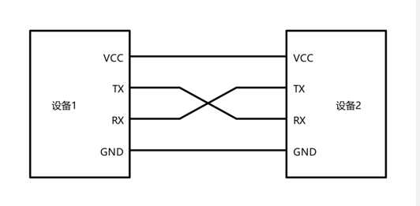|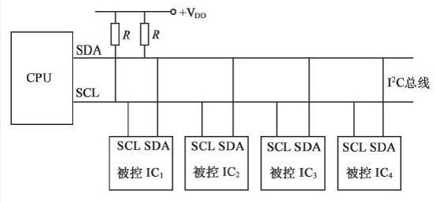|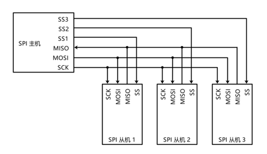|

## CAN硬件电路

- 每个设备通过CAN收发器挂载在CAN总线网络上
- CAN控制器引出的TX和RX与CAN收发器相连，CAN收发器引出的CAN_H和CAN_L分别与总线的CAN_H和CAN_L相连
- **高速CAN使用闭环网络**，CAN_H和CAN_L两端添加**120Ω**的终端电阻
- 低速CAN使用开环网络，CAN_H和CAN_L其中一端添加2.2kΩ的终端电阻

|高速CAN                                  |低速CAN                                  |
|-----------------------------------------|----------------------------------------|
|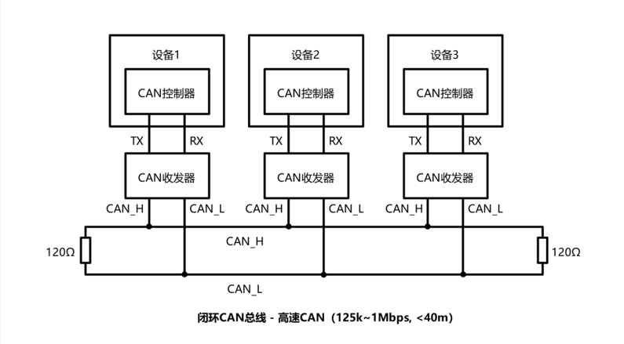|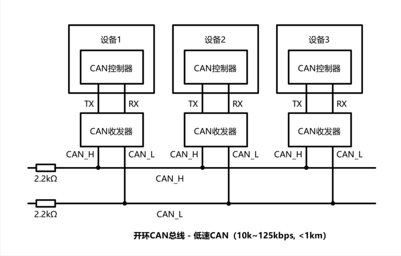|

## CAN电平标准

- CAN总线采用差分信号，即两线电压差（VCAN_H-VCAN_L）传输数据位
- 高速CAN规定：
  - 电压差为0V时表示逻辑1（隐性电平）
  - 电压差为2V时表示逻辑0（显性电平）
- 低速CAN规定：
  - 电压差为-1.5V时表示逻辑1（隐性电平）
  - 电压差为3V时表示逻辑0（显性电平）

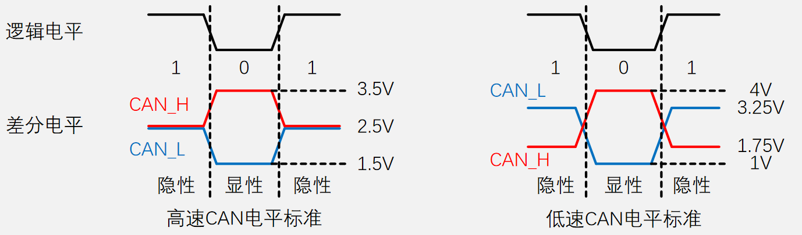

## CAN收发器 – TJA1050（高速CAN）

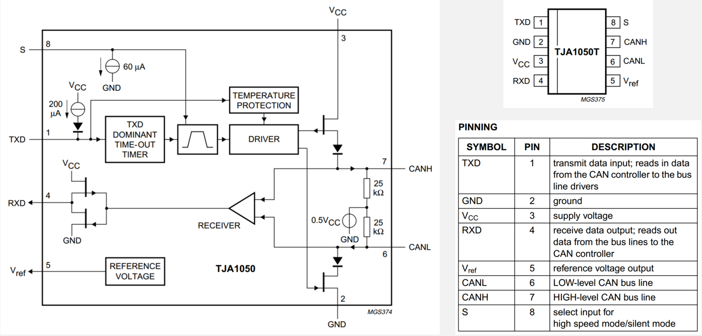

## CAN物理层特性

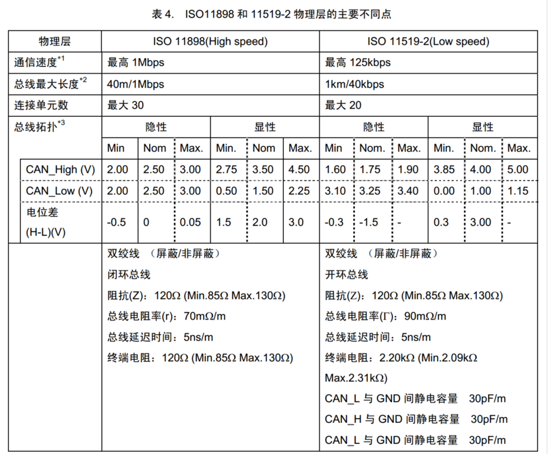

# 2.帧格式

## CAN总线帧格式

CAN协议规定了以下5种类型的帧：

|帧类型 |用途                              |
|------|----------------------------------|
|数据帧|发送设备主动发送数据（广播式）       |
|遥控帧|接收设备主动请求数据（请求式）       |
|错误帧|某个设备检测出错误时向其他设备通知错误|
|过载帧|接收设备通知其尚未做好接收准备       |
|帧间隔|用于将数据帧及遥控帧与前面的帧分离开  |

## 数据帧

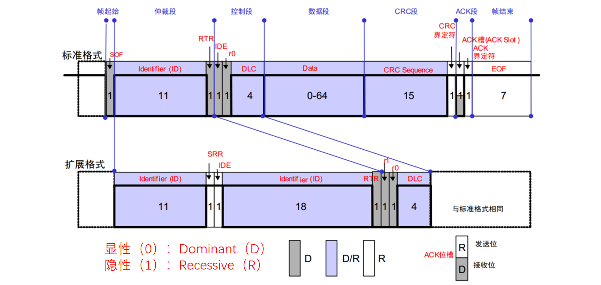

- **SOF（Start of Frame）**：帧起始，表示后面一段波形为传输的数据位
- **ID（Identify）**：标识符，区分功能，同时决定优先级
- **RTR（Remote Transmission Request ）**：远程请求位，区分数据帧和遥控帧
- **IDE（Identifier Extension）**：扩展标志位，区分标准格式和扩展格式
- **SRR（Substitute Remote Request）**：替代RTR，协议升级时留下的无意义位
- **r0/r1（Reserve）**：保留位，为后续协议升级留下空间
- **DLC（Data Length Code）**：数据长度，指示数据段有几个字节
- **Data**：数据段的1~8个字节有效数据
- **CRC（Cyclic Redundancy Check）**：循环冗余校验，校验数据是否正确
- **ACK（Acknowledgement）**：应答位，判断数据有没有被接收方接收
- **CRC/ACK界定符**：为应答位前后发送方和接收方释放总线留下时间
- **EOF（End of Frame ）**：帧结束，表示数据位已经传输完毕

 

- CAN 1.2时期，仅存在标准格式，IDE位当时仍为保留位r1

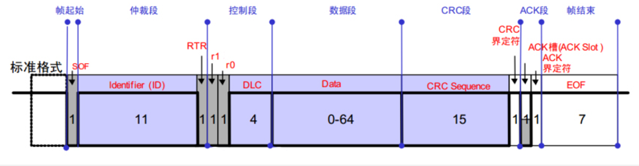

- CAN 2.0时期，ID不够用，出现了扩展格式，增加了ID的位数，为了区分标准格式与扩展格式，协议将标准格式中的r1赋予了新功能—IDE

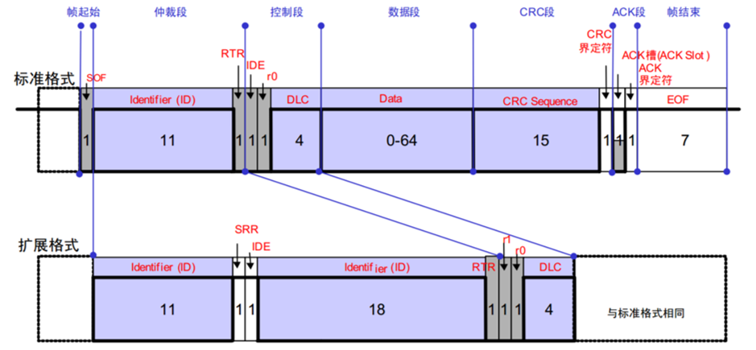

## 遥控帧

遥控帧无数据段，RTR为隐性电平1，其他部分与数据帧相同

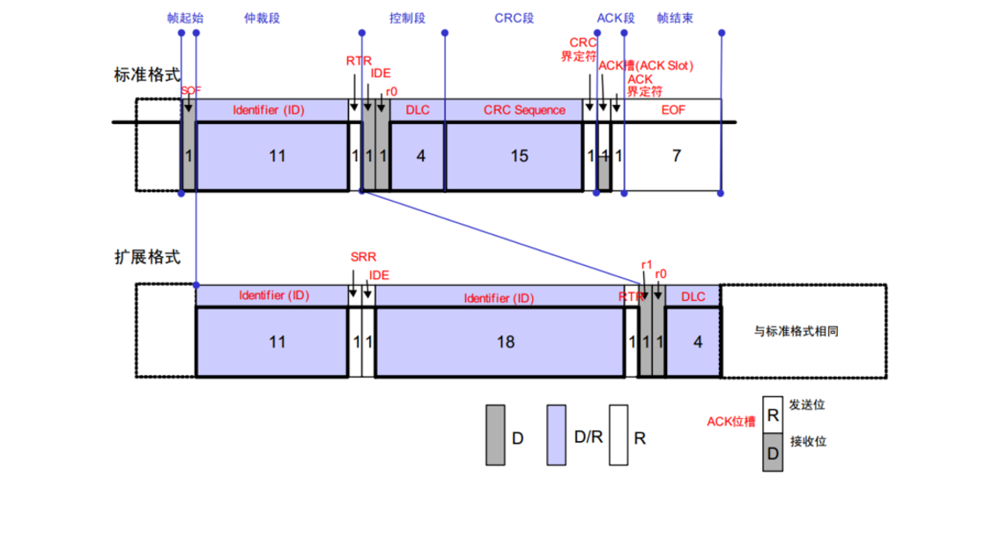

## 错误帧

总线上所有设备都会监督总线的数据，一旦发现“位错误”或“填充错误”或“CRC错误”或“格式错误”或“应答错误” ，这些设备便会发出错误帧来破坏数据，同时终止当前的发送设备

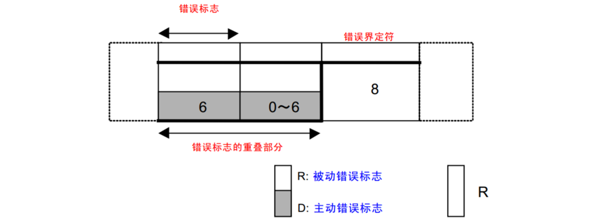

## 过载帧

当接收方收到大量数据而无法处理时，其可以发出过载帧，延缓发送方的数据发送，以平衡总线负载，避免数据丢失

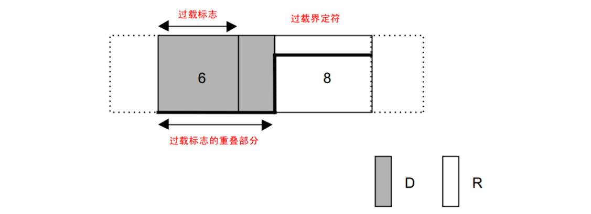

## 帧间隔

将数据帧和遥控帧与前面的帧分离开

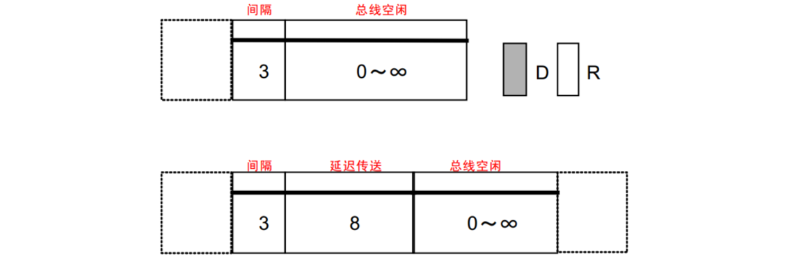

## 位填充

- 位填充规则：发送方每发送 5个相同电平 后，自动追加一个相反电平的填充位，接收方检测到填充位时，会自动移除填充位，恢复原始数据
- 例如：  

| ||||
|-|-|-|-|
|即将发送：   |100000110   |10000011110      |0111111111110   |
|实际发送：   |1000001110  |1000001111100    |011111011111010 | 
|实际接收：   |1000001110  |1000001111100    |011111011111010 |
|移除填充后： |100000110   |10000011110      |0111111111110   |

- 位填充作用：
  - 增加波形的定时信息，利于接收方执行再同步，防止波形长时间无变化，导致接收方不能精确掌握数据采样时机
  - 将正常数据流与“错误帧”和“过载帧”区分开，标志“错误帧”和“过载帧”的特异性
  - 保持CAN总线在发送正常数据流时的活跃状态，防止被误认为总线空闲

## 波形示例

- 标准数据帧，报文ID为0x555，数据长度1字节，数据内容为0xAA

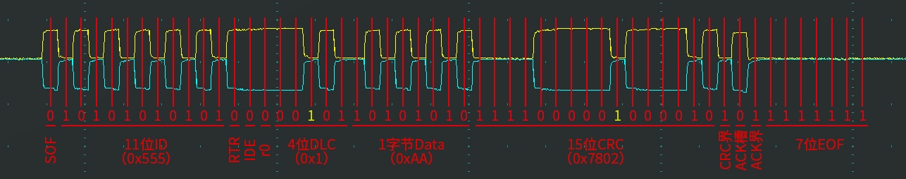

- 标准数据帧，报文ID为0x666，数据长度2字节，数据内容为0x12, 0x34

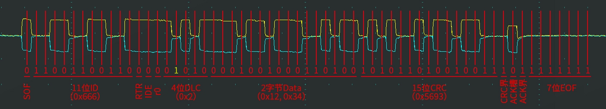

- 扩展数据帧，报文ID为0x0789ABCD，数据长度1字节，数据内容为0x56

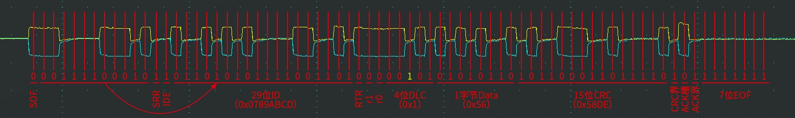

- 标准遥控帧，报文ID为0x088，数据长度1字节，无数据内容

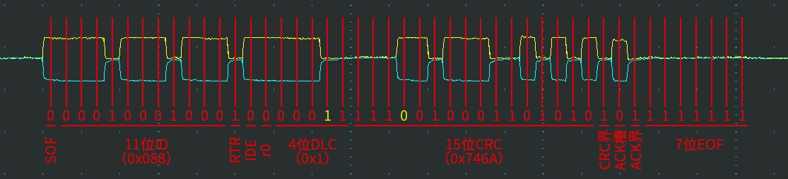

# 3.位同步

## 接收方数据采样

- CAN总线没有时钟线，总线上的所有设备通过约定波特率的方式确定每一个数据位的时长
- 发送方以约定的位时长每隔固定时间输出一个数据位
- 接收方以约定的位时长每隔固定时间采样总线的电平，输入一个数据位
- 理想状态下，接收方能依次采样到发送方发出的每个数据位，且采样点位于数据位中心附近

## 接收方数据采样遇到的问题

- 接收方以约定的位时长进行采样，但是采样点没有对齐数据位中心附近

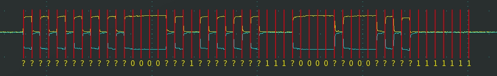

- 接收方刚开始采样正确，但是时钟有误差，随着误差积累，采样点逐渐偏离

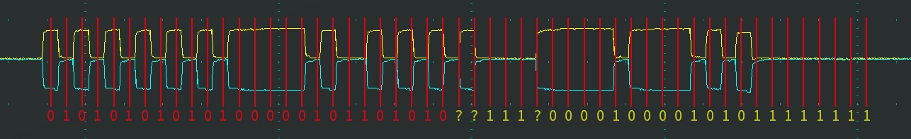

## 位时序

- 为了灵活调整每个采样点的位置，使采样点对齐数据位中心附近，CAN总线对每一个数据位的时长进行了更细的划分，分为同步段（SS）、传播时间段（PTS）、相位缓冲段1（PBS1）和相位缓冲段2（PBS2），每个段又由若干个最小时间单位（Tq）构成

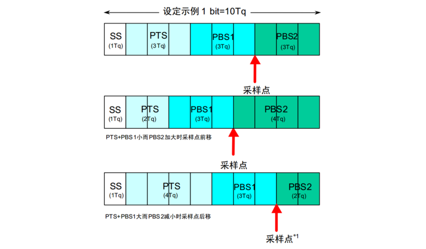

> SS = 1Tq  
> PTS = 1~8Tq  
> PBS1 = 1~8Tq  
> PBS2 = 2~8Tq  

## 硬同步

- 每个设备都有一个位时序计时周期，当某个设备（发送方）率先发送报文，其他所有设备（接收方）收到SOF的下降沿时，接收方会将自己的位时序计时周期拨到SS段的位置，与发送方的位时序计时周期保持同步
- 硬同步只在帧的第一个下降沿（SOF下降沿）有效
- 经过硬同步后，若发送方和接收方的时钟没有误差，则后续所有数据位的采样点必然都会对齐数据位中心附近

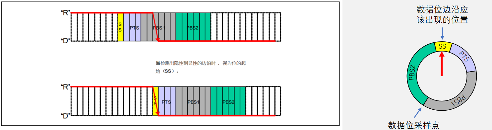

## 再同步

- 若发送方或接收方的时钟有误差，随着误差积累，数据位边沿逐渐偏离SS段，则此时接收方根据再同步补偿宽度值（SJW）通过加长PBS1段，或缩短PBS2段，以调整同步
- 再同步可以发生在第一个下降沿之后的每个数据位跳变边沿

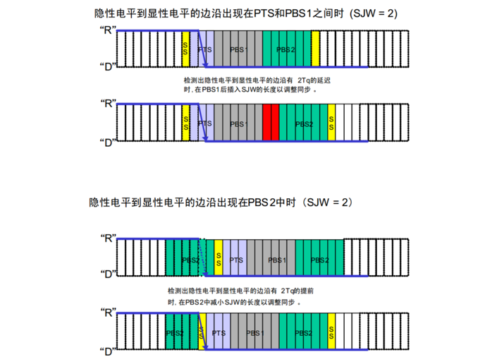

> SJW=1~4Tq

## 波特率计算

- 波特率 = 1 / 一个数据位的时长 = 1 / (${T_{SS} + T_{PTS} + T_{PBS1} + T_{PBS2}}$)
- 例如：  
  - SS = 1Tq，PTS = 3Tq，PBS1 = 3Tq，PBS2 = 3Tq  
  - Tq = 0.5us  
  - 波特率 = 1 / (0.5us + 1.5us + 1.5us + 1.5us) = 200kbps  

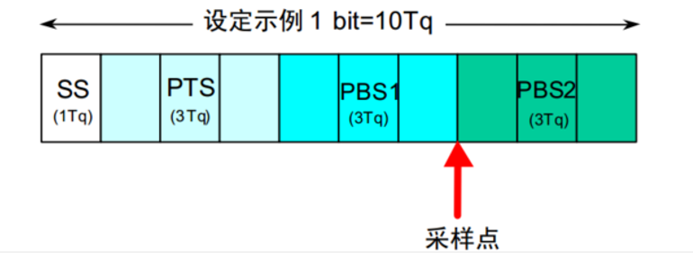

# 4.仲裁

## 多设备同时发送遇到的问题

- CAN总线只有一对差分信号线，同一时间只能有一个设备操作总线发送数据，若多个设备同时有发送需求，该如何分配总线资源？
- 解决问题的思路：制定资源分配规则，依次满足多个设备的发送需求，确保同一时间只有一个设备操作总线

## 资源分配规则

1. 规则1：先占先得

- 若当前已经有设备正在操作总线发送数据帧/遥控帧，则其他任何设备不能再同时发送数据帧/遥控帧（可以发送错误帧/过载帧破坏当前数据）
- 任何设备检测到连续11个隐性电平，即认为总线空闲，只有在总线空闲时，设备才能发送数据帧/遥控帧
- 一旦有设备正在发送数据帧/遥控帧，总线就会变为活跃状态，必然不会出现连续11个隐性电平，其他设备自然也不会破坏当前发送
- 若总线活跃状态其他设备有发送需求，则需要等待总线变为空闲，才能执行发送需求

2. 规则2：非破坏性仲裁

- 若多个设备的发送需求同时到来或因等待而同时到来，则CAN总线协议会根据ID号（仲裁段）进行非破坏性仲裁，ID号小的（优先级高）取到总线控制权，ID号大的（优先级低）仲裁失利后将转入接收状态，等待下一次总线空闲时再尝试发送
- 实现非破坏性仲裁需要两个要求：  
  - **线与特性**：总线上任何一个设备发送显性电平0时，总线就会呈现显性电平0状态，只有当所有设备都发送隐性电平1时，总线才呈现隐性电平1状态，即：0 & X & X = 0，1 & 1 & 1 = 1
  - **回读机制**：每个设备发出一个数据位后，都会读回总线当前的电平状态，以确认自己发出的电平是否被真实地发送出去了，根据线与特性，发出0读回必然是0，发出1读回不一定是1

## 非破坏性仲裁过程

数据位从前到后依次比较，出现差异且数据位为1的设备仲裁失利

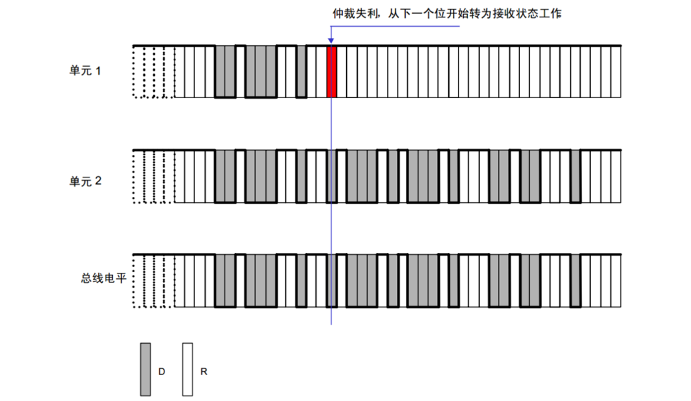

> 由于CAN通信的**线与特性**，当出现第一个差异位时，必然是数据位为0的设备仲裁成功，由此实现了**ID号小的报文具有高优先级**

## 数据帧和遥控帧的优先级

数据帧和遥控帧ID号一样时，数据帧的优先级高于遥控帧，这是通过**数据帧的RTR位为0，遥控帧的RTR位为1**实现的。

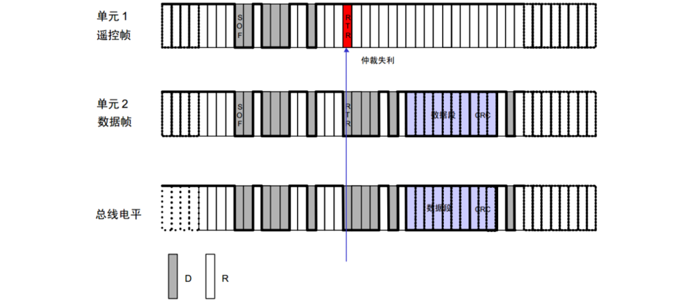

## 标准格式和扩展格式的优先级

标准格式11位ID号和扩展格式29位ID号的高11位一样时，标准格式的优先级高于扩展格式。SRR必须始终为1，以保证此要求。

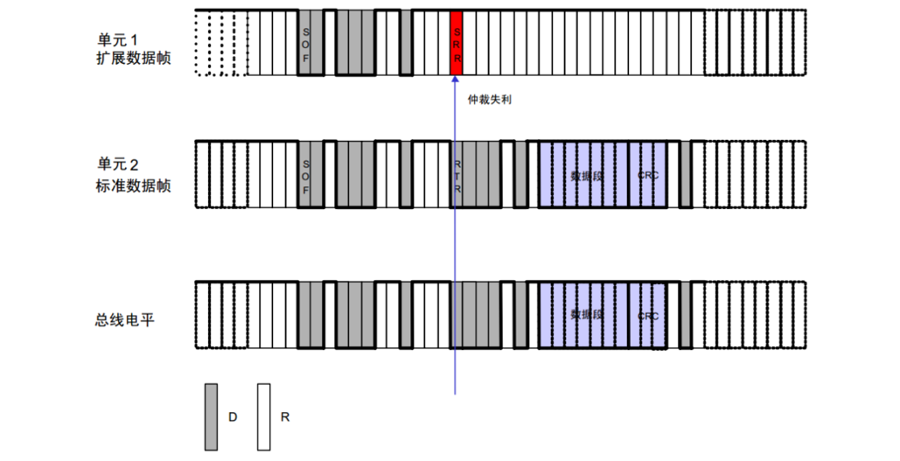

# 5.错误处理