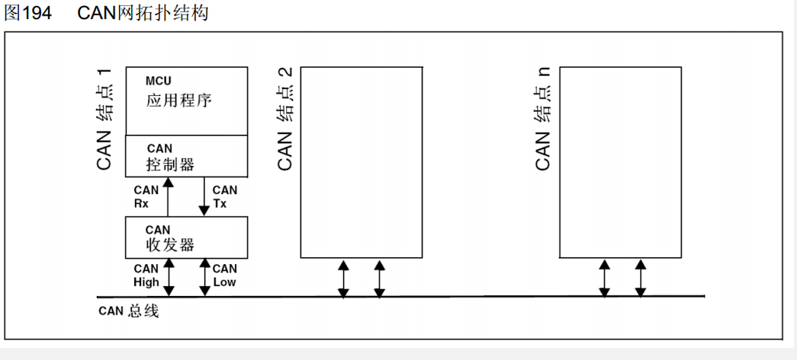
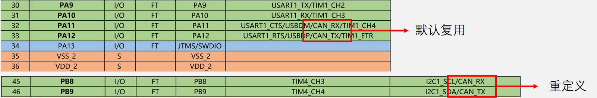
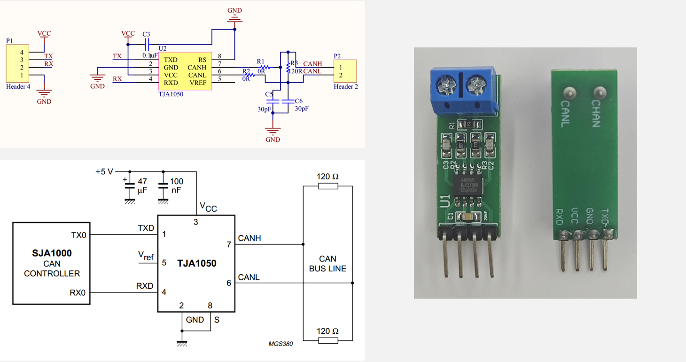
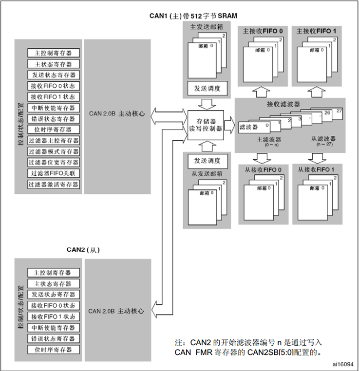
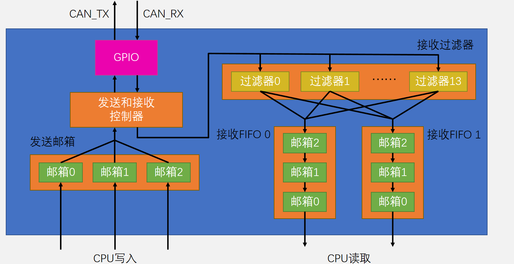
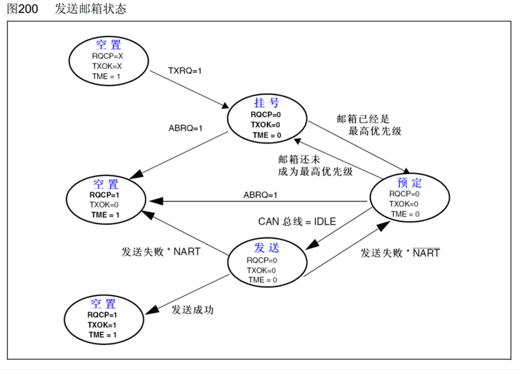
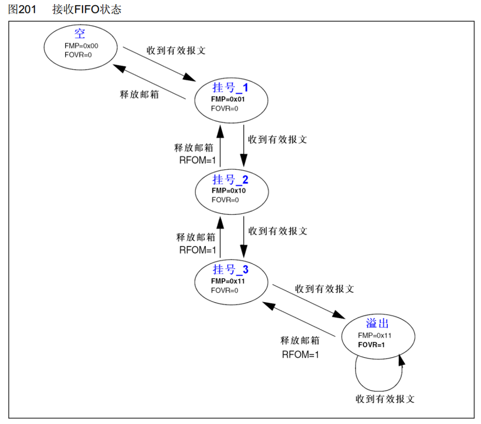
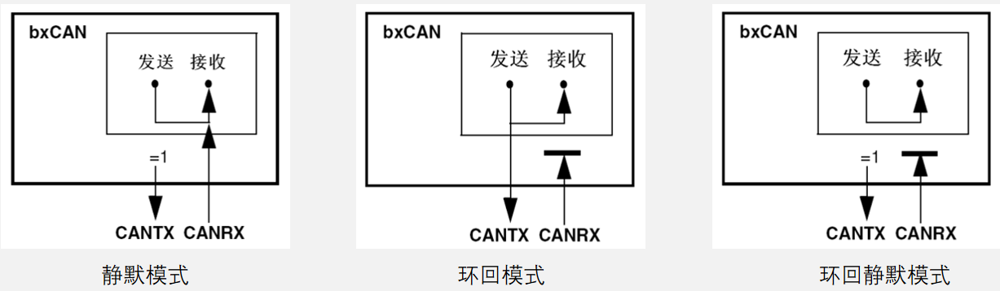
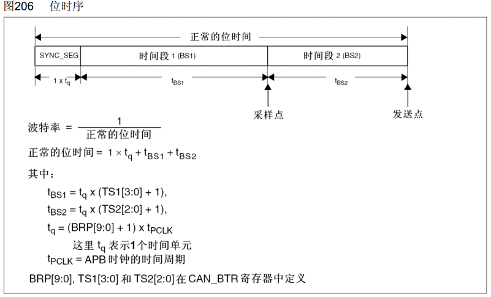

## STM32 CAN外设简介

- STM32内置bxCAN外设（CAN控制器），支持CAN2.0A和2.0B，可以自动发送CAN报文和按照过滤器自动接收指定CAN报文，程序只需处理报文数据而无需关注总线的电平细节
- 波特率最高可达1兆位/秒
- 3个可配置优先级的发送邮箱
- 2个3级深度的接收FIFO
- 14个过滤器组（互联型28个）
- 时间触发通信、自动离线恢复、自动唤醒、禁止自动重传、接收FIFO溢出处理方式可配置、发送优先级可配置、双CAN模式

> STM32F103C8T6 CAN资源：CAN1

## CAN网拓扑结构

## CAN收发器电路

## CAN框图

## CAN基本结构

## 发送接收过程

**发送过程**  
基本流程：选择一个空置邮箱 → 写入报文 → 请求发送

**接收流程**  
基本流程：接收到一个报文→匹配过滤器后进入FIFO 0或FIFO 1→CPU读取

**发送和接收配置位**  

- NART：置1，关闭自动重传，CAN报文只被发送1次，不管发送的结果如何（成功、出错或仲裁丢失）；置0，自动重传，CAN硬件在发送报文失败时会一直自动重传直到发送成功

- TXFP：置1，优先级由发送请求的顺序来决定，先请求的先发送；置0，优先级由报文标识符来决定，标识符值小的先发送（标识符值相等时，邮箱号小的报文先发送）

- RFLM：置1，接收FIFO锁定，FIFO溢出时，新收到的报文会被丢弃；置0，禁用FIFO锁定，FIFO溢出时，FIFO中最后收到的报文被新报文覆盖

## 标识符过滤器

每个过滤器的核心由两个32位寄存器组成：FxR1[31:0]和FxR2[31:0]

- FSCx：位宽设置
    - 置0，16位；置1，32位

- FBMx：模式设置
    - 置0，屏蔽模式；置1，列表模式

- FFAx：关联设置
    - 置0，过滤后的报文进FIFO 0；置1，过滤后的报文进FIFO 1

- FACTx：激活设置
    - 置0，禁用；置1，启用

> 共有十四个过滤器，x可以为0 ~ 13

### 过滤器寄存器配置

根据FSCx和FBMx的配置，过滤器可工作在四种模式：

- 1个32位过滤器-屏蔽模式
    - FxR1写入ID，FxR2写入掩码。对应位写1表示接收的ID必须和FxR1中对应位一样，写0为无关。
- 2个32位过滤器-列表模式
    - 每个过滤器可选择 $\color{red}{通过}$ 一个标准帧ID或一个扩展帧ID。一个过滤器可过滤2个标准帧ID或两个扩展帧ID。
- 2个16位过滤器-屏蔽模式
    - 同上
- 4个16位过滤器-列表模式
    - 每个过滤器可选择 $\color{red}{通过}$ 一个标准帧ID。一个过滤器可过滤4个标准帧ID。

> 注意寄存器里的RTR位和IDE位是否需要选择或屏蔽。

### 过滤器配置示例

|总线上存在的ID  |想要接收的ID  |过滤器模式  |R1[31:0]配置值  |R2[31:0]配置值  |
|---------------|-------------|-----------|----------------|---------------|
|0x123, 0x234,   0x345, 0x456,   0x567, 0x678|0x234,   0x345,   0x567|16位/列表|ID: R1[15:0]=0x234<<5   ID: R1[31:16]=0x345<<5|ID: R2[15:0]=0x567<<5   ID: R2[31:16]=0x000<<5|
|0x100\~0x1FF,  0x200\~0x2FF,  0x310\~0x31F,  0x320\~0x32F|0x200\~0x2FF,  0x320\~0x32F|16位/屏蔽|ID: R1[15:0]=0x200<<5   Mask: R1[31:16]=(0x700<<5)\|0x10\|0x8|ID: R2[15:0]=0x320<<5   Mask: R2[31:16]=(0x7F0<<5)\|0x10\|0x8|
|0x123, 0x234,   0x345, 0x456,   0x12345678,  0x0789ABCD|0x123,  0x12345678|32位/列表|ID: R1[31:0]=0x123<<21|ID: R2[31:0]=(0x12345678<<3)\|0x4|
|0x12345600\~0x123456FF,   0x0789AB00\~0x0789ABFF|0x12345600\~   0x123456FF|32位/屏蔽|ID: R1[31:0]=(0x12345600<<3)\|0x4|Mask: R2[31:0]=(0x1FFFFF00<<3)\|0x4\|0x2|
|任意ID|只要遥控帧|32位/屏蔽|ID: R1[31:0]=0x2|Mask: R2[31:0]=0x2|
|任意ID|所有帧|32位/屏蔽|ID: R1[31:0]=随意|Mask: R2[31:0]=0|

## 测试模式

- **静默模式**：用于分析CAN总线的活动，不会对总线造成影响
- **环回模式**：用于自测试，同时发送的报文可以在CAN_TX引脚上检测到
- **环回静默模式**：用于热自测试，自测的同时不会影响CAN总线

## 工作模式

- **初始化模式**：用于配置CAN外设，禁止报文的接收和发送
- **正常模式**：配置CAN外设后进入正常模式，以便正常接收和发送报文
- **睡眠模式**：低功耗，CAN外设时钟停止，可使用软件唤醒或者硬件自动唤醒
- **AWUM**：置1，自动唤醒，一旦检测到CAN总线活动，硬件就自动清零SLEEP，唤醒CAN外设；置0，手动唤醒，软件清零SLEEP，唤醒CAN外设

## 位时间特性

>stm32的can外设中，PTS段和PBS1段合为BS1段
>SS = 1Tq  
>BS1 = 1\~16Tq  
>BS2 = 1\~8Tq  

>SJW=1\~4Tq

>**波特率 = APB1时钟频率 / 分频系数 / 一位的Tq数量   &emsp;&emsp;&emsp; = 36MHz / (BRP[9:0]+1) / (1 + (TS1[3:0]+1) + (TS2[2:0]+1))**

## can中断

CAN外设占用4个专用的中断向量

- 发送中断：发送邮箱空时产生

- FIFO 0中断：收到一个报文/FIFO 0满/FIFO 0溢出时产生

- FIFO 1中断：收到一个报文/FIFO 1满/FIFO 1溢出时产生

- 状态改变错误中断：出错/唤醒/进入睡眠时产生

## 时间触发通信

- TTCM：置1，开启时间触发通信功能；置0，关闭时间触发通信功能
- CAN外设内置一个16位的计数器，用于记录时间戳
- TTCM置1后，该计数器在每个CAN位的时间自增一次，溢出后归零
- 每个发送邮箱和接收FIFO都有一个TIME[15:0]寄存器，发送帧SOF时，硬件捕获计数器值到发送邮箱的TIME寄存器，接收帧SOF时，硬件捕获计数器值到接收FIFO的TIME寄存器
- 发送邮箱可配置TGT位，捕获计数器值的同时，也把此值写入到数据帧数据段的最后两个字节，为了使用此功能，DLC必须设置为8

## 错误处理和离线恢复

- TEC和REC根据错误的情况增加或减少
- ABOM：置1，开启离线自动恢复，进入离线状态后，就自动开启恢复过程；置0，关闭离线自动恢复，软件必须先请求进入然后再退出初始化模式，随后恢复过程才被开启

