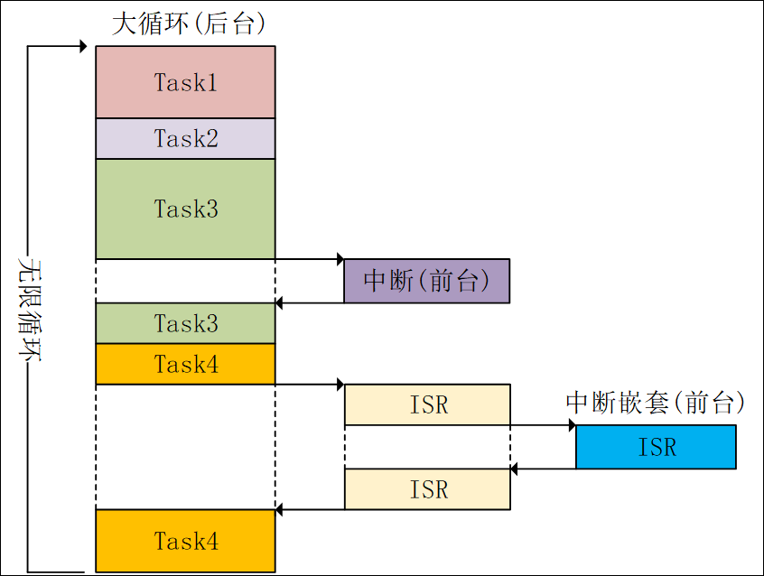
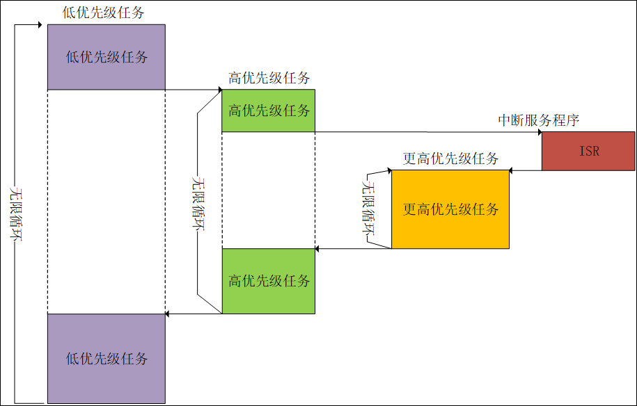

# 1. 裸机与FreeRTOS介绍

**场景一：**  
以打游戏和回复信息两个任务举例，裸机和FreeRTOS的处理如下。  

对于裸机系统，只能按顺序执行每个任务。

```cpp
while(1) 
{ 
    打游戏();
    回复信息(); 
}

```

对于RTOS系统，可以创建两个任务，然后 <font color = red>以很短的时间间隔交替执行</font> 两个任务，使得 $\color{red}{看起来两个任务在同时执行}$ 。
 <font color = red>以很短的时间间隔交替执行</font> 
```cpp
void main(void) 
{ 
    /* 创建打游戏任务 */
    xTaskCreate（打游戏）
    /* 创建回复信息任务 */
    xTaskCreate(回复信息)
}

void 游戏(void) 
{ 
    while(1) 
    { 
        打游戏();
    }
}

void 信息(void) 
{ 
    while(1) 
    { 
        回复信息();
    }
}

```

**场景二：**  
假设突然来了一个更紧急的任务**去医院**，裸机和FreeRTOS的处理如下：  

对于裸机， $\color{red}{去医院被设置为一个中断}$ ，当中断触发时置位flag，然后主循环检查flag被置位后执行去医院的程序。  

```cpp
while(1) 
{ 
    打游戏();
    回复信息(); 
    if(FLAG == 1)
    {
        去医院();
        FLAG = 0;
    }
}

```

对于FreeRTOS， $\color{red}{去医院被设置为更高优先级的任务}$ ，该任务可以打断**打游戏**和**回复信息**任务。  

```cpp
void main(void) 
{ 
    /* 创建打游戏任务 */
    xTaskCreate（打游戏）
    /* 创建回复信息任务 */
    xTaskCreate(回复信息)
    /* 创建去医院任务 */ 
    xTaskCreate(去医院)
}

void 游戏(void) 
{ 
    while(1) 
    { 
        打游戏();
    }
}

void 信息(void) 
{ 
    while(1) 
    { 
        回复信息();
    }
}

/*更高优先级任务*/
void 去医院(void) 
{ 
    while(1) 
    { 
        去医院();
    }
}

```

# 2. 裸机与RTOS特点
## 2.1. 裸机特点

裸机：裸机又称为前后台系统，前台系统指的中断服务函数，后台系统指的大循环，即应用程序  

1. 实时性差，(应用程序) 轮流执行
2. delay空等待，CPU不执行其他代码
3. 结构臃肿，实现功能都放在无限循环



## 2.2. RTOS特点

1. 分而治之，实现功能划分为多个任务
2. 延时函数，任务调度
3. 抢占式，高优先级任务抢占低优先级任务
4. 任务堆栈，每个任务都有自己的栈空间

**注意**
> $\color{red}{1、中断可以打断任意任务}$  
> $\color{red}{2、任务可以同等优先级}$  


