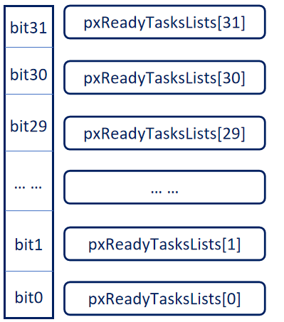

# 1. 任务调度
## 1.1. 简介
调度器就是使用相关的调度算法来决定当前需要执行的哪个任务。  

FreeRTOS 一共支持三种任务调度方式：

**抢占式调度**  
主要是针对优先级不同的任务，每个任务都有一个优先级，优先级高的任务可以抢占优先级低的任务。  

**时间片调度**  
主要针对优先级相同的任务，当多个任务的优先级相同时， 任务调度器会在每一次系统时钟节拍到的时候切换任务。  

**协程式调度**  
当前执行任务将会一直运行，同时高优先级的任务不会抢占低优先级任务，FreeRTOS现在虽然还支持，但是官方已经表示不再更新协程式调度  

## 1.2. 抢占式调度

  

**运行条件**  

1. 创建三个任务：Task1、Task2、Task3
2. Task1、Task2、Task3的优先级分别为1、2、3；

>在FreeRTOS中 $\color{red}{任务设置的数值越大，优先级越高}$ ，所以TASK3的优先级最高。  

**运行过程**  

1. 首先Task1在运行中，在这个过程中Task2就绪了，在抢占式调度器的作用下Task2会抢占Task1的运行
2. Task2运行过程中，Task3就绪了，在抢占式调度器的作用下Task3会抢占Task2的运行
3. Task3运行过程中，Task3阻塞了（系统延时或等待信号量等），此时就绪态中，优先级最高的任务Task2执行
4. Task3阻塞解除了（延时到了或者接收到信号量），此时Task3恢复到就绪态中，抢占TasK2的运行

**注意**  

> $\color{red}{1. 高优先级任务，优先执行}$  
> $\color{red}{2. 高优先级任务不停止，低优先级任务无法执行}$  
> $\color{red}{3. 被抢占的任务将会进入就绪态}$  

## 1.3. 时间片调度

 $\color{red}{同等优先级任务}$ 轮流地享有相同的 CPU 时间 $\color{red}{(可设置)}$ ， 叫时间片，在FreeRTOS中， $\color{red}{一个时间片就等于SysTick 中断周期}$ 

 

  

 **运行条件**  

 1. 创建三个任务：Task1、Task2、Task3
 2. Task1、Task2、Task3的优先级均为1；即3个任务同等优先级

**运行过程**  

1. 首先Task1运行完一个时间片后，切换至Task2运行
2. Task2运行完一个时间片后，切换至Task3运行
3. Task3运行过程中（还不到一个时间片），Task3阻塞了（系统延时或等待信号量等），此时直接切换到下一个任务Task1
4. Task1运行完一个时间片后，切换至Task2运行

**注意**  

> $\color{red}{1. 同等优先级任务，轮流执行；时间片流转}$  
> $\color{red}{2. 一个时间片大小，取决为滴答定时器中断周期}$  
> $\color{red}{3. 注意没有用完的时间片不会再使用，下次任务Task3得到执行还是按照一个时间片的时钟节拍运行}$  
> 4. 使用时间片调度需把宏 $\color{red}{configUSE_TIME_SLICING}$ 和  $\color{red}{configUSE_PREEMPTION 置1}$ 
# 2. 任务状态
FreeRTOS中任务共存在4种状态：  

**运行态：**  
正在执行的任务，该任务就处于运行态，注意在STM32中，同一时间仅一个任务处于运行态  

**就绪态**  
如果该任务已经能够被执行，但当前还未被执行，那么该任务处于就绪态

**阻塞态**  
如果一个任务因延时或等待外部事件发生，那么这个任务就处于阻塞态  

**挂起态**  
类似暂停，调用函数``vTaskSuspend()``进入挂起态，需要调用解挂函数``vTaskResume()``才可以进入就绪态  

四种任务状态之间的切换图如下所示：  

  

**注意**  
> $\color{red}{1、仅就绪态可转变成运行态}$  
> $\color{red}{2、其他状态的任务想运行，必须先转变成就绪态}$  

除了运行态，其他三种任务状态的任务都有其对应的任务状态列表  

**就绪列表**  
``pxReadyTasksLists[x]``，其中x代表任务优先级数值。当某个位置一时，代表所对应的优先级就绪列表有任务存在

  

**阻塞列表**  
``pxDelayedTaskList``

**挂起列表**  
``xSuspendedTaskList``

**注意**  
>  $\color{red}{1.调度器总是在所有处于就绪列表的任务中，选择具有最高优先级的任务来执行}$  
>  $\color{red}{2.相同优先级的任务会连接在同一个就绪列表上}$  