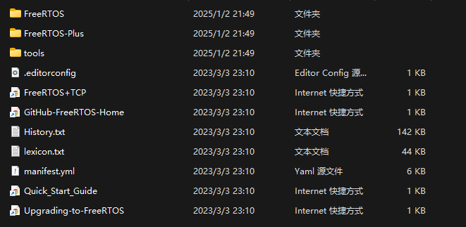
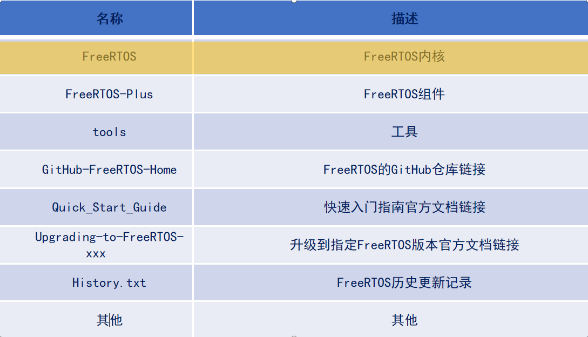
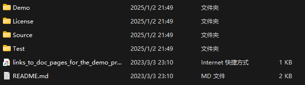
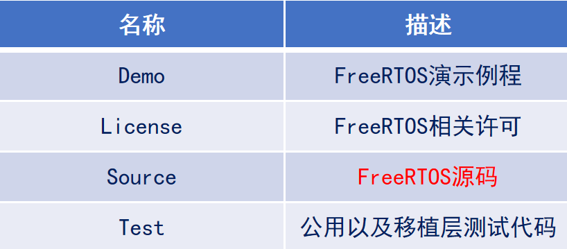
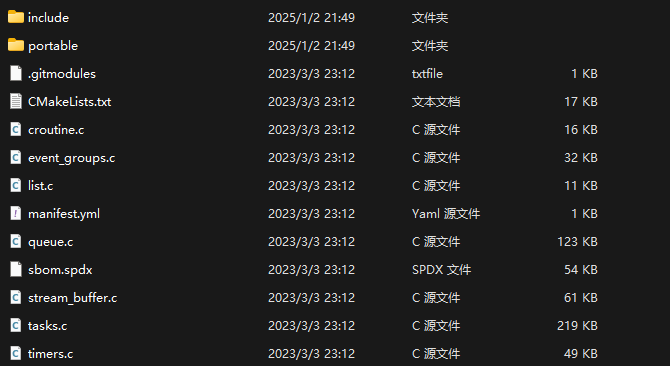
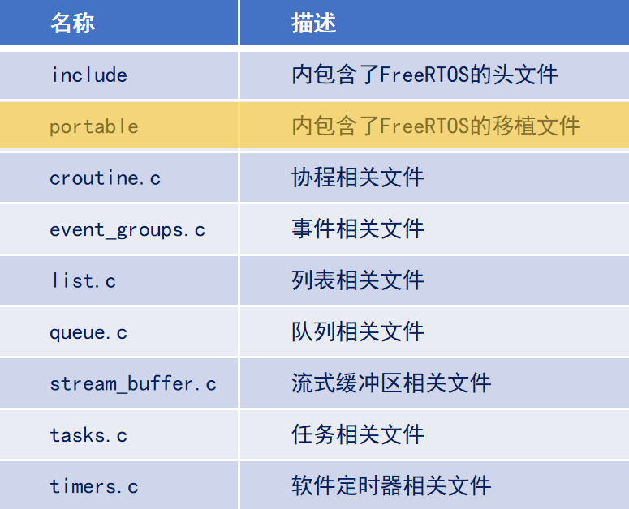
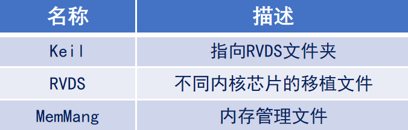

# 1. FreeRTOS源码
从 [FreeRTOS官网](https://www.freertos.org/)下载源码,目录结构如下：

 

各个部分的简介如下：

 

FreeRTOS内核部分的目录如下：

 

各个部分的简介如下：

 

FreeRTOS的源码的目录结构如下：

 

各个部分的简介如下：

 

FreeRTOS操作系统归根到底是一个软件层面的东西，那FreeRTOS是如何跟硬件联系在一起的呢？  
portable文件夹里面的东西就是连接桥梁  
由于我们使用MDK开发，因此这里只重点关注以下文件夹：  

 

各个部分简介如下：

# 2. FreeRTOS移植步骤

1. 添加FreeRTOS源码
2. 添加FreeRTOSConfig.h 配置文件
3. 修改SYSTEM文件中的sys.c、delay.c、usart.c
4. 修改Systick中断、SVC中断、PendSV中断
5. 验证移植是否成功

## 2.1. 系统配置文件详解
FreeRTOSConfig.h 配置文件作用：  
对FreeRTOS的功能进行 **配置和裁剪** ，以及 **API函数的使能** 等。

相关宏大致可分为三类:  
**INCLUDE**  
配置FreeRTOS中可选的API函数  
**config**  
完成FreeRTOS的功能配置和裁剪  
**其他配置项**  
PendSV宏定义、SVC宏定义
