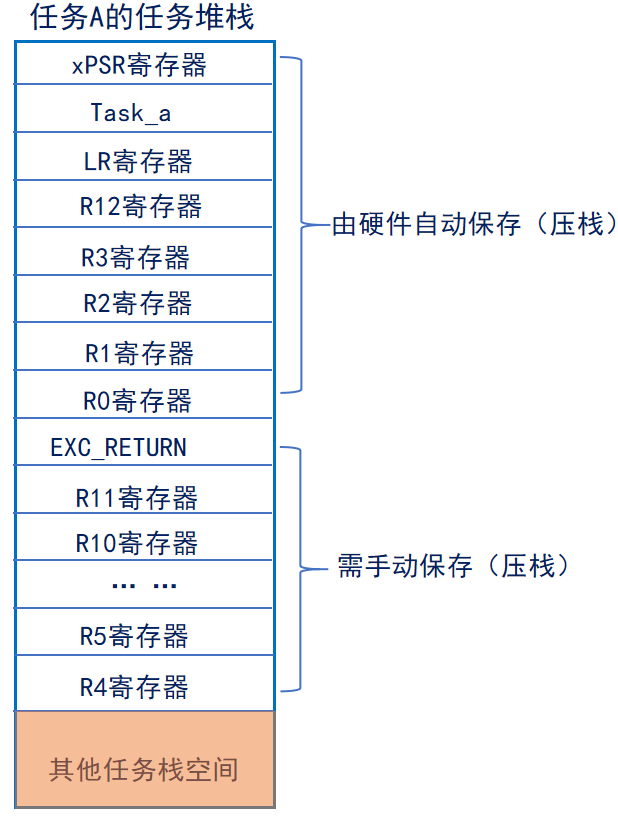
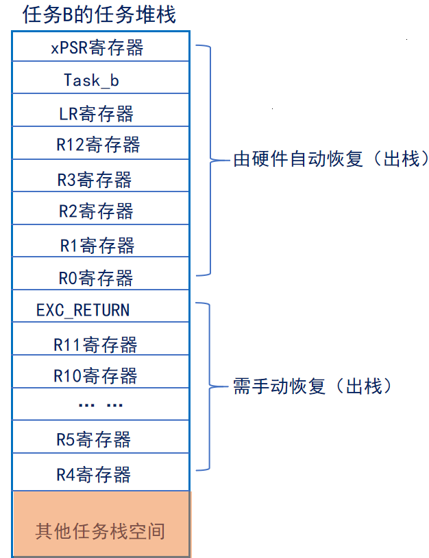
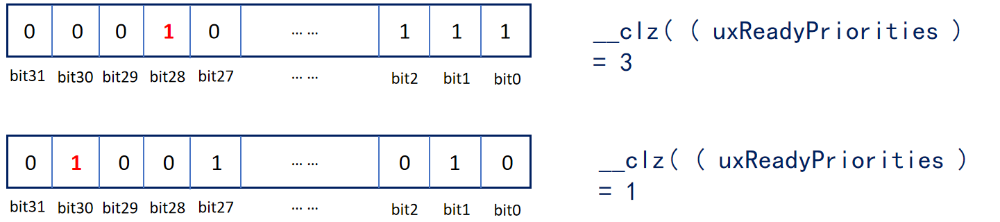
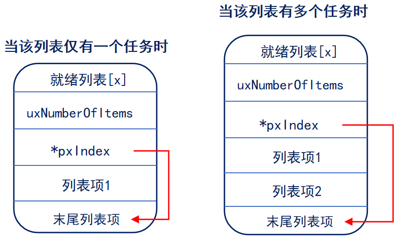

# 1. 开启任务调度器
``vTaskStartScheduler()``用于启动任务调度器，任务调度器启动后， FreeRTOS 便会开始进行任务调度。
该函数内部实现如下：  
1. 创建空闲任务
2. 如果使能软件定时器，则创建定时器任务
3. 关闭中断，防止调度器开启之前或过程中，受中断干扰，会在运行第一个任务时打开中断
4. 初始化全局变量，并将任务调度器的运行标志设置为已运行
5. 初始化任务运行时间统计功能的时基定时器
6. 调用函数``xPortStartScheduler()``

函数``xPortStartScheduler()``的作用是完成启动任务调度器中与硬件架构相关的配置部分，以及启动第一个任务，该函数的内部实现如下：  
1. 检测用户在 FreeRTOSConfig.h 文件中对中断的相关配置是否有误
2. 配置 PendSV 和 SysTick 的中断优先级为最低优先级
3. 调用函数 vPortSetupTimerInterrupt()配置 SysTick
4. 初始化临界区嵌套计数器为 0
5. 调用函数 prvEnableVFP()使能 FPU
6. 调用函数 prvStartFirstTask()启动第一个任务

# 2. 启动第一个任务
``prvStartFirstTask ()     /* 开启第一个任务 */``  
``vPortSVCHandler ()     /* SVC中断服务函数 */``  
假设我们要启动的第一个任务是任务A，那么就需要将任务A的寄存器值恢复到CPU寄存器。任务A的寄存器值，在一开始创建任务时就保存在任务堆栈里边！  
**注意：**  
>- 中断产生时，硬件自动将xPSR，PC(R15)，LR(R14)，R12，R3-R0出/入栈；而R4~R11需要手动出/入栈
>- 进入中断后硬件会强制使用MSP指针 ，此时LR(R14)的值将会被自动被更新为特殊的EXC_RETURN

## 2.1 prvStartFirstTask ()
用于初始化启动第一个任务前的环境，主要是重新设置MSP 指针，并使能全局中断。
1. 什么是MSP指针？  
>程序在运行过程中需要一定的栈空间来保存局部变量等一些信息。当有信息保存到栈中时，MCU 会自动更新 SP 指针，ARM Cortex-M 内核提供了两个栈空间：  
>> 1.  **主堆栈指针（MSP）** 。它由 OS 内核、异常服务例程以及所有需要特权访问的应用程序代码来使用  
>> 2.  **进程堆栈指针（PSP）** 。用于常规的应用程序代码（不处于异常服务例程中时）。  

<br/>

>在FreeRTOS中，中断使用MSP（主堆栈），中断以外使用PSP（进程堆栈）

2. 为什么是 0xE000ED08？
>- 因为需从 0xE000ED08 获取向量表的偏移，为啥要获得向量表呢？因为向量表的第一个是 MSP 指针！
>- 取 MSP 的初始值的思路是先根据向量表的位置寄存器 VTOR (0xE000ED08) 来获取向量表存储的地址；再根据向量表存储的地址，来访问第一个元素，也就是初始的 MSP
>- CM3 允许向量表重定位——从其它地址处开始定位各异常向量 这个就是向量表偏移量寄存器，向量表的起始地址保存的就是主栈指针MSP 的初始值

## 2.2 vPortSVCHandler ()
当使能了全局中断，并且手动触发 SVC 中断后，就会进入到 SVC 的中断服务函数中。  
1. 通过 pxCurrentTCB 获取优先级最高的就绪态任务的任务栈地址，优先级最高的就绪态任务是系统将要运行的任务
2. 通过任务的栈顶指针，将任务栈中的内容出栈到 CPU 寄存器中，任务栈中的内容在调用任务创建函数的时候，已初始化，然后设置 PSP 指针 。
3. 通过往 BASEPRI 寄存器中写 0，允许中断。
4. R14 是链接寄存器 LR，在 ISR 中（此刻我们在 SVC 的 ISR 中），它记录了异常返回值 EXC_RETURN，而EXC_RETURN 只有 6 个合法的值（M4、M7），如下所示：  

|                                   |            |     M3       |
|-----------------------------------|------------|--------------|
|描述                                |使用浮点单元 |未使用浮点单元 |
|中断返回后进入Hamdler模式，并使用MSP  |0xFFFFFFE1  |0xFFFFFFF1    |
|中断返回后进入线程模式，并使用 MSP    |0xFFFFFFE9  |0xFFFFFFF9    |
|中断返回后进入线程模式，并使用 PSP    |0xFFFFFFED  |0xFFFFFFFD    |


**注意：**  
>  **SVC中断只在启动第一次任务时会调用一次，以后均不调用** 
## 2.3 出栈/压栈汇编指令详解
1. 出栈（恢复现场），方向：从下往上（低地址往高地址）：假设r0地址为0x04汇编指令示例：  
``ldmia r0!, {r4-r6}   /* 任务栈r0地址由低到高，将r0存储地址里面的内容手动加载到 CPU寄存器r4、r5、r6 */``  
r0地址(0x04)内容加载到r4，此时地址r0 = r0+4  = 0x08  
r0地址(0x08)内容加载到r5，此时地址r0 = r0+4  = 0x0C  
r0地址(0x0C)内容加载到r6，此时地址r0 = r0+4  = 0x10  

2. 压栈（保存现场），方向：从上往下（高地址往低地址）：假设r0地址为0x10汇编指令示例：  
``stmdb r0!, {r4-r6} }   /* r0的存储地址由高到低递减，将r4、r5、r6里的内容存储到r0的任务栈里面。 */``  
地址：r0 = r0-4  = 0x0C，将r6的内容（寄存器值）存放到r0所指向地址(0x0C)  
地址：r0 = r0-4  = 0x08，将r5的内容（寄存器值）存放到r0所指向地址(0x08)  
地址：r0 = r0-4  = 0x04，将r4的内容（寄存器值）存放到r0所指向地址(0x04)  

# 3.切换任务
任务切换的本质： **就是CPU寄存器的切换** 。  
假设当由任务A切换到任务B时，主要分为两步：  
1. 需暂停任务A的执行，并将此时任务A的寄存器保存到任务堆栈，这个过程叫做 **保存现场** ；
2. 将任务B的各个寄存器值（被存于任务堆栈中）恢复到CPU寄存器中，这个过程叫做 **恢复现场** ；
> 对任务A保存现场，对任务B恢复现场，这个整体的过程称之为： **上下文切换** 

## 3.1 任务切换过程示例
1. 当前任务A在执行:  


2. 切换至任务B的  
第一步：保存任务A的寄存器


3. 切换至任务B的  
第二步：将任务B的寄存器恢复


4. 任务切换后的寄存器：  


## 3.2 PendSV中断是如何触发的？
1. 滴答定时器中断调用  
2. 执行FreeRTOS提供的相关API函数： **portYIELD()**  

> **本质：通过向中断控制和状态寄存器 ICSR 的bit28 写入 1 挂起 PendSV 来启动 PendSV 中断** 

## 3.3 查找最高优先级任务
``vTaskSwitchContext( )                    /* 查找最高优先级任务 */``  
``taskSELECT_HIGHEST_PRIORITY_TASK( )    /* 通过这个函数完成 */``

<br/>

```cpp
    #define taskSELECT_HIGHEST_PRIORITY_TASK()                                                  \
    {                                                                                           \
        UBaseType_t uxTopPriority;                                                              \
                                                                                                \
        /* Find the highest priority list that contains ready tasks. */                         \
        portGET_HIGHEST_PRIORITY( uxTopPriority, uxTopReadyPriority );                          \
        configASSERT( listCURRENT_LIST_LENGTH( &( pxReadyTasksLists[ uxTopPriority ] ) ) > 0 ); \
        listGET_OWNER_OF_NEXT_ENTRY( pxCurrentTCB, &( pxReadyTasksLists[ uxTopPriority ] ) );   \
    } /* taskSELECT_HIGHEST_PRIORITY_TASK() */
```

## 3.4 前导置0指令

```cpp
#define portGET_HIGHEST_PRIORITY( uxTopPriority, uxReadyPriorities )
        uxTopPriority = ( 31UL - ( uint32_t ) __clz( ( uxReadyPriorities ) ) )
```



所谓的前导置零指令，大家可以简单理解为计算一个 32位数，头部 0 的个数  
通过前导置零指令 **获得最高优先级** 

## 3.5 获取最高优先级任务的任务控制块
通过以下函数获取当前最高优先级任务的任务控制块：  

```cpp
#define listGET_OWNER_OF_NEXT_ENTRY( pxTCB, pxList )                                           \
    {                                                                                          \
        List_t * const pxConstList = ( pxList );                                               \
        /* Increment the index to the next item and return the item, ensuring */               \
        /* we don't return the marker used at the end of the list.  */                         \
        ( pxConstList )->pxIndex = ( pxConstList )->pxIndex->pxNext;                           \
        if( ( void * ) ( pxConstList )->pxIndex == ( void * ) &( ( pxConstList )->xListEnd ) ) \
        {                                                                                      \
            ( pxConstList )->pxIndex = ( pxConstList )->pxIndex->pxNext;                       \
        }                                                                                      \
        ( pxTCB ) = ( pxConstList )->pxIndex->pvOwner;                                         \
    }
```

