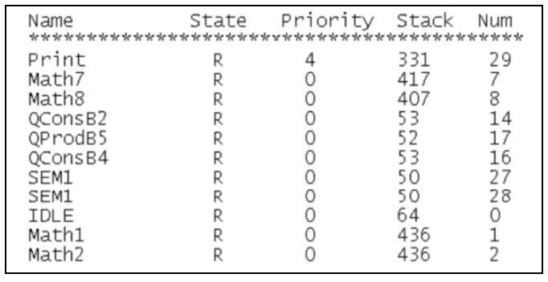
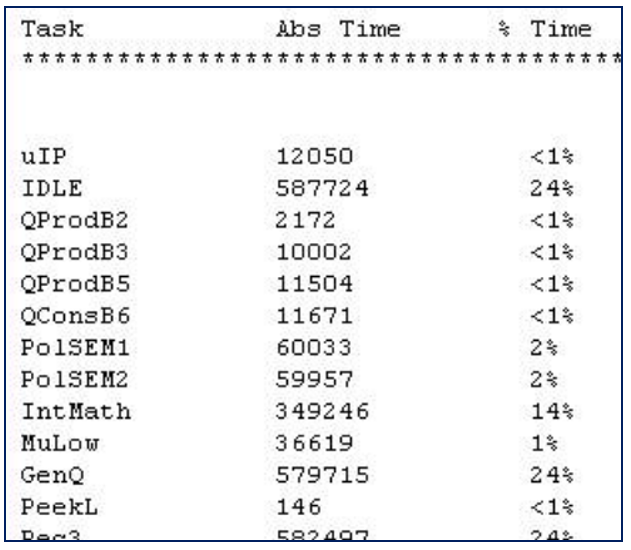

# 1. FreeRTOS任务相关API函数介绍
**FreeRTOS任务相关API函数介绍：**  

<table>
  <tbody>
    <tr>
      <td>函数</td>
      <td>描述</td>
    </tr>
    <tr>
      <td>uxTaskPriorityGet()</td>
      <td><br>获取任务优先级</td>
    </tr>
    <tr>
      <td>vTaskPrioritySet()</td>
      <td>设置任务优先级</td>
    </tr>
    <tr>
      <td>uxTaskGetNumberOfTasks()</td>
      <td>获取系统中任务的数量</td>
    </tr>
    <tr>
      <td>uxTaskGetSystemState()</td>
      <td>获取所有任务状态信息</td>
    </tr>
    <tr>
      <td>vTaskGetInfo()</td>
      <td>获取指定单个的任务信息</td>
    </tr>
    <tr>
      <td>xTaskGetCurrentTaskHandle()</td>
      <td>获取当前任务的任务句柄</td>
    </tr>
    <tr>
      <td>xTaskGetHandle()</td>
      <td>根据任务名获取该任务的任务句柄</td>
    </tr>
    <tr>
      <td>uxTaskGetStackHighWaterMark()</td>
      <td>获取任务的任务栈历史剩余最小值</td>
    </tr>
    <tr>
      <td>eTaskGetState()</td>
      <td>获取任务状态</td>
    </tr>
    <tr>
      <td>vTaskList()</td>
      <td>以“表格”形式获取所有任务的信息</td>
    </tr>
    <tr>
      <td>vTaskGetRunTimeStats()</td>
      <td>获取任务的运行时间</td>
    </tr>
  </tbody>
  <colgroup>
    <col>
    <col>
  </colgroup>
</table>

## 1.1 uxTaskPriorityGet
``UBaseType_t  uxTaskPriorityGet(  const TaskHandle_t xTask  )``  
此函数用于获取指定任务的任务优先级，使用该函数需将 $\color{red}{INCLUDE\_uxTaskPriorityGet}$ 置 1。  
``xTask``为要查找的任务句柄，NULL代表任务自身。返回值为 $\color{red}{任务优先级数值}$ ，类型为整数。  

## 1.2 vTaskPrioritySet
``void vTaskPrioritySet( TaskHandle_t xTask , UBaseType_t uxNewPriority )``  
此函数用于改变某个任务的任务优先级，使用该函数需将 $\color{red}{INCLUDE\_vTaskPrioritySet}$ 为 1。  
``xTask``为要查找的任务句柄，NULL代表任务自身。  
``uxNewPriority``为 $\color{red}{需要设置的任务优先级}$ 。  

## 1.3 uxTaskGetNumberOfTasks
``UBaseType_t uxTaskGetNumberOfTasks( void )``  
此函数用于获取系统中任务的任务数量  
返回值为 $\color{red}{系统中任务的数量}$  

## 1.4 uxTaskGetSystemState
```cpp
UBaseType_t  uxTaskGetSystemState( TaskStatus_t * const pxTaskStatusArray,
                                   const UBaseType_t uxArraySize,
                                   configRUN_TIME_COUNTER_TYPE * const pulTotalRunTime )
```

此函数用于获取系统中所有任务的任务状态信息，使用该函数需将宏  $\color{red}{configUSE\_TRACE\_FACILITY}$  置 1  
各参数含义如下：  

<table>
  <tbody>
    <tr>
      <td>形参</td>
      <td>描述</td>
    </tr>
    <tr>
      <td>xTaskStatusArray</td>
      <td>指向TaskStatus_t 结构体数组首地址</td>
    </tr>
    <tr>
      <td>uxArraySize</td>
      <td>接收信息的数组大小</td>
    </tr>
    <tr>
      <td>pulTotalRunTime</td>
      <td>系统总运行时间，为NULL 则省略总运行时间值</td>
    </tr>
  </tbody>
  <colgroup>
    <col>
    <col>
  </colgroup>
</table>

返回值为 $\color{red}{获取信息的任务数量}$ 

## 1.5 uxTaskGetSystemState
```cpp
UBaseType_t  uxTaskGetSystemState(  TaskStatus_t * const pxTaskStatusArray,
                                    const UBaseType_t uxArraySize,
                                    configRUN_TIME_COUNTER_TYPE * const pulTotalRunTime  )
```

```cpp
typedef struct xTASK_STATUS
{
    TaskHandle_t                     xHandle;                        /* 任务句柄 */ 
    const char *                     pcTaskName;                     /* 任务名 */ 
    UBaseType_t                      xTaskNumber;                    /* 任务编号 */ 
    eTaskState e                     CurrentState;                   /* 任务状态 */ 
    UBaseType_t                      uxCurrentPriority;              /* 任务优先级 */ 
    UBaseType_t                      uxBasePriority;                 /* 任务原始优先级*/ 
    configRUN_TIME_COUNTER_TYPE      ulRunTimeCounter;               /* 任务运行时间*/
    StackType_t *                    pxStackBase;                    /* 任务栈基地址 */ 
    configSTACK_DEPTH_TYPE           usStackHighWaterMark;           /* 任务栈历史剩余最小值 */ 
} TaskStatus_t;
```

## 1.6 vTaskGetInfo
```cpp
void vTaskGetInfo( TaskHandle_t xTask,
                    TaskStatus_t * pxTaskStatus,
                    BaseType_t xGetFreeStackSpace,
                    eTaskState eState )
```

此函数用于获取指定的单个任务的状态信息，使用该函数需将宏  $\color{red}{configUSE\_TRACE\_FACILITY}$  置 1。  
各参数含义如下：  
<table>
  <tbody>
    <tr>
      <td>形参</td>
      <td>描述</td>
    </tr>
    <tr>
      <td>xTask</td>
      <td>指定获取信息的任务的句柄</td>
    </tr>
    <tr>
      <td>pxTaskStatus</td>
      <td>接收任务信息的变量</td>
    </tr>
    <tr>
      <td>xGetFreeStackSpace</td>
      <td><br>任务栈历史剩余最小值，<br>当为“pdFALSE” 则跳过这个步骤，<br>当为“pdTRUE”则检查历史剩余最小堆栈</td>
    </tr>
    <tr>
      <td>eState</td>
      <td>任务状态，可直接赋值，如想获取代入“eInvalid”</td>
    </tr>
  </tbody>
  <colgroup>
    <col>
    <col>
  </colgroup>
</table>

任务状态如下：  
```cpp
typedef enum
{   
    eRunning = 0,     /* 运行态 */ 
    eReady            /* 就绪态 */ 
    eBlocked,         /* 阻塞态 */ 
    eSuspended,       /* 挂起态 */ 
    eDeleted,         /* 任务被删除 */ 
    eInvalid          /* 无效 */ 
} eTaskState;
```

## 1.7 xTaskGetCurrentTaskHandle
``TaskHandle_t    xTaskGetCurrentTaskHandle( void )``  
此函数用于获取当前任务的任务句柄， 使用该函数需将宏  $\color{red}{INCLUDE\_xTaskGetCurrentTaskHandle}$  置 1  
返回值为 $\color{red}{当前任务的任务句柄}$ 

## 1.8 xTaskGetHandle
``TaskHandle_t xTaskGetHandle(const char * pcNameToQuery);``  
此函数用于通过任务名获取任务句柄 ， 使用该函数需将宏  $\color{red}{INCLUDE\_xTaskGetHandle}$ 置 1。  
参数``pcNameToQuery``为任务名。返回值为任务句柄。  

## 1.9 uxTaskGetStackHighWaterMark
``UBaseType_t    uxTaskGetStackHighWaterMark( TaskHandle_t  xTask )``  
此函数用于获取指定任务的任务栈历史最小剩余堆栈；  
使用该函数需将宏 $\color{red}{INCLUDE\_uxTaskGetStackHighWaterMark}$ 置 1。  
参数``xTask``为任务句柄。返回值为 $\color{red}{任务栈的历史剩余最小值}$ 。  

## 1.10 eTaskGetState
``eTaskState    eTaskGetState(TaskHandle_t xTask)``  
此函数用于查询某个任务的运行状态，使用此函数需将宏  $\color{red}{INCLUDE\_eTaskGetState}$ 置1。  
参数``xTask``为待获取状态任务的任务句柄，返回值为 $\color{red}{任务状态}$ 。  

## 1.11 vTaskList
``void   vTaskList(char * pcWriteBuffer)``  
此函数用于以“表格”的形式获取系统中任务的信息 ；  
使用此函数需将宏  $\color{red}{configUSE\_TRACE\_FACILITY}$ 和 $\color{red}{configUSE\_STATS\_FORMATTING_FUNCTIONS}$ 置1。  
参数``pcWriteBuffer``为接收任务信息的缓存指针。  
打印表格如下所示：  
<div></div>  

含义如下：  
Name        ： 创建任务的时候给任务分配的名字。  
State        ： 任务的壮态信息， B 是阻塞态， R 是就绪态， S 是挂起态， D 是删除态  
Priority  ：任务优先级。  
Stack      ： 任务堆栈的“高水位线”，就是堆栈历史最小剩余大小。  
Num        ： 任务编号，这个编号是唯一的，当多个任务使用同一个任务名的时候可以通过此编号来做区分。  

# 2. 时间统计API函数介绍
``void    vTaskGetRunTimeStats( char * pcWriteBuffer )``  
此函数用于统计任务的运行时间信息，使用此函数需将宏 $\color{red}{configGENERATE\_RUN\_TIME\_STAT}$ 、$\color{red}{configUSE\_STATS\_FORMATTING\_FUNCTIONS}$ 置1。  
参数``pcWriteBuffer``为接收任务运行时间信息的缓存指针。  
打印表格如下所示：  
<div></div>  

含义如下：  
Task:        任务名称  
Abs Time:    任务实际运行的总时间（绝对时间）  
% Time:      占总处理时间的百分比  

**时间统计API函数使用流程**  
1. 将宏 $\color{red}{configGENERATE\_RUN\_TIME\_STATS}$ 置1  
2. 将宏 $\color{red}{configUSE\_STATS\_FORMATTING\_FUNCTIONS}$ 置1  
3. 当将此宏 $\color{red}{configGENERATE\_RUN\_TIME\_STAT}$ 置1之后，还需要实现2个宏定义：  
    1.  $\color{red}{portCONFIGURE\_TIMER\_FOR\_RUNTIME\_STATE() }$ ：用于初始化用于配置任务运行时间统计的时基定时器；注意：这个时基定时器的计时精度需高于系统时钟节拍精度的10至100倍！
    2.  $\color{red}{portGET\_RUN\_TIME\_COUNTER\_VALUE()}$ ：用于获取该功能时基硬件定时器计数的计数值 。

