## PID简介

- PID是比例（Proportional）、积分（Integral）、微分（Differential）的缩写
- PID是一种闭环控制算法，它动态改变施加到被控对象的输出值（Out），使得被控对象某一物理量的实际值（Actual），能够快速、准确、稳定地跟踪到指定的目标值（Target）
- PID是一种基于误差（Error）调控的算法，其中规定：误差=目标值-实际值，PID的任务是使误差始终为0
- PID对被控对象模型要求低，无需建模，即使被控对象内部运作规律不明确，PID也能进行调控

## 开环与闭环

- **开环（Open Loop）**：控制器单向输出值给被控对象，不获取被控对象的反馈，控制器对被控对象的执行状态不清楚  


- **闭环（Closed Loop）**：控制器输出值给被控对象，同时获取被控对象的反馈，控制器知道被控对象的执行状态，可以根据反馈修改输出值以优化控制  
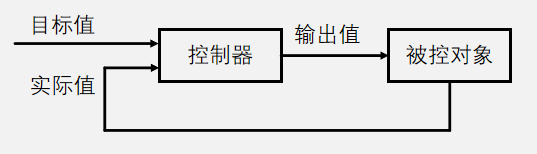

## PID公式与系统框图

- 定义误差： $error(t)=target(t)−actual(t)$ 
- PID输出值： $ out(t)\, =\, {K}_{p}(error(t)+\frac {1} {{T}_{i}}\int ^{t}_{0} {error(t)dt}+\frac {{T}_{d}derror(t)} {dt}) $ 
- PID输出值： $out(t)\, =\, {K}_{p}\ast error(t)+{K}_{i}\ast \int ^{t}_{0} {error(t)dt}+{K}_{d}\ast \frac {derror(t)} {dt}$ 

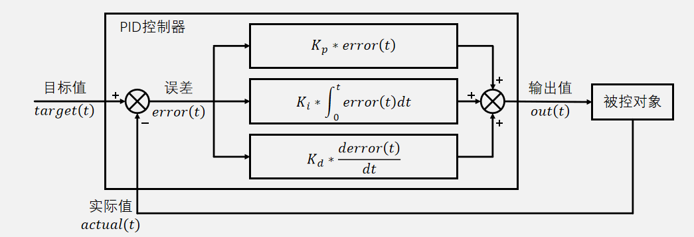

## 比例项（P）

- 只含有比例项的PID输出值： $out(t)={K}_{p}\ast error(t)$ 
- 比例项的输出值仅取决于当前时刻的误差，与历史时刻无关。当前存在误差时，比例项输出一个与误差呈正比的值，当前不存在误差时，比例项输出0
- ${K}_{p}$越大，比例项权重越大，系统响应越快，但超调也会随之增加
- 纯比例项控制时，系统一般会存在稳态误差，${K}_{p}$越大，稳态误差越小

**P项作用示例**  
|                                    |                                    |
|------------------------------------|------------------------------------|
| 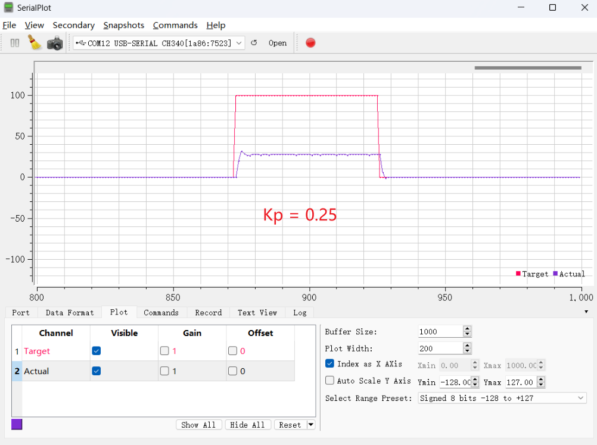 | 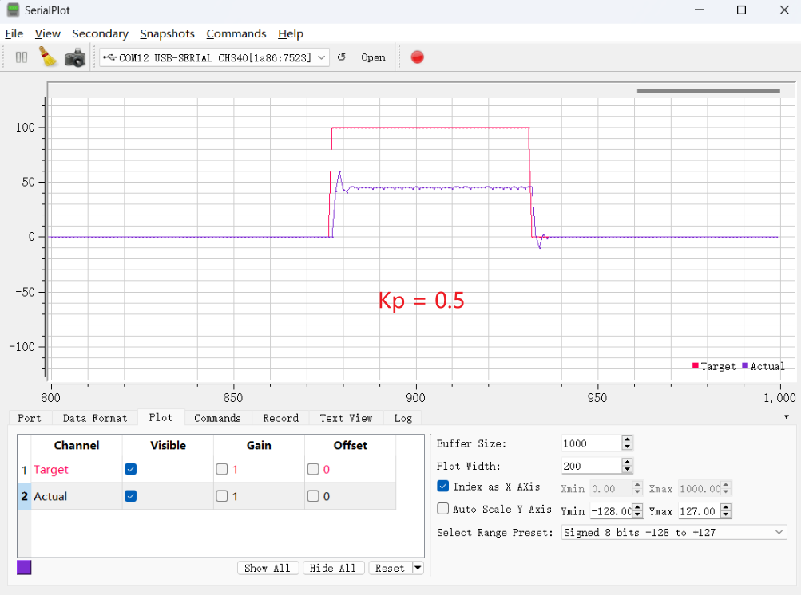 |
| 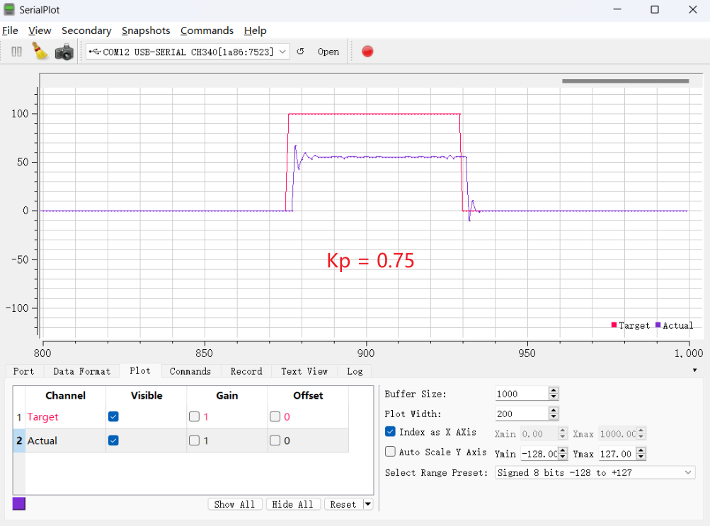 | 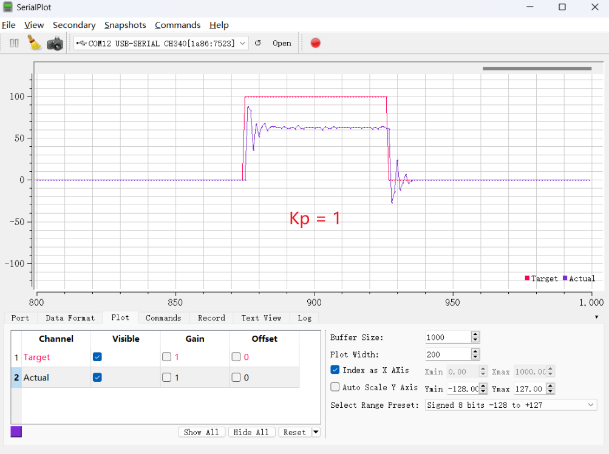 |

## 稳态误差

- PID稳态误差：系统进入稳态时，实际值和目标值存在始终一个稳定的差值
- 稳态误差产生原因：纯比例项控制时，若误差为0，则比例项结果也为0。被控对象输入0时，一般会自发地向一个方向偏移，产生误差。产生误差后，误差非0，比例项负反馈调控输出，当调控输出力度和自发偏移力度相同时，系统达到稳态
- 判断是否会产生稳态误差：给被控对象输入0，判断被控对象会不会自发偏移
- 判断稳态误差的方向：给被控对象输入0，自发偏移方向即为稳态误差方向

## 积分项（I）

- 含有比例项和积分项的PID输出值： $out(t)\, =\, {K}_{p}\ast error(t)+{K}_{i}\ast \int ^{t}_{0} {error(t)dt}$ 
- 积分项的输出值取决于$0~t$所有时刻误差的积分，与历史时刻有关。积分项将历史所有时刻的误差累积，乘上积分项系数${K}_{i}$后作为积分项输出值
- 积分项用于弥补纯比例项产生的稳态误差，若系统持续产生误差，则积分项会不断累积误差，直到控制器产生动作，让稳态误差消失
- ${K}_{i}$越大，积分项权重越大，稳态误差消失越快，但系统滞后性也会随之增加

**PI项作用示例**  
|                                      |                                      |
|--------------------------------------|--------------------------------------|
| 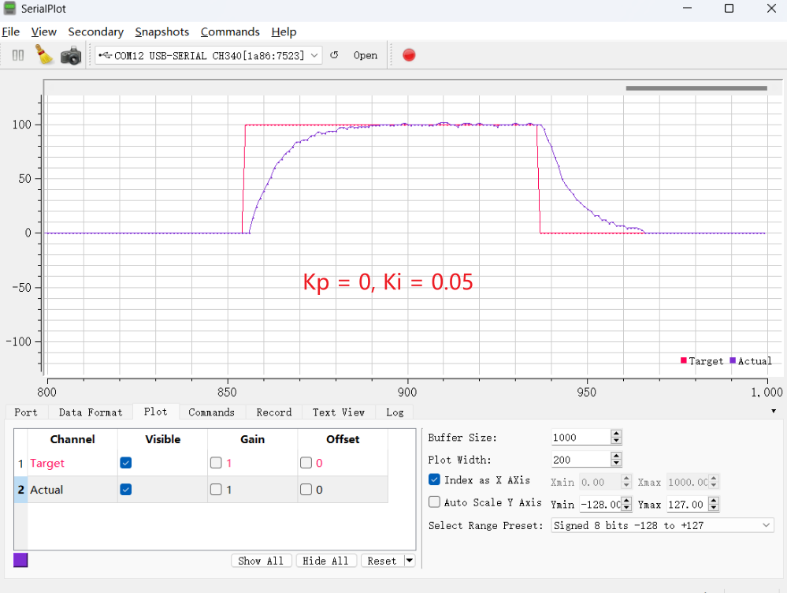 | 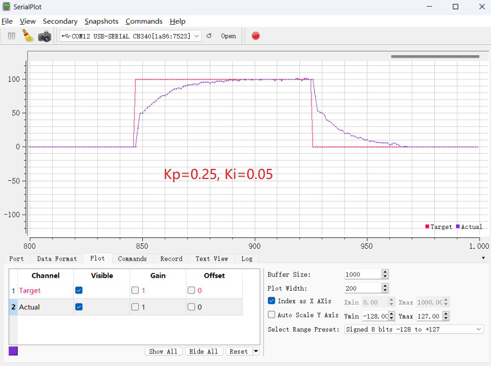 |
|  |  |
| 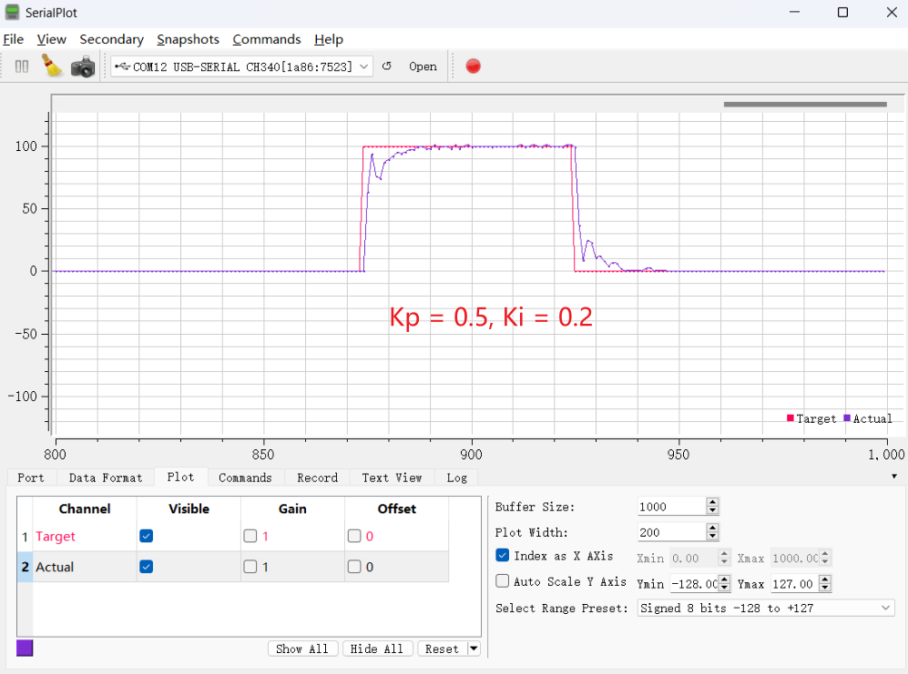 |  |

## 微分项（D）

- 含有比例项、积分项和微分项的PID输出值： $out(t)\, =\, {K}_{p}\ast error(t)+{K}_{i}\ast \int ^{t}_{0} {error(t)dt}+{K}_{d}\ast \frac {derror(t)} {dt}$ 
- 微分项的输出值取决于当前时刻误差变化的斜率，与当前时刻附近误差变化的趋势有关。当误差急剧变化时，微分项会负反馈输出相反的作用力，阻碍误差急剧变化
- 斜率一定程度上反映了误差未来的变化趋势，这使得微分项具有 “预测未来，提前调控”的特性
- 微分项给系统增加阻尼，可以有效防止系统超调，尤其是惯性比较大的系统
- ${K}_{d}$越大，微分项权重越大，系统阻尼越大，但系统卡顿现象也会随之增加

**D项作用示意图**

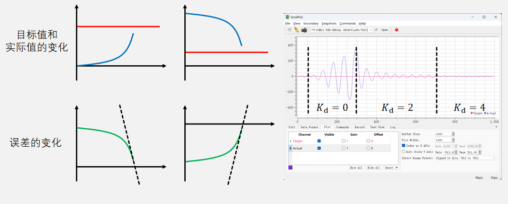

## 连续形式PID与离散形式PID公式

- 连续形式PID： $out(t)\, =\, {K}_{p}\ast error(t)+{K}_{i}\ast \int ^{t}_{0} {error(t)dt}+{K}_{d}\ast \frac {derror(t)} {dt}$ 

- 离散形式PID： $out(k)\, =\, {K}_{p}\ast error(k)+{K}_{i}\ast T\sum ^{k}_{j=0} {error(j)}+{K}_{d}\ast \frac {error(k)\, -\, error(k-1)} {T}$ 

- 若将$T$并入${K}_{i}$ 和${K}_{d}$ ，则： $out(k)\, =\, {K}_{p}\ast error(k)+{K}_{i}\ast \sum ^{k}_{j=0} {error(j)}+{K}_{d}\ast (error(k)\, -\, error(k-1))$ 

**连续形式PID离散化示意图**

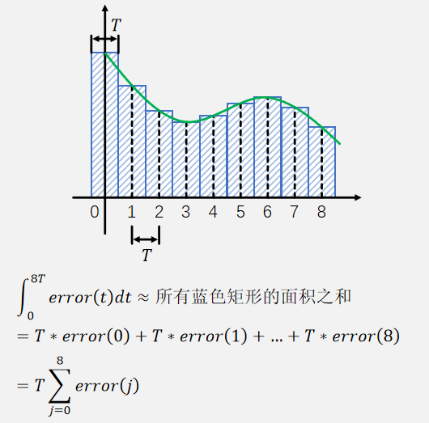
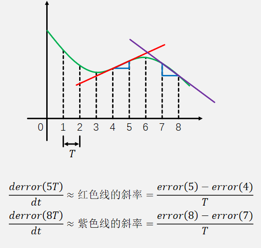

## 位置式PID与增量式PID公式

- 位置式PID：  
 $out(k)\, =\, {K}_{p}\ast error(k)+{K}_{i}\ast \sum ^{k}_{j=0} {error(j)}+{K}_{d}\ast (error(k)\, -\, error(k-1))$ 

- 当$k = k - 1$时：  
 $out(k-1)\, =\, {K}_{p}\ast error(k-1)+{K}_{i}\ast \sum ^{k-1}_{j=0} {error(j)}+{K}_{d}\ast (error(k-1)\, -\, error(k-2))$  

- 两式相减得到增量式PID：  
 $\Delta out(k)\, =\, {K}_{p}\ast (error(k)\, -\, error(k-1))+{K}_{i}\ast error(k)+{K}_{d}\ast (error(k)\, -\, 2*error(k-1)\, +\, error(k-2))$ 

## 位置式PID与增量式PID比较

- 位置式PID由连续形式PID直接离散得到，每次计算得到的是全量的输出值，可以直接给被控对象
- 增量式PID由位置式PID推导得到，每次计算得到的是输出值的增量，如果直接给被控对象，则需要被控对象内部有积分功能
- 增量式PID也可在控制器内进行积分，然后输出积分后的结果，此时增量式PID与位置式PID整体功能没有区别
- 位置式PID和增量式PID计算时产生的中间变量不同，如果对这些变量加以调节，可以实现不同的特性

## PID程序实现

- 确定一个调控周期T，每隔时间T，程序执行一次PID调控

**方法1**
```cpp
int main(void)
{
    while(1)
    {
        /****************************/
        /*      在此执行PID调控      */
        /****************************/
        Delay_ms(/*延时时间T*/);
    }
}
```

**方法2**
```cpp
int main(void)
{
    Timer_Init();

    while(1)
    {

    }
}

void TIM2_IRQHandler(void)
{
    if(TIM_GetITStatus(TIM2, TIM_IT_Update) == SET)
    {
        /*每隔时间T,程序执行到这里一次*/

        /****************************/
        /*      在此执行PID调控      */
        /****************************/

        TIM_ClearITPendingBit(TIM2, TIM_IT_Update);
    }
}
```

**方法3**
```cpp
uint8_t Flag;

int main(void)
{
    Timer_Init();

    while(1)
    {
        if(Flag == 1)
        {
            Flag = 1;
            /****************************/
            /*      在此执行PID调控      */
            /****************************/
        }
    }
}

void TIM2_IRQHandler(void)
{
    if(TIM_GetITStatus(TIM2, TIM_IT_Update) == SET)
    {
        /*每隔时间T,程序执行到这里一次*/
        Flag  = 1;
        TIM_ClearITPendingBit(TIM2, TIM_IT_Update);
    }
}
```

## 位置式PID程序实现

```cpp
/*定义变量*/
float Target, Actual, Out;          //目标值，实际值，输出值
float Kp = 值, Ki = 值, Kd = 值;    //比例项，积分项，微分项的权重
Float Error0, Error1, ErrorInt;     //本次误差，上次误差，误差积分

int main(void)
{
    Timer_Init();

    while(1)
    {
        /*用户在此处根据需求写入PID控制器的目标值*/
        Target = 用户指定的一个值;
    }
}

void TIM2_IRQHandler(void)
{
    if(TIM_GetITStatus(TIM2, TIM_IT_Update) == SET)
    {
        /*每隔时间T,程序执行到这里一次*/

        /***********执行PID调控**********/
        /*获取实际值*/
        Actual = 读取传感器();

        /*获取本次误差和上次误差*/
        Error1 = Error0;
        Error0 = Target - Actual;

        /*误差积分（累加）*/
        ErrorInt += Error0;

        /*PID计算*/
        Out = Kp * Error0 + Ki * ErrorInt + Kd * (Error0 - Error1);

        /*输出限幅*/
        if(Out > 上限)  {Out = 上限;}
        if(Out < 下限)  {Out = 下限;}

        /*执行控制*/
        输出至被控对象(Out);
        /****************************/

        TIM_ClearITPendingBit(TIM2, TIM_IT_Update);
    }
}
```

## 增量式PID程序实现（控制器内积分，输出全量）

```cpp
/*定义变量*/
float Target, Actual, Out;          //目标值，实际值，输出值
float Kp = 值, Ki = 值, Kd = 值;    //比例项，积分项，微分项的权重
Float Error0, Error1, Error2;       //本次误差，上次误差，上上次误差

int main(void)
{
    Timer_Init();

    while(1)
    {
        /*用户在此处根据需求写入PID控制器的目标值*/
        Target = 用户指定的一个值;
    }
}

void TIM2_IRQHandler(void)
{
    if(TIM_GetITStatus(TIM2, TIM_IT_Update) == SET)
    {
        /*每隔时间T,程序执行到这里一次*/

        /***********执行PID调控**********/
        /*获取实际值*/
        Actual = 读取传感器();

        /*获取本次误差和上次误差*/
        Error2 = Error1;
        Error1 = Error0;
        Error0 = Target - Actual;

        /*PID计算*/
        Out += Kp * (Error0 - Error1) + Ki * Error0
                 + Kd * (Error0 - 2 * Error1 + Error2);

        /*输出限幅*/
        if(Out > 上限)  {Out = 上限;}
        if(Out < 下限)  {Out = 下限;}

        /*执行控制*/
        输出至被控对象(Out);
        /****************************/

        TIM_ClearITPendingBit(TIM2, TIM_IT_Update);
    }
}
```